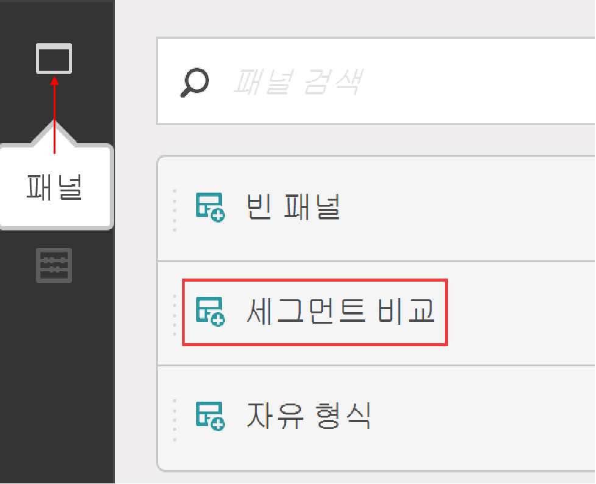
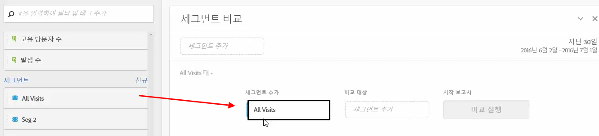
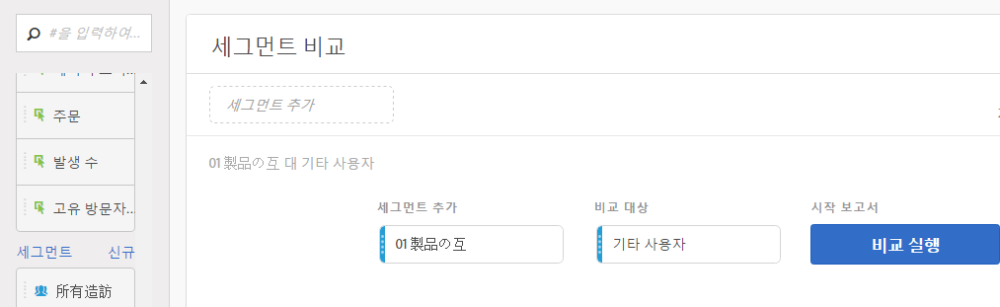
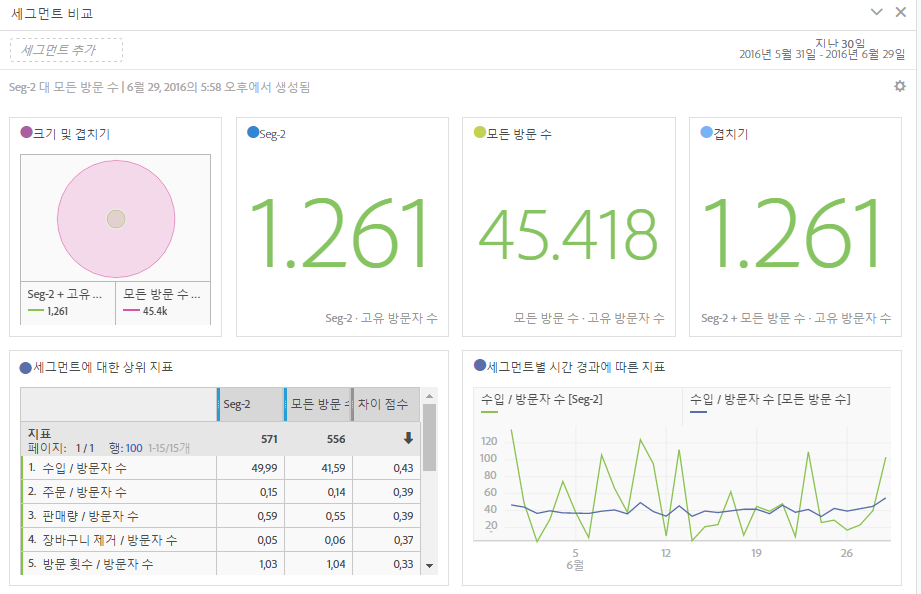
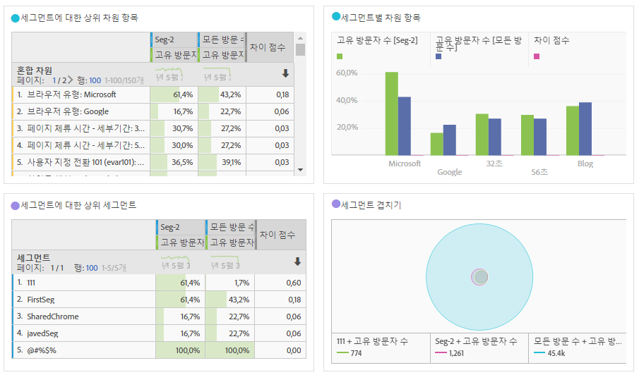
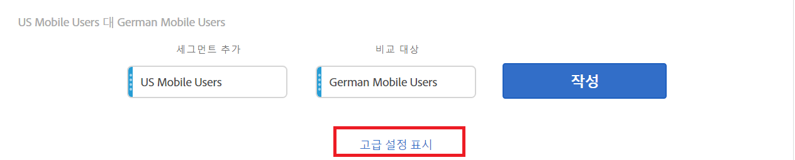
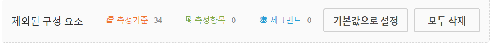
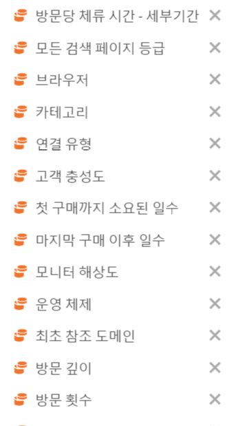

# 세그먼트 비교

Analysis Workspace에서 세그먼트를 비교하는 방법을 설명합니다.

>[!NOTE]
>
>You can also compare segments within a [fallout analysis](../../../../analyze/analysis-workspace/visualizations/fallout/compare-segments-fallout.md#section_E0B761A69B1545908B52E05379277B56).

## Compare segments {#section_8F2BFC45131C49B4A2E08A063CD7A91F}

1. **[!UICONTROL Analytics]** &gt; **[!UICONTROL 작업 영역으로]** 이동하고 프로젝트를 엽니다.

1. 왼쪽 여백의 **[!UICONTROL 패널]** 레일에서 **세그먼트 비교]를 선택한 후 새 프로젝트 또는 기존 프로젝트로 드래그합니다.[!UICONTROL **

   

1. 비교 날짜 범위가 적절히 설정되어 있는지 확인합니다.
1. 비교할 세그먼트를 선택한 후 패널에 놓습니다. 예를 들어 "Super Shoppers" 세그먼트가 있다고 가정할 경우

   

   이 세그먼트를 패널로 드래그하면 선택한 세그먼트에 포함되지 않은 모든 사람(이 경우 "Non Super Shoppers")을 포함하는 **[!UICONTROL 기타 사용자]세그먼트가 생성됩니다.** 따라서 이 세그먼트를 만들 필요가 없어집니다. 기타 사용자는 **[!UICONTROL 비교 대상]필드의 패널에 자동으로 추가됩니다.** 이 필드를 삭제하고 Super Shopper를 선택한 다른 세그먼트와 비교할 수 있습니다.

   

1. **[!UICONTROL 고급 옵션 표시]를 클릭하여 세그먼트 비교 분석에서 구성 요소(차원, 지표 또는 세그먼트)를 제외합니다.** 자세한 내용은 [비교에서 구성 요소 제외](../../../../analyze/analysis-workspace/c-panels/c-segment-comparison/compare-segments.md#section_5E98FFA0744140C08D83700E3F025937)를 참조하십시오.

1. 적절한 "비교 대상" 세그먼트를 선택한 후에는 **[!UICONTROL 작성을 클릭합니다]**.

   이 작업을 수행하면 모든 차원, 지표 및 기타 세그먼트를 거치는 백엔드 프로세스가 시작되어 두 세그먼트 간의 통계적 차이를 확인합니다. 도구 맨 위에는 모든 지표 및 차원에서 중요한 차이점을 검색할 때까지 남은 시간을 나타내는 진행률 표시줄이 표시됩니다. 또한 가장 자주 사용된 지표, 차원 및 세그먼트가 먼저 실행되도록 우선 순위가 지정되므로 최대한 빨리 가장 관련성 높은 결과를 얻을 수 있습니다.

   백엔드 프로세스가 검색을 완료하면 다양한 새 시각적 결과를 볼 수 있습니다.

   

   

1. 그러면 [새 시각화, 테이블 및 요약](../../../../analyze/analysis-workspace/c-panels/c-segment-comparison/segment-comparison.md#concept_74FAC1C6D0204F9190A110B0D9005793)을 검토하여 세그먼트 비교 결과를 해석합니다.

## Exclude components from comparison {#section_5E98FFA0744140C08D83700E3F025937}

경우에 따라 세그먼트 비교에서 일부 차원, 지표 또는 세그먼트를 제외할 수 있습니다. 예를 들어 미국 모바일 사용자 세그먼트를 독일 모바일 사용자와 비교한다고 가정해 봅시다. 이 두 세그먼트의 위치가 명백히 다르기 때문에 지리와 관련된 차원을 포함하는 것은 의미가 없습니다. 이러한 차원은 제외할 수 있습니다. 방법은 다음과 같습니다.

1. 비교하려는 세그먼트를 패널로 드래그한 다음 **[!UICONTROL 고급 옵션 표시]를 클릭하여 세그먼트 비교 분석에서 구성 요소(차원, 지표 또는 세그먼트)를 제외합니다.**

   

1. 제외할 구성 요소를 **[!UICONTROL 제외된 구성 요소]패널에 끌어 놓습니다.** (이것을 제외할 구성 요소의 "블랙리스트"로 볼 수 있습니다.) 이러한 구성 요소를 기본값으로 설정하거나, **[!UICONTROL 모두 지우기]를 설정하여 다시 시작할 수 있습니다.**

   

1. **[!UICONTROL 모든]세그먼트 비교에서 이러한 구성 요소를 제외하려면****기본값으로 설정**&#x200B;을 클릭합니다.

1. 제외된 구성 요소 목록을 수정해야 하는 경우, 구성 요소를 두 번 클릭하기만 하면 됩니다. 예를 들어 차원을 두 번 클릭하면 제외된 차원 목록이 표시됩니다.

   

1. 원하지 않는 차원 옆에 있는 x를 클릭하여 삭제한 다음 **[!UICONTROL 기본값으로 설정을 클릭하여 목록을 저장합니다]**.

