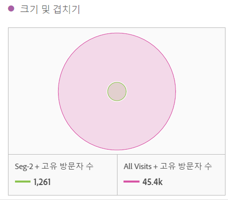
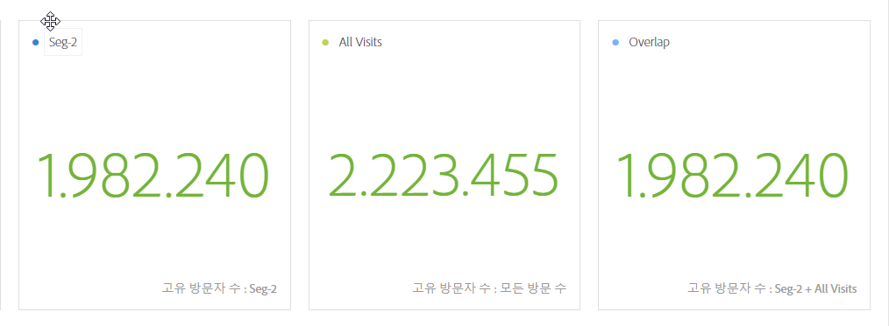
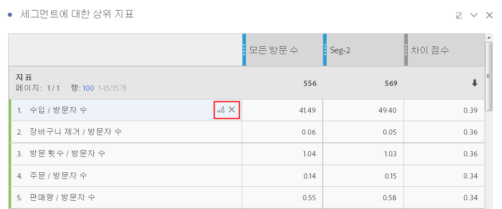
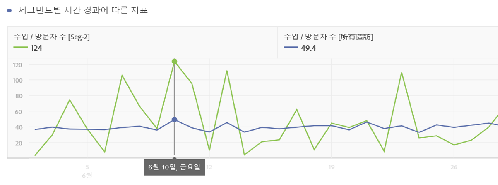
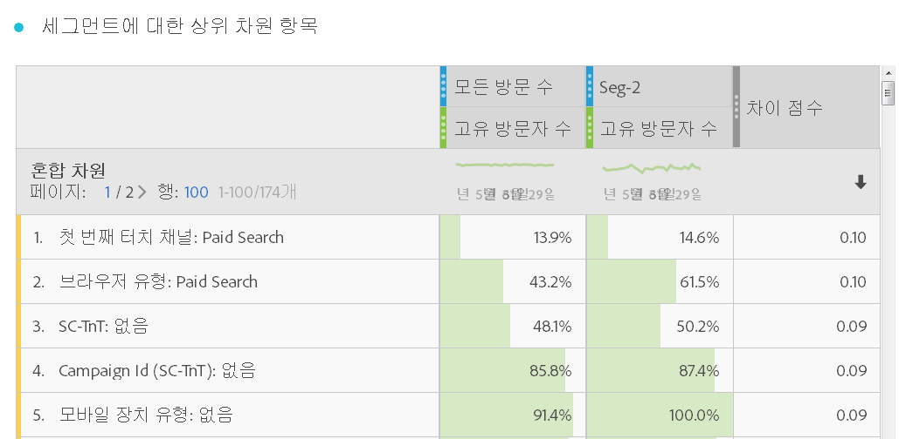
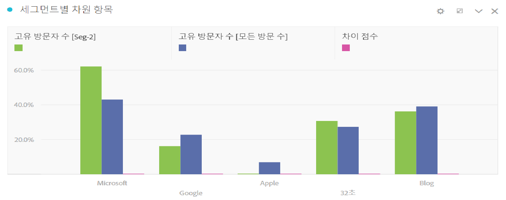
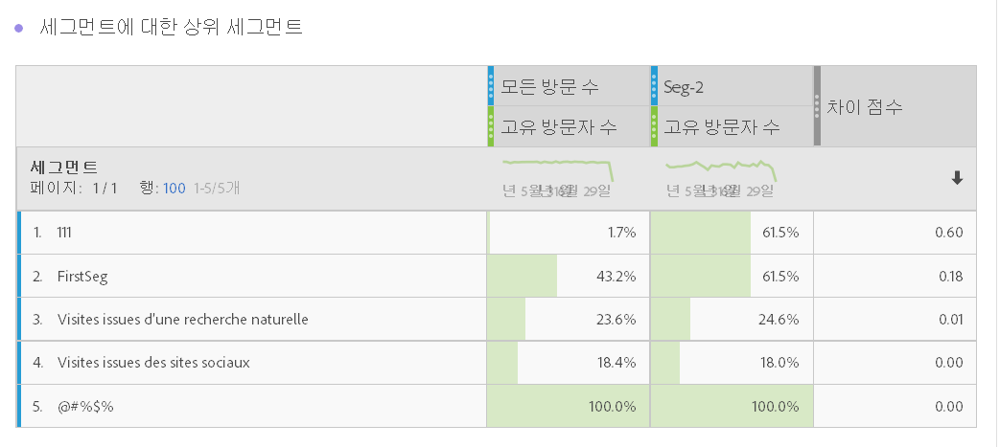
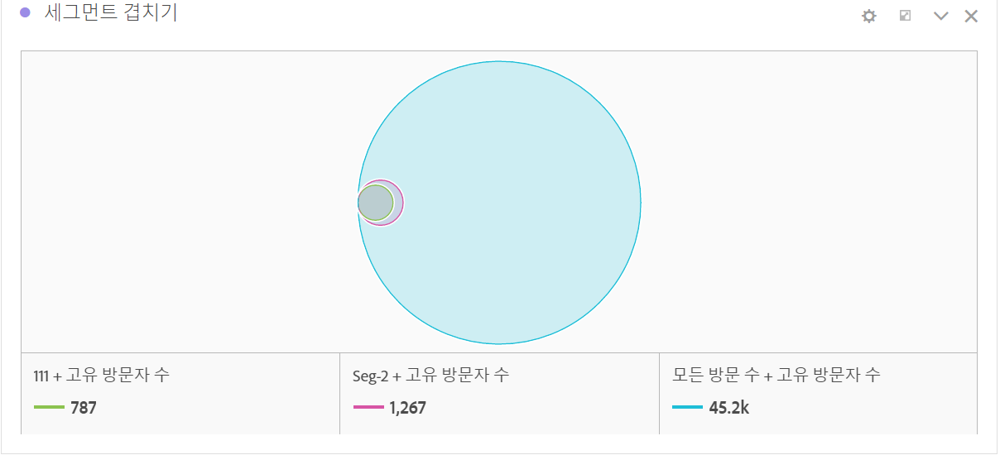

# 세그먼트 IQ 개요

세그먼트 비교(세그먼트 IQ) 도구는 사용자가 액세스하는 모든 개별 지표 및 차원의 자동화된 분석을 통해 세그먼트들(개수 제한 없음) 간의 통계적으로 가장 유의한 차이를 알아냅니다. 또한 회사 KPI를 구동하는 대상 세그먼트의 주요 특성을 자동으로 파악하고 세그먼트들이 얼마나 많이 겹치는지도 확인할 수 있도록 합니다.

분석가들은 광범위한 회사 지표 및 차원에 걸쳐 세그먼트 간의 적절한 차이점을 검색하느라 몇 시간, 심지어 며칠 동안 고생할 수 있습니다. 이 분석은 지루하고 시간이 많이 소요되는 일일 뿐 아니라 타깃팅된 마케팅 노력에 지대한 영향을 미칠 수 있는 세그먼트에 대해 핵심적인 차이를 만드는 통찰력을 놓쳤는지도 확신할 수 없습니다.

[YouTube의 세그먼트 비교](https://www.youtube.com/watch?v=fO3PNB93U_w&list=PL2tCx83mn7GuNnQdYGOtlyCu0V5mEZ8sS&index=38) (4:46)

다음은 세그먼트 비교 도구에 추가된 몇 가지 핵심적인 새 개념인 시각화 및 테이블입니다.

## “Everyone else” segment {#section_30AEE8181E5D46D9AB27F7CA3815D0CD}

편의를 위해 수동으로 만들 필요가 없도록 "기타 모든" 세그먼트를 추가했습니다. 예를 들어 구매자를 대상으로 합니다. 비구매자 세그먼트는 이미 "기타 모든" 세그먼트에 포함되므로 생성하지 않아도 되며 비교를 위해 다른 세그먼트를 추가해야 하는 경우 빠르게 제거할 수 있습니다.

## Size and overlap {#section_885A71EE458C43189A77B8F552CA346A}

크기 및 겹치기 시각화는 선택된 각 세그먼트의 상대적 크기와 서로 겹치는 정도를 그림으로 나타냅니다. 시각화 위로 커서를 놓으면 겹치거나 겹치지 않는 섹션에 포함된 방문자 수를 알 수 있습니다. 또한 추가 분석을 위해 겹치는 부분을 마우스 오른쪽 버튼으로 클릭하여 완전히 새로운 세그먼트를 생성할 수도 있습니다. 두 세그먼트가 겹치지 않는 경우 (예: "everyone other" 세그먼트 사용) 이 시각화에 반영된 데이터도 표시됩니다.

## Population summaries {#section_21F2B66C60184A71B89E2982A6FB945D}

크기 및 크로스오버 시각화 오른쪽의 세그먼트 비교 도구에는 각 세그먼트의 고유한 총 방문자 수 및 겹치는 사람 수가 표시됩니다.

## Top metrics {#section_E4A38516424949B79A559DC8793071F2}

>[!NOTE]
>
>세그먼트 비교 완료 후 적용되는 행 항목은 차이 점수를 받지 못합니다. 테이블은 비교되는 두 세그먼트에 대한 지표 데이터만 로드합니다.

상위 지표 테이블에는 선택한 두 세그먼트 사이에서 통계적으로 가장 차이가 있는 지표가 표시됩니다. 이 테이블의 각 행은 차이 지표를 각 세그먼트 간 차이 크기 순서대로 표시합니다. 또한 지표가 방문자별로 표시되므로 테이블에 “방문 횟수”가 표시될 경우 테이블의 해당 수치에는 각 세그먼트의 방문자별 평균 방문 횟수가 표시됩니다. 또한 이 지표가 이러한 두 세그먼트 간에 어떻게 다른지를 나타내는 차이 점수도 제공됩니다. 점수가 1이면 통계적으로 차이가 큰 것이고, 점수가 0이면 통계적으로 차이가 없는 것입니다.

각 테이블의 차이 점수가 계산되는 방식에 대한 자세한 내용은 [세그먼트 비교에 사용되는 통계 테스트](../../../../analyze/analysis-workspace/c-panels/c-segment-comparison/statistical-test.md#concept_0B6AC754EAED460283D4626983F838F4).

상위 지표 테이블은 Analysis Workspace에서 사용되는 다른 테이블과 비슷합니다. 관심 있는 지표를 테이블로 드래그하면 비교 방식이 표시됩니다.

원하는 방식으로 테이블을 사용자 지정할 수 있습니다. 또한 테이블의 각 행에 새로운 “시각화 만들기” 아이콘도 추가했습니다. 상위 지표 테이블을 복잡하게 구성하지 않으려고 하며 새 테이블을 좀 더 깊이 있게 분석하려는 경우 이 아이콘을 클릭하여 세그먼트 비교 도구 위쪽에 완전히 새로운 테이블과 시각화를 생성할 수 있습니다. 이 지표가 관련성이 없는 경우 “X”를 클릭하여 테이블에서 제거할 수 있습니다. 마지막으로 다른 자유 형식 테이블과 마찬가지로, 기본적으로 표시되는 기본 5개 라인 항목보다 더 많은 항목을 표시하려는 경우 표시된 지표 목록을 한 페이지씩 넘겨서 보거나 상위 10개, 20개, 50개 등을 표시할 수 있습니다.

지표 테이블 오른쪽에는 연결된 시각화가 표시됩니다. 기본적으로 세그먼트 비교 도구에서는 각 세그먼트에 대해 지난 30일 동안 나타난 상위 지표를 테이블에 표시합니다. 상위 지표 테이블에 표시된 다른 지표를 시각화하려면 클릭하여 선택하기만 하면 선택된 지표를 나타내도록 오른쪽의 시각화가 업데이트됩니다.

## Top dimension items {#section_439C1782B153427CB4FB85E177146EC0}

>[!NOTE]
>
>세그먼트 비교 완료 후 적용되는 행 항목은 차이 점수를 받지 못합니다. 테이블은 비교되는 두 세그먼트에 대한 지표 데이터만 로드합니다.

상위 지표 테이블과 비슷하게, 세그먼트 비교 도구에서는 모든 차원에서 가장 큰 차이를 보이는 차원 항목을 나타내는 상위 차원 항목 테이블을 제공합니다. 각 행은 각 세그먼트의 백분율을 표시하여 이 차원 항목을 나타냅니다.

예를 들어 “세그먼트 A”를 “세그먼트 B”와 비교하는 경우 상위 차원 항목 테이블은 “세그먼트 A”의 방문자 100%가 차원 항목 브라우저 유형 Google을 나타내지만 "세그먼트 B"의 19.6%만이 이 차원 항목을 유지한다는 것을 보여줄 수 있습니다.

상위 차원 항목 테이블 오른쪽의 세그먼트 비교 도구에서는 비교를 위해 해당 차원의 다른 상위 차원 항목과 함께 선택된 상위 차원 항목이 강조 표시됩니다.

## Top segments table {#section_6A0C39F930564240AF7A157005C7A80B}

>[!NOTE]
>
>세그먼트 비교 완료 후 적용되는 행 항목은 차이 점수를 받지 못합니다. 테이블은 비교되는 두 세그먼트에 대한 지표 데이터만 로드합니다.

상위 세그먼트 테이블은 선택한 두 세그먼트 간에 매우 다르게 겹치는 세그먼트(비교를 위해 선택한 두 세그먼트 제외)를 표시하는 유용한 테이블입니다. 예를 들어 세그먼트 A와 세그먼트 B를 비교할 경우 상위 세그먼트 테이블에는 세 번째 세그먼트인 “Repeat Visitors”가 세그먼트 A와는 많이 겹치지만 세그먼트 B와는 겹치지 않는다는 것을 보여줄 수 있습니다.

또한 테이블 오른쪽의 겹치기 시각화에는 상위 차별화 추가 세그먼트가 표시됩니다.

겹치기 시각화는 이러한 모든 세그먼트 간 겹치기 차이를 그래픽으로 보여주며, 다른 연결된 시각화와 마찬가지로, 테이블의 각 추가 세그먼트를 클릭하면 선택한 세그먼트와 일치하도록 시각화가 업데이트됩니다.

세그먼트 비교 시 사용되는 [통계 테스트](../../../../analyze/analysis-workspace/c-panels/c-segment-comparison/statistical-test.md#concept_0B6AC754EAED460283D4626983F838F4)에 대한 자세한 내용을 보려면 여기를 클릭하십시오.
