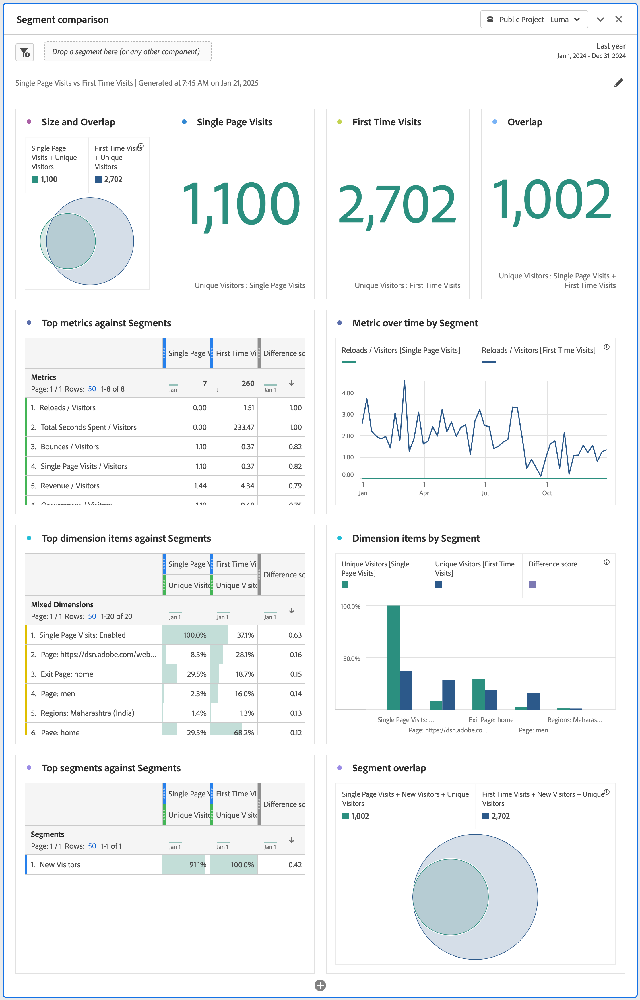

# 세그먼트 비교 패널 개요 {#segment-comparison-overview}

<!-- markdownlint-disable MD034 -->

>[!CONTEXTUALHELP]
>id="workspace_segmentcomparison_button"
>title="세그먼트 비교"
>abstract="모든 데이터 포인트에서 두 세그먼트를 빠르게 비교하여 관련 차이점을 자동으로 찾습니다."

<!-- markdownlint-enable MD034 -->

<!-- markdownlint-disable MD034 -->

>[!CONTEXTUALHELP]
>id="workspace_segmentcomparison_panel"
>title="세그먼트 비교 패널"
>abstract="모든 데이터 포인트에서 두 세그먼트를 빠르게 비교하여 관련 차이점을 자동으로 찾습니다.  **매개 변수&#x200B;** **세그먼트 추가**: 분석할 첫 번째 세그먼트입니다. **비교 대상**: 비교할 두 번째 세그먼트로서, *기타 사용자*(첫 번째 세그먼트의 역순)으로 자동으로 채워집니다. 원하는 경우 *기타 사용자*&#x200B;를 다른 세그먼트로 바꿀 수 있습니다. **고급 설정**: 세그먼트 비교에서 구성 요소를 분석으로부터 제외할 수 있는 기능입니다."
<!-- markdownlint-enable MD034 -->

>[!BEGINSHADEBOX]

_이 문서에서는_  _&#x200B;**Adobe Analytics**&#x200B;의 세그먼트 비교 패널에 대해 설명합니다._ __ _&#x200B;**Customer Journey Analytics**&#x200B;에는 동등한 패널이 없습니다._

>[!ENDSHADEBOX]

세그먼트 비교 패널은 세그먼트들(개수 제한 없음) 간의 통계적으로 가장 중요한 차이를 알아냅니다. 이 기능은 액세스 권한이 있는 모든 차원 및 지표에 대한 자동화된 분석을 반복합니다. 비교는 회사 KPI를 구동하는 대상 세그먼트의 주요 특성을 자동으로 파악하고 세그먼트들이 얼마나 많이 겹치는지 확인할 수 있도록 해 줍니다.

>[!BEGINSHADEBOX]

데모 비디오를 보려면  [세그먼트 비교](https://video.tv.adobe.com/v/33251?quality=12&learn=on&captions=kor){target="_blank"}를 확인하십시오.

>[!ENDSHADEBOX]

## 사용

**[!UICONTROL 속성]** 패널 사용 방법:

1. **[!UICONTROL 속성]** 패널을 만듭니다. 패널을 만드는 방법에 대한 자세한 내용은 [패널 만들기](../panels.md#create-a-panel)를 참조하십시오.

1. 패널의 [입력](#panel-input)을 지정합니다.

1. 패널의 [출력](#panel-output)을 확인합니다.

### 패널 입력

다음 입력 설정을 사용하여 [!UICONTROL 세그먼트 비교]를 구성할 수 있습니다.

| 입력 | 설명 |
| --- | --- |
| **[!UICONTROL 세그먼트 추가]** | 비교할 차원을 선택합니다. |
| **[!UICONTROL 비교 대상]** | 처음 선택한 세그먼트를 비교하는 데 사용할 차원을 선택합니다. 특정 세그먼트를 선택하지 않으면 기본 세그먼트인 **[!UICONTROL 기타 사용자]** 세그먼트가 사용됩니다. |
| **[!UICONTROL 고급 설정 표시 / 숨기기]** | **[!UICONTROL 고급 설정 표시]**&#x200B;를 선택하여 **[!UICONTROL 제외된 구성 요소]**&#x200B;를 구성하고, **[!UICONTROL 고급 설정 숨기기]**&#x200B;를 선택하여 **[!UICONTROL 제외된 구성 요소]**&#x200B;를 숨깁니다. |
| **[!UICONTROL 제외된 구성 요소]** | 제외할 **[!UICONTROL 차원]**, **[!UICONTROL 지표]** 또는 **[!UICONTROL 세그먼트]** 와 같은 구성 요소를 지정할 수 있습니다. <ul><li>컨테이너에서 하나 이상의 차원, 지표 또는 세그먼트를 끌어다 **[!UICONTROL 제외된 구성 요소]** 컨테이너에 놓습니다.</li><li>구성 요소를 제거하려면 유형(**[!UICONTROL 차원]** **[!UICONTROL 지표]** 또는 **[!UICONTROL 세그먼트]**)을 선택하고 를 선택하여 구성 요소를 제거합니다. 구성 요소를 모두 제거하려면 **[!UICONTROL 모두 지우기]**&#x200B;를 선택합니다.</li><li>현재 선택한 차원, 지표 및 세그먼트를 기본값으로 설정하려면 **[!UICONTROL 기본값으로 설정]**&#x200B;을 선택합니다.</li></ul> |

패널을 빌드하려면 **[!UICONTROL 빌드]**&#x200B;를 선택합니다.

### 패널 출력

Adobe Analytics에서 원하는 두 세그먼트에 대한 분석을 완료하면 출력 패널에 몇 가지 시각화가 표시됩니다.

| 시각화 | 설명 |
|---|---|
| **[!UICONTROL 크기 및 겹치기]** | 선택된 각 세그먼트의 상대적 크기와 서로 겹치는 정도를 [벤](/help/analyze/analysis-workspace/visualizations/venn.md) 시각화를 사용하여 나타냅니다. |
| **[!UICONTROL 첫 번째 세그먼트의 고유 방문자]** | 첫 번째 세그먼트(단일 페이지 방문 횟수 예에서)에 대한 고유 방문자를 보여주는 [요약 번호](/help/analyze/analysis-workspace/visualizations/summary-number-change.md) 시각화 |
| **[!UICONTROL 두 번째 세그먼트의 고유 방문자]** | 두 번째 세그먼트(첫 번째 방문 예에서)에 대한 고유 방문자를 보여주는 [요약 번호](/help/analyze/analysis-workspace/visualizations/summary-number-change.md) 시각화 |
| **[!UICONTROL 세그먼트에 대한 상위 지표]** | 선택한 세그먼트에 대한 주요 지표를 보여 주는 [자유 형식 테이블](/help/analyze/analysis-workspace/visualizations/freeform-table/freeform-table.md). |
| **[!UICONTROL 세그먼트별 시간 경과에 따른 지표]** | 선택된 세그먼트에 대한 시간 경과 지표를 보여 주는 [라인](/help/analyze/analysis-workspace/visualizations/line.md) 시각화. |
| **[!UICONTROL 세그먼트에 대한 상위 차원 항목]** | 선택된 세그먼트에 대한 혼합 차원 항목을 보여 주는 [자유 형식 테이블](/help/analyze/analysis-workspace/visualizations/freeform-table/freeform-table.md). |
| **[!UICONTROL 세그먼트별 차원 항목]** | 세그먼트별 차원 항목을 보여 주는 [가로 막대](/help/analyze/analysis-workspace/visualizations/horizontal-bar.md) 시각화. |
| **[!UICONTROL 세그먼트에 대한 상위 세그먼트]** | 세그먼트에 대한 상위 세그먼트를 보여 주는 [자유 형식 테이블](/help/analyze/analysis-workspace/visualizations/freeform-table/freeform-table.md). |
| **[!UICONTROL 세그먼트 겹치기]** | 세그먼트가 겹치는 부분을 보여 주는 [ 벤](/help/analyze/analysis-workspace/visualizations/venn.md) 시각화. |

을 사용하여 패널을 재구성하고 재작성합니다.

<!--
#### Size and overlap

Illustrates the comparative sizes of each selected segment and how much they overlap with each other using a venn diagram. You can hover over the visual to see how many visitors were in each overlapping or non-overlapping section. You can also right click on the overlap to create a brand new segment for further analysis. If the two segments are mutually exclusive, no overlap is shown between the two circles (typically seen with segments using a hit container).

#### Population summaries

To the right of the Size and Overlap visualization, the total unique visitor count in each segment and overlap is shown.

#### Top metrics

Displays the most statistically significant metrics between the two segments. Each row in this table represents a differentiating metric, ranked by how different it is between each segment. A difference score of 1 means it is statistically significant, while a difference score of 0 means there is no statistical significance.

This visualization is similar to freeform tables in Analysis Workspace. If deeper analysis on a specific metric is desired, hover over a line item and click 'Create visual'. A new table is created to analyze that specific metric. If a metric is irrelevant to your analysis, hover over the line item and click the 'X' to remove it.

>[!NOTE]
>
>Metrics added to this table after the segment comparison has finished do not receive a Difference Score.

#### Metric over time by segment

To the right of the metrics table is a linked visualization. You can click a line item in the table on the left, and this visualization updates to show that metric trended over time.

#### Top dimensions

Shows the most statistically significant dimension items across all of your dimensions. Each row shows the percentage of each segment exhibiting this dimension item. For example, this table might reveal that 100% of visitors in 'Segment A' had the dimension item 'Browser Type: Google', whereas only 19.6% of 'Segment B' had this dimension item. A difference score of 1 means it is statistically significant, while a difference score of 0 means there is no statistical significance.

This visualization is similar to freeform tables in Analysis Workspace. If deeper analysis on a specific dimension item is desired, hover over a line item and click 'Create visual'. A new table is created to analyze that specific dimension item. If a dimension item is irrelevant to your analysis, hover over the line item and click the 'X' to remove it.

>[!NOTE]
>
>Dimension items added to this table after the segment comparison has finished do not receive a Difference Score.

#### Dimension items by segment

To the right of the dimensions table is a linked bar chart visualization. It shows all displayed dimension items in a bar chart. Clicking a line item in the table on the left updates the visualization on the right.

#### Top segments

Shows which other segments (other than the two segments selected for comparison) have statistically significant overlap. For example, this table can show that a third segment, 'Repeat Visitors', overlaps highly with 'Segment A' but does not overlap with 'Segment B'. A difference score of 1 means it is statistically significant, while a difference score of 0 means there is no statistical significance.

This visualization is similar to freeform tables in Analysis Workspace. If deeper analysis on a specific segment is desired, hover over a line item and click 'Create visual'. A new table is created to analyze that specific segment. If a segment is irrelevant to your analysis, hover over the line item and click the 'X' to remove it.

>[!NOTE]
>
>Segments added to this table after the segment comparison has finished do not receive a Difference Score.

#### Segment overlap

To the right of the segments table is a linked venn diagram visualization. It shows the most statistically significant segment applied to your compared segments. For example, 'Segment A' + 'Statistically significant segment' vs. 'Segment B' + 'Statistically significant segment'. Clicking a segment line item in the table on the left updates the venn diagram on the right.

-->
