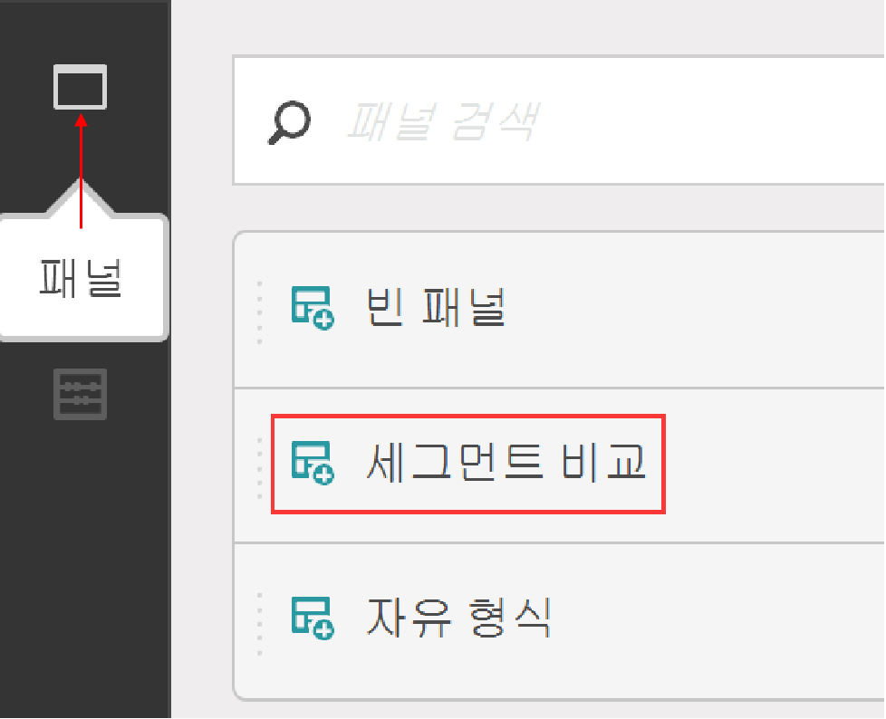
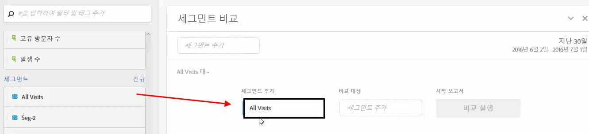
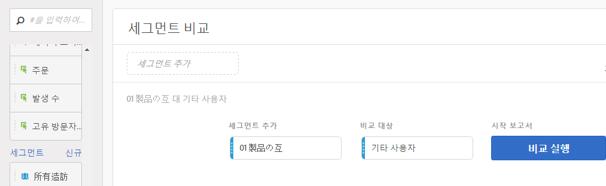
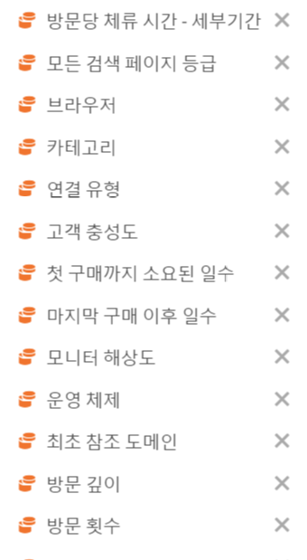
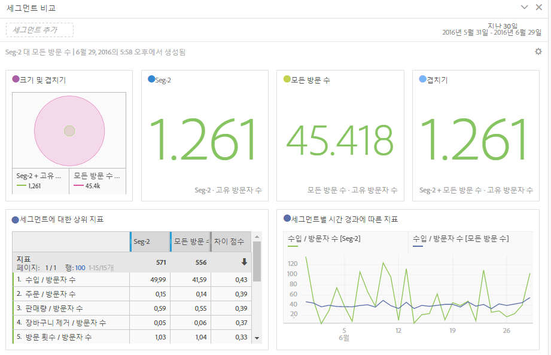

# 세그먼트 비교 패널 개요

세그먼트 비교 패널은 제한 없는 세그먼트 [간에 통계적으로 가장 중요한](../../segment-iq.md) 차이점을 검색하는 세그먼트 IQ의 도구 부분입니다. 이 기능은 액세스 권한이 있는 모든 차원 및 지표에 대한 자동화된 분석을 통해 반복됩니다. Adobe Marketing Cloud는 회사의 KPI를 유도하는 고객 세그먼트의 주요 특성을 자동으로 분석하여 어떤 세그먼트가 겹치는 정도를 파악할 수 있도록 해줍니다.

## 세그먼트 비교 패널 만들기

1. Adobe ID [자격 증명을 사용하여 Experiencecloud.adobe.com](https://experiencecloud.adobe.com) 에 로그인합니다.
1. 오른쪽 상단에 있는 9제곱아이콘을 클릭한 다음 컬러 Analytics 로고를 클릭합니다.
1. 상단 탐색 막대에서 [작업 영역]을 클릭합니다.
1. '새 프로젝트 만들기' 버튼을 클릭합니다.
1. 모달 팝업에서 '빈 프로젝트'가 선택되어 있는지 확인하고 만들기를 클릭합니다.
1. 왼쪽의 패널 단추를 클릭한 다음 자동으로 생성된 자유 형식 테이블 패널 위나 아래에 세그먼트 비교 패널을 드래그합니다.

   

1. 비교할 세그먼트를 선택한 후 패널에 놓습니다.

   

   세그먼트를 패널로 드래그하면 Analytics에서 선택한 세그먼트에 [!UICONTROL 없는 모든 사람이 포함된] '다른 모든 사람의 세그먼트'를 자동으로 만듭니다. 비교 패널에서 자주 사용되는 세그먼트이지만 자유롭게 제거하고 다른 세그먼트를 비교할 수 있습니다.

   

1. 비교할 두 개의 세그먼트를 결정했으면 빌드를 [!UICONTROL 클릭합니다].

   이 작업은 선택한 두 세그먼트와 모든 차원, 지표 및 기타 세그먼트 간의 통계적 차이를 찾는 백엔드 프로세스를 시작합니다. 패널 맨 위의 진행률 표시줄은 모든 지표 및 차원이 분석될 때까지 남은 시간을 나타냅니다. 가장 자주 사용되는 지표, 차원 및 세그먼트는 먼저 실행되도록 우선 순위가 지정되므로 가장 연관성 있는 결과가 적시에 반환됩니다.

## 비교에서 구성 요소 제외

때때로 세그먼트 비교에서 일부 차원, 지표 또는 세그먼트를 제외하는 것이 좋습니다. 예를 들어 '미국 모바일 사용자' 세그먼트를 '독일 모바일 사용자'와 비교하려고 합니다. 이러한 세그먼트는 이미 이러한 차이점을 의미하므로 지리적 위치 관련 차원을 포함시키는 것은 적합하지 않습니다.

1. 원하는 두 개의 세그먼트가 패널에 있으면 [!UICONTROL '고급 옵션 표시'를 클릭합니다].
1. Drag and drop components you want to exclude into the [!UICONTROL Excluded Components] panel.

   

모든 향후 세그먼트 비교에서 현재 구성 요소를 자동으로 제외하려면 [!UICONTROL '기본값으로] 설정'을 클릭합니다. 제외된 구성 요소를 편집하려면 구성 요소 유형을 클릭한 다음 구성 요소 옆에 있는 'X'를 클릭하여 분석에 다시 포함합니다. 세그먼트 비교에 모든 구성 요소를 다시 포함하려면 '모두 지우기'를 클릭합니다.

## 세그먼트 비교 보고서 보기

Adobe에서 원하는 두 세그먼트 분석을 완료하면 몇 가지 시각화를 통해 결과를 표시합니다.

### 크기 및 겹치기

선택한 각 세그먼트의 비교 크기와 벤 다이어그램을 사용하여 서로 겹치는 정도를 보여 줍니다. 시각화 위로 커서를 놓으면 겹치거나 겹치지 않는 섹션에 포함된 방문자 수를 알 수 있습니다. 또한 추가 분석을 위해 겹치는 부분을 마우스 오른쪽 버튼으로 클릭하여 완전히 새로운 세그먼트를 생성할 수도 있습니다. 두 세그먼트가 상호 배타적인 경우 두 서클 사이에 겹치지 않습니다(일반적으로 히트 컨테이너를 사용하는 세그먼트에서 표시).

### 인구 요약

크기 및 겹치기 시각화의 오른쪽에 각 세그먼트에서 총 고유 방문자 수와 겹치는 방문자 수가 표시됩니다.

### 주요 지표

두 세그먼트 간에 통계적으로 가장 중요한 지표를 표시합니다. 이 테이블의 각 행은 차이 지표를 각 세그먼트 간 차이 크기 순서대로 표시합니다. 차이 점수가 1이면 통계적으로 유의미한 반면, 차이 점수가 0이면 통계적 중요성이 없다는 것을 의미합니다.

이 시각화는 분석 작업 공간의 자유 형식 테이블과 유사합니다. 특정 지표에 대한 심층적인 분석이 필요한 경우 라인 항목 위로 마우스를 가져간 후 '시각적 만들기'를 클릭합니다. 특정 지표를 분석하기 위해 새 테이블이 만들어집니다. 지표가 분석과 관련이 없는 경우 라인 항목 위로 마우스를 가져간 후 'X'를 클릭하여 제거합니다.

> [!NOTE] 세그먼트 비교가 완료된 후 이 표에 추가된 지표는 차이 점수를 받지 않습니다.

### 세그먼트별 시간 경과에 따른 지표

지표 테이블 오른쪽에는 연결된 시각화가 표시됩니다. 왼쪽의 표에 있는 라인 항목을 클릭하면 이 시각화가 업데이트되어 시간에 따른 지표 트렌드를 표시합니다.

### 상위 차원

모든 차원에서 통계적으로 가장 중요한 차원 값을 표시합니다. 각 행은 이 차원 값을 표시하는 각 세그먼트의 백분율을 보여줍니다. 예를 들어, 이 표에는 '세그먼트 A'의 방문자 100%에 '브라우저 유형:반면 '세그먼트 B'의 19.6%만이 이 차원 항목을 가지고 있었습니다. 차이 점수가 1이면 통계적으로 유의미한 반면, 차이 점수가 0이면 통계적 중요성이 없다는 것을 의미합니다.

이 시각화는 분석 작업 공간의 자유 형식 테이블과 유사합니다. 특정 차원 값에 대한 심층적인 분석을 원하는 경우 라인 항목 위로 마우스를 가져간 후 '시각적 만들기'를 클릭합니다. 특정 차원 값을 분석하기 위해 새 테이블이 생성됩니다. 차원 값이 분석과 관련이 없는 경우 라인 항목 위로 마우스를 가져간 후 'X'를 클릭하여 제거합니다.

> [!NOTE] 세그먼트 비교가 완료된 후 이 표에 추가된 차원 값은 차이 점수를 받지 않습니다.

### 세그먼트별 차원 항목

차원 테이블 오른쪽에는 연결된 막대 차트 시각화가 있습니다. 막대 차트에 표시된 모든 차원 값이 표시됩니다. 왼쪽의 표에서 라인 항목을 클릭하면 오른쪽의 시각화가 업데이트됩니다.

### 주요 세그먼트

비교를 위해 선택한 두 세그먼트 이외의 다른 세그먼트가 통계적으로 유의한 겹치는 것을 보여줍니다. 예를 들어 이 표에는 세 번째 세그먼트인 '반복 방문자'가 '세그먼트 A'와 겹치지만 '세그먼트 B'와 겹치지 않는다는 것을 알 수 있습니다. 차이 점수가 1이면 통계적으로 유의미한 반면, 차이 점수가 0이면 통계적 중요성이 없다는 것을 의미합니다.

이 시각화는 분석 작업 공간의 자유 형식 테이블과 유사합니다. 특정 세그먼트에 대한 심층적인 분석이 필요한 경우 라인 항목 위로 마우스를 가져간 후 '시각적 만들기'를 클릭합니다. 특정 세그먼트를 분석하기 위해 새 테이블이 만들어집니다. 세그먼트가 분석과 관련이 없는 경우 라인 항목 위로 마우스를 가져간 후 'X'를 클릭하여 제거합니다.

> [!NOTE] 세그먼트 비교가 완료된 후 이 표에 추가된 세그먼트는 차이 점수를 받지 않습니다.

### 세그먼트 오버랩

세그먼트 테이블 오른쪽에는 연결된 벤 다이어그램 시각화가 있습니다. 비교된 세그먼트에 가장 통계적으로 유의한 세그먼트를 보여줍니다. 예를 들어 '세그먼트 A' + '통계적으로 유의한 세그먼트'와'세그먼트 B' + '통계적으로 유의한 세그먼트'. 왼쪽 테이블의 세그먼트 라인 항목을 클릭하면 오른쪽의 벤 다이어그램이 업데이트됩니다.

