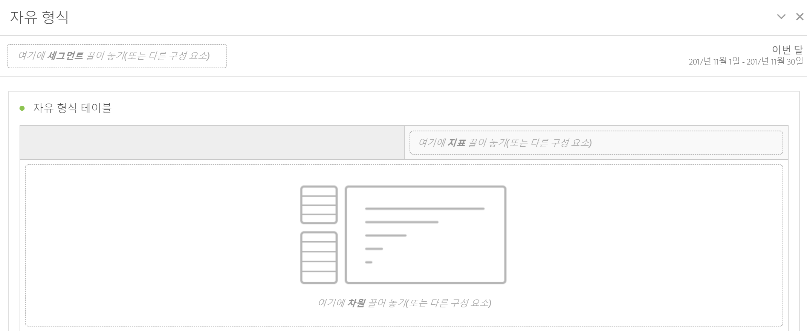

# 자유 형식 패널

>[!BEGINSHADEBOX]

_이 문서에서는_  _**Adobe Analytics**&#x200B;의 자유 형식 패널에 대해 설명합니다._ _이 문서의_  _**Customer Journey Analytics** 버전은 [자유 형식 패널](/help/analyze/analysis-workspace/c-panels/freeform-panel.md)을 참조하십시오._

>[!ENDSHADEBOX]

**[!UICONTROL 자유 형식 패널]**&#x200B;은 기본 시작 상태로 [자유 형식 테이블](/help/analyze/analysis-workspace/visualizations/freeform-table/freeform-table.md) 시각화가 있는 빈 패널입니다.

## 사용

**[!UICONTROL 자유 형식 패널]**&#x200B;을 사용하는 방법:

1. **[!UICONTROL 자유 형식 패널]**&#x200B;을 만듭니다. 패널을 만드는 방법에 대한 자세한 내용은 [패널 만들기](panels.md#create-a-panel)를 참조하십시오.

   

1. [Analytics 구성 요소 안내서](/help/components/home.md) 자유 형식 패널에 구성 요소를 추가하는 방법 및 [자유 형식 테이블](/help/analyze/analysis-workspace/visualizations/freeform-table/freeform-table.md) 시각화를 참조하십시오.

>[!MORELIKETHIS]
>
>[패널 만들기](/help/analyze/analysis-workspace/c-panels/panels.md#create-a-panel)
>>[Analytics 구성 요소 안내서](/help/components/home.md)
>>[자유 형식 테이블 시각화](/help/analyze/analysis-workspace/visualizations/freeform-table/freeform-table.md)
>
