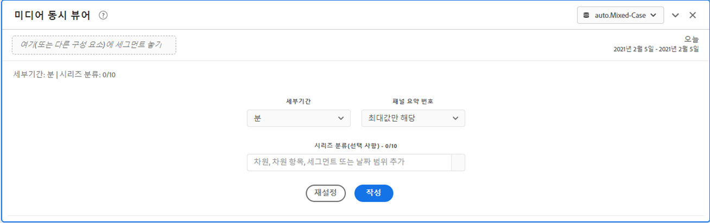
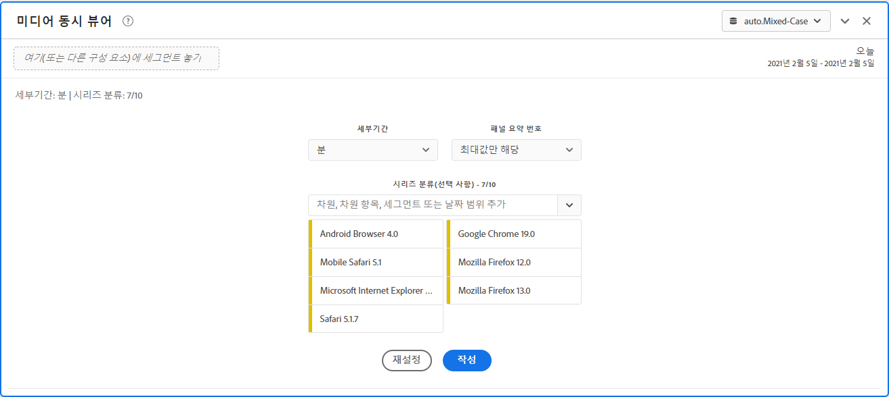
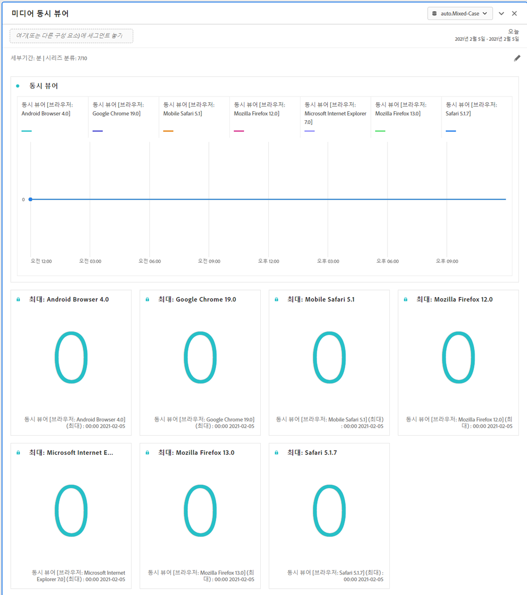
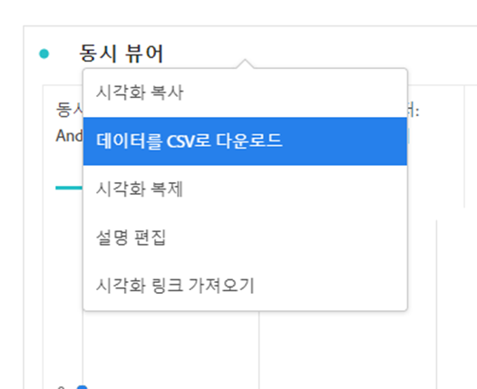

# 미디어 동시 뷰어 패널

Media Analytics 고객은 동시 시청자를 분석하여 최대 동시 시청 시간 발생 위치 또는 시청 감소 발생 위치를 파악하여 콘텐츠 품질 및 시청자 참여에 대한 귀중한 통찰력을 제공하고 볼륨 또는 규모에 대한 문제 해결 또는 계획에 도움을 줄 수 있습니다.

Analysis Workspace에서 동시 뷰어는 세션 수에 관계없이 특정 시점에 미디어 스트림을 보는 고유 방문자 수입니다.

미디어 동시 뷰어 패널을 사용하면 최대 동시 시청에 대한 세부 정보와 분류 및 비교 기능을 통해 시간에 따른 동시 시청자를 분석할 수 있습니다.  미디어 동시 뷰어 패널에 액세스하려면 Media Analytics 구성 요소가 활성화된 보고서 세트로 이동합니다. 그런 다음 맨 왼쪽에 있는 패널 아이콘을 클릭하고 패널을 Analysis Workspace 프로젝트로 끌어옵니다.

## 패널 입력 {#Input}

다음 입력 설정을 사용하여 미디어 동시 뷰어 패널을 구성할 수 있습니다.

| 설정 | 설명 |
|---|---|
| 패널 날짜 범위 | 패널 날짜 범위 기본값은 오늘입니다.  단 하루 또는 여러 달이 보이도록 편집할 수 있습니다.    이 시각화는 1440개의 데이터 행으로 제한됩니다 (예: 분 단위 세부 기간에서 24시간).  날짜 범위와 세부 기간 조합의 결과 행이 1440개를 초과하는 경우 전체 날짜 범위를 수용하도록 세부 기간이 자동으로 업데이트됩니다. |
| 세부기간 | 세부 기간 기본값은 분입니다.    이 시각화는 1440개의 데이터 행으로 제한됩니다 (예: 분 단위 세부 기간에서 24시간).  날짜 범위와 세부 기간 조합의 결과 행이 1440개를 초과하는 경우 전체 날짜 범위를 수용하도록 세부 기간이 자동으로 업데이트됩니다. |
| 패널 요약 번호 | 동시 시청자의 날짜 또는 시간 세부 정보를 보려면 요약 번호를 사용할 수 있습니다. 최대값은 최대 동시 시청에 대한 세부 정보를 표시합니다. 최소값은 저점에 대한 세부 정보를 보여줍니다.  패널 기본값은 최대값만 표시하지만 최소값 또는 최대값과 최소값을 모두 표시하도록 변경할 수 있습니다.  분류를 사용하는 경우 각각에 대한 요약 번호가 표시됩니다. |
| 시리즈 분류 | 필요에 따라 세그먼트, 차원, 차원 항목 또는 날짜 범위별로 시각화를 분류할 수 있습니다.   - 한 번에 최대 10개의 줄을 볼 수 있습니다. 분류는 단일 수준으로 제한됩니다.  - 차원을 끌어오면 선택한 패널 날짜 범위를 기반으로 최상위 차원 항목이 자동으로 선택됩니다.  - 날짜 범위를 비교하려면 2개 이상의 날짜 범위를 시리즈 분류 필터로 끌어옵니다. |

### 기본 보기

### 시리즈 분류 보기

## 패널 출력 {#Output}

미디어 동시 뷰어 패널은 최대 및/또는 최소 동시 시청자에 대한 세부 정보를 포함하는 꺾은선형 차트 및 요약 번호를 반환합니다.  패널 맨 위에는 선택한 패널 설정을 알려주는 요약 줄이 제공됩니다.

언제든지 오른쪽 상단의 편집 연필을 클릭하여 패널을 수정하고 다시 만들 수 있습니다.

시리즈 분류를 선택한 경우 꺾은선형 차트에 선과 요약 번호가 각각 표시됩니다.

### 데이터 소스

이 패널에서 사용할 수 있는 유일한 지표는 동시 뷰어입니다.

| 지표 | 설명 |
|---|---|
| 동시 뷰어 | 세션 수에 관계없이 특정 시점에 미디어 스트림을 시청하는 고유 방문자의 수입니다.  동시 활성 세션을 사용하는 보고서 섹션의 동시 뷰어 보고와 다릅니다.  고유 방문자 계정을 사용하면 표시 경계 (세션이 종료되고 동시에 시작되는 위치)에서 원하지 않는 급등을 제거할 수 있습니다. |

이 보기에서는 자유 형식 테이블을 사용할 수 없습니다.  데이터 소스를 보려면 꺾은선형 차트를 마우스 오른쪽 버튼으로 클릭하고 .csv 파일로 다운로드할 수 있습니다.  시리즈 분류가 포함됩니다.

## FAQ {#FAQ}

| 질문 | 답변 |
|---|---|
| 자유 형식 테이블은 어디에 있습니까? 데이터 소스는 어떻게 볼 수 있습니까? | 이 보기에서는 자유 형식 테이블을 사용할 수 없습니다.  꺾은선형 차트를 마우스 오른쪽 버튼으로 클릭하고 CSV 파일을 다운로드하여 데이터 소스를 다운로드할 수 있습니다. |
| 세부 기간이 변경된 이유는 무엇입니까? | 이 시각화는 1440개의 데이터 행으로 제한됩니다 (예: 분 단위 세부 기간에서 24시간).  날짜 범위와 세부 기간 조합의 결과 행이 1440개를 초과하는 경우 전체 날짜 범위를 수용하도록 세부 기간이 자동으로 업데이트됩니다.  큰 날짜 범위에서 작은 날짜 범위로 변경하는 경우 날짜 범위가 변경되면 세부 기간이 허용되는 가장 낮은 세부 항목으로 업데이트됩니다. 더 높은 수준의 세부 기간으로 보려면 패널을 편집하고 다시 빌드하십시오. |
| 비디오 이름, 세그먼트, 콘텐츠 유형 등을 어떻게 비교합니까? | 단일 시각화에서 이들을 비교하려면 시리즈 분석 필터에서 세그먼트, 차원 또는 특정 차원 항목을 끌어옵니다.  보기는 10개의 분류로 제한됩니다.  10개 이상을 보려면 여러 패널을 사용해야 합니다. |
| 날짜 범위는 어떻게 비교합니까? | 단일 시각화에서 날짜 범위를 비교하려면 2개 이상의 날짜 범위를 끌어서 시리즈 분류를 사용합니다.  이러한 날짜 범위는 패널 날짜 범위보다 우선 적용됩니다. |
| 시각화 유형은 어떻게 변경합니까? | 이 패널은 시계열에 대한 선 시각화만 허용합니다. |
| 예외 항목 탐지를 실행할 수 있습니까? | 아니요.  이 패널에서는 예외 항목 탐지를 사용할 수 없습니다. |
| 활성 세션 대신 고유 방문자를 사용하는 이유는 무엇입니까? | 고유 방문자를 사용하면 표시 경계 (세션이 종료되고 동시에 시작되는 위치)에서 원하지 않는 급등을 제거할 수 있습니다. |
| 분 단위보다 세부 기간 수준이 높은 동시 시청자가 있다는 것은 무엇을 의미합니까? | 세부 기간이 1분보다 큰 경우, 동시 시청자는 해당 시간 범위 내의 모든 분에 대한 고유 동시 시청자의 합계입니다.  예를 들어, 시간 수준 세부 기간에서 동시 시청자 수는 시간 내의 모든 분에 대한 고유 동시 시청자의 합계입니다. |
| 분 수준 세부 기간으로 하루 이상을 확인하고 싶은 경우 어떻게 해야 합니까? | 분 수준 세부 기간으로 한 번에 최대 1개월의 데이터에 액세스하려면 Analytics 2.0 API를 사용할 수 있습니다. 자세한 내용은[Analytics 2.0 API를 사용하여 동시 뷰어 JSON 보고서 데이터 가져오기](https://docs.adobe.com/content/help/ko-KR/media-analytics/using/media-reports/media-default-reports/get-concurrent-json20.html)를 참조하십시오. |
| Workspace 패널에 동시 뷰어 보고서와 동일한 정보가 표시됩니까? | 아니요.  Analysis Workspace에서 동시 뷰어는 세션 수에 관계없이 특정 시점에 미디어 스트림을 시청하는 고유 방문자 수로 정의됩니다.  동시 활성 세션을 사용하는 보고서 섹션의 동시 뷰어 보고와 다릅니다.  고유 방문자 계정을 사용하면 표시 경계 (세션이 종료되고 동시에 시작되는 위치)에서 원하지 않는 급등을 제거할 수 있습니다. |

<!-- For more information about Media Concurrent Viewers, visit [MA doc page]( https://url). -->
