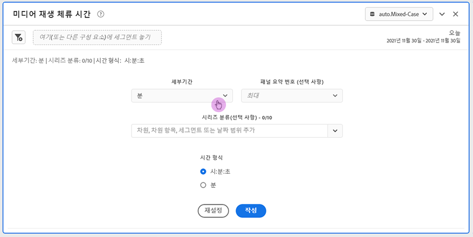
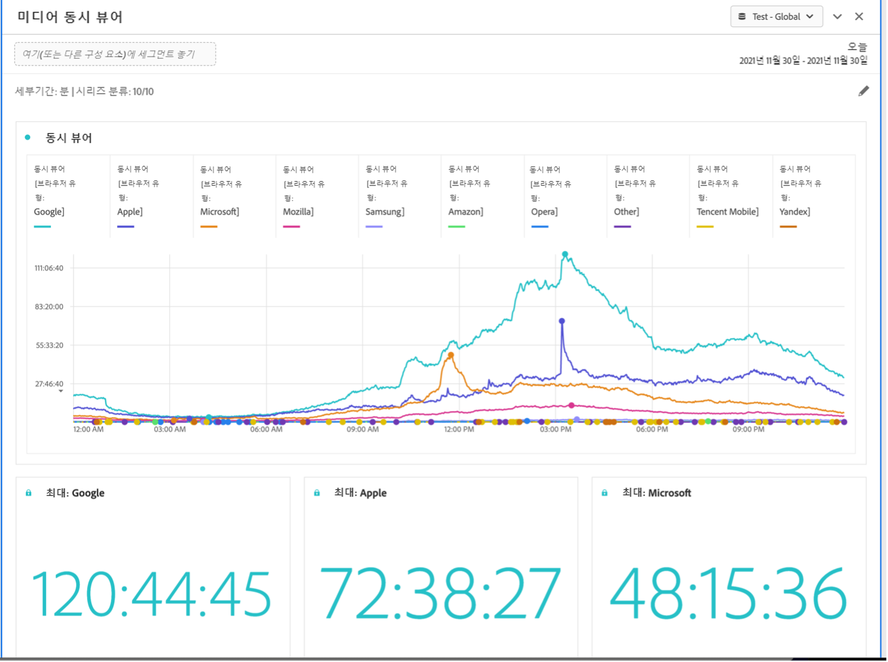

# 미디어 재생 소요 시간 패널

Media Analytics 고객은 재생 시간을 분석하여 최대 동시 시청 시간 발생 위치 또는 시청 감소 발생 위치를 파악하여 콘텐츠 품질 및 시청자 참여에 대한 귀중한 통찰력을 제공하고 볼륨 또는 규모에 대한 문제 해결 또는 계획에 도움을 줄 수 있습니다.

Analysis Workspace에서 재생 소요 시간은 특정 시점에서 미디어 스트림을 시청하는 데 소요된 시간이며 일시 중지, 버퍼 및 시작 시간을 포함합니다.

미디어 재생 소요 시간은 최대 동시 시청과 분류 및 비교 기능에 대한 세부 정보와 함께 시간 경과에 따른 재생을 분석할 수 있습니다. 미디어 재생 소요 시간 패널에 액세스하려면 Media Analytics 구성 요소가 활성화된 보고서 세트로 이동하십시오. 그런 다음 맨 왼쪽에 있는 패널 아이콘을 클릭하고 패널을 Analysis Workspace 프로젝트로 끌어옵니다.

이 패널에는 달력의 새로운 기능도 포함되어 있어 24시간 미만을 선택하고 표시할 수 있습니다. 전체 패널에 대해 이를 수행하거나 연속 기간을 사용하여 세그먼트를 만들어 프로그램 또는 프로그램 섹션 전반의 시청률 리드인/리드아웃을 추적할 수 있습니다. 해당 날짜 세그먼트 중 두 개 이상을 배치하면 공통 x축으로 시작하는 선을 오버레이하거나 특정 x축으로 시작하는 선을 순차적으로 표시할 수 있는 날짜 시퀀스 표시에 대한 라디오 버튼 옵션이 표시됩니다.

## 패널 입력 {#Input}

다음 입력 설정을 사용하여 미디어 재생 소요 시간 패널을 구성할 수 있습니다.

| 설정 | 설명 |
|---|---|
| 패널 날짜 범위 | 패널 날짜 범위 기본값은 오늘입니다. 단 하루 또는 여러 달이 보이도록 편집할 수 있습니다. 이 시각화는 1440개의 데이터 행으로 제한됩니다(예: 분 단위 세부 기간에서 24시간). 날짜 범위와 세부 기간 조합의 결과 행이 1440개를 초과하는 경우 전체 날짜 범위를 수용하도록 세부 기간이 자동으로 업데이트됩니다. |
| 세부기간 | 세부 기간 기본값은 분입니다. 이 시각화는 1440개의 데이터 행으로 제한됩니다(예: 분 단위 세부 기간에서 24시간). 날짜 범위와 세부 기간 조합의 결과 행이 1440개를 초과하는 경우 전체 날짜 범위를 수용하도록 세부 기간이 자동으로 업데이트됩니다. |
| 패널 요약 번호 | 재생 소요 시간의 날짜 또는 시간 세부 정보를 보려면 요약 번호를 사용할 수 있습니다. 최대값은 최대 동시 시청에 대한 세부 정보를 표시합니다. 최소값은 저점에 대한 세부 정보를 보여 줍니다. 합계는 선택에 소요된 총 재생 시간을 합산합니다. 패널 기본값은 최대값만 표시하지만 최소값, 합계 또는 세 가지 조합을 표시하도록 변경할 수 있습니다. 분류를 사용하는 경우 각각에 대한 요약 번호가 표시됩니다. |
| 시리즈 분류 | 필요에 따라 세그먼트, 차원, 차원 항목 또는 날짜 범위별로 시각화를 분류할 수 있습니다.
- 한 번에 최대 10개의 줄을 볼 수 있습니다. 분류는 단일 수준으로 제한됩니다.

- 차원을 끌어오면 선택한 패널 날짜 범위를 기반으로 최상위 차원 항목이 자동으로 선택됩니다.
- 날짜 범위를 비교하려면 2개 이상의 날짜 범위를 시리즈 분류 필터로 끌어옵니다. |
| 시간 형식 | 시간:Minutes:초(기본값) 또는 분(0.5로 반올림된 정수로 표시됨)으로 소요된 재생 시간을 볼 수 있습니다. |
| 날짜 시퀀스 표시 | 두 개 이상의 날짜 범위 세그먼트를 시리즈 분류로 배치한 경우 오버레이(기본값) 또는 순차적 중에서 선택하는 옵션이 표시됩니다. 오버레이는 공통 x축으로 시작하는 선을 표시하여 병렬로 실행되는 반면, 순차적 옵션은 특정 x축으로 시작하는 선을 표시합니다. 데이터가 정렬되면(예: 세그먼트 1이 오후 8시 44분에 끝나고 세그먼트 2가 오후 8시 45분에 시작됨) 선이 순차적으로 표시됩니다. |

### 기본 보기

## 패널 출력 {#Output}

미디어 재생 소요 시간 패널은 최대, 최소 및/또는 소요 재생 시간 합계에 대한 세부 정보를 포함하는 라인 차트와 요약 번호를 반환합니다. 패널 맨 위에는 선택한 패널 설정을 알려 주는 요약 줄이 제공됩니다.

언제든지 오른쪽 상단의 편집 연필을 클릭하여 패널을 수정하고 다시 만들 수 있습니다.

시리즈 분류를 선택한 경우 꺾은선형 차트에 선과 요약 번호가 각각 표시됩니다.

### 데이터 소스

이 패널에서 사용할 수 있는 유일한 지표는 재생 시간입니다.

| 지표 | 설명 |
|---|---|
| 재생 소요 시간 | 일시 중지, 버퍼 및 시작 시간을 포함하여 선택한 세부 기간 동안 시청한 콘텐츠의 총 시간:minutes:초(또는 분)입니다. |

## FAQ {#FAQ}

| 질문 | 답변 |
|---|---|
| 자유 형식 테이블은 어디에 있습니까? 데이터 소스는 어떻게 볼 수 있습니까? | 

이 보기에서는 자유 형식 테이블을 사용할 수 없습니다. 라인 차트를 마우스 오른쪽 버튼으로 클릭하고 CSV 파일을 다운로드하여 데이터 소스를 다운로드할 수 있습니다.
 |
| 
세부 기간이 변경된 이유는 무엇입니까?
 | 
이 시각화는 1440개의 데이터 행으로 제한됩니다(예: 분 단위 세부 기간에서 24시간). 날짜 범위와 세부 기간 조합의 결과 행이 1440개를 초과하는 경우 전체 날짜 범위를 수용하도록 세부 기간이 자동으로 업데이트됩니다.

큰 날짜 범위에서 작은 날짜 범위로 변경하는 경우 날짜 범위가 변경되면 세부 기간이 허용되는 가장 낮은 세부 항목으로 업데이트됩니다. 더 높은 수준의 세부 기간으로 보려면 패널을 편집하고 다시 빌드하십시오.
 |
| 

비디오 이름, 세그먼트, 콘텐츠 유형 등을 어떻게 비교합니까?
 | 
단일 시각화에서 이들을 비교하려면 시리즈 분석 필터에서 세그먼트, 차원 또는 특정 차원 항목을 끌어옵니다.

보기는 10개의 분류로 제한됩니다. 10개 이상을 보려면 여러 패널을 사용해야 합니다.
 |
| 날짜 범위는 어떻게 비교합니까? | 단일 시각화에서 날짜 범위를 비교하려면 2개 이상의 날짜 범위를 끌어서 시리즈 분류를 사용합니다. 이러한 날짜 범위는 패널 날짜 범위보다 우선 적용됩니다. |
| 시각화 유형은 어떻게 변경합니까? | 

이 패널은 시계열에 대한 선 시각화만 허용합니다.
 |
| 예외 항목 탐지를 실행할 수 있습니까? | 

아니요. 이 패널에서는 예외 항목 탐지를 사용할 수 없습니다.
 |
