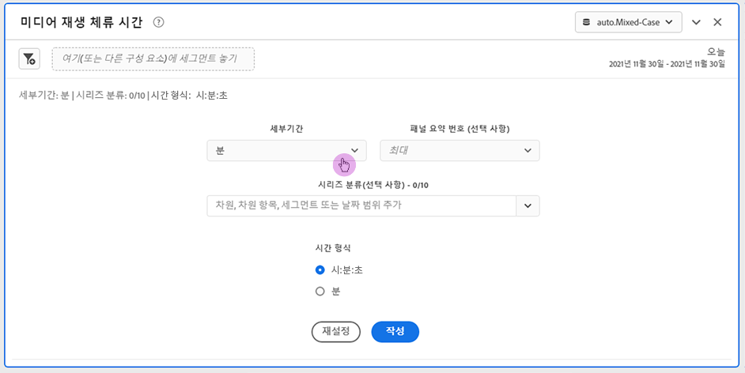
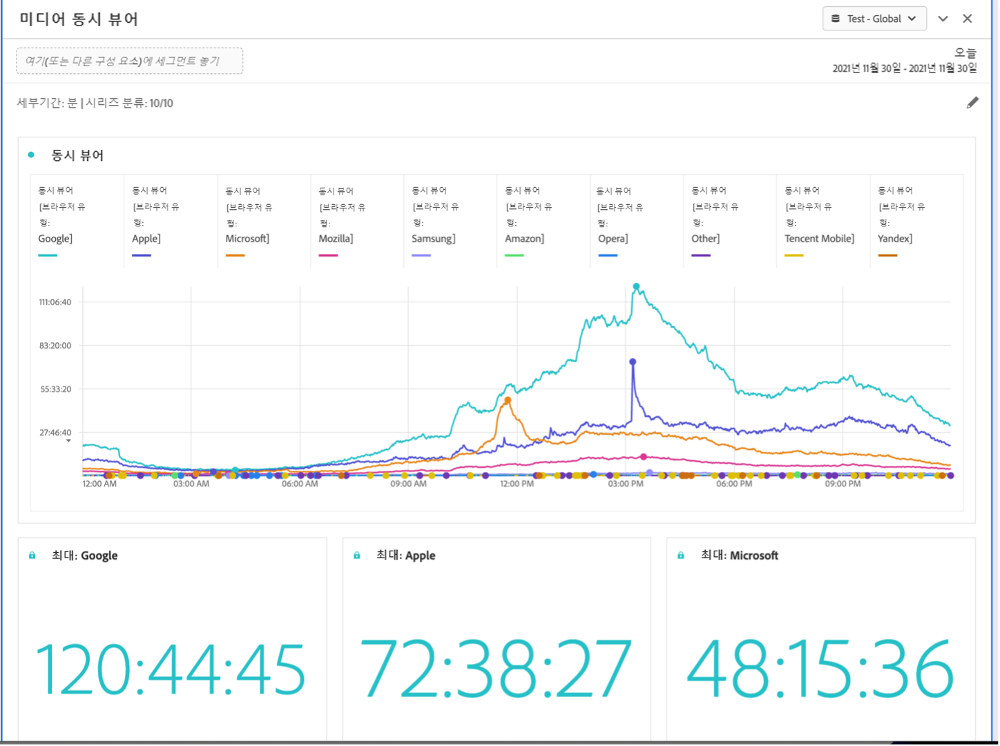

# 미디어 재생 시간 패널 입력 및 출력 {#Inputs-and-outputs}

다음 입력 및 출력 설정을 사용하여 미디어 재생 시간 패널을 사용자 지정할 수 있습니다.

## 패널 입력 {#Input}

다음 입력 설정을 사용하여 미디어 재생 소요 시간 패널을 구성할 수 있습니다.

| 설정 | 설명 |
|---|---|
| 패널 날짜 범위 | 패널 날짜 범위 기본값은 오늘입니다. 단 하루 또는 여러 달이 보이도록 편집할 수 있습니다. 이 시각화는 1440개의 데이터 행으로 제한됩니다(예: 분 단위 세부 기간에서 24시간). 날짜 범위와 세부 기간 조합의 결과 행이 1440개를 초과하는 경우 전체 날짜 범위를 수용하도록 세부 기간이 자동으로 업데이트됩니다. |
| 세부기간 | 세부 기간 기본값은 분입니다. 이 시각화는 1440개의 데이터 행으로 제한됩니다(예: 분 단위 세부 기간에서 24시간). 날짜 범위와 세부 기간 조합의 결과 행이 1440개를 초과하는 경우 전체 날짜 범위를 수용하도록 세부 기간이 자동으로 업데이트됩니다. |
| 패널 요약 번호 | 재생 소요 시간의 날짜 또는 시간 세부 정보를 보려면 요약 번호를 사용할 수 있습니다. 최대값은 최대 동시 시청에 대한 세부 정보를 표시합니다. 최소값은 저점에 대한 세부 정보를 보여 줍니다. 합계는 선택에 소요된 총 재생 시간을 합산합니다. 패널 기본값은 최대값만 표시하지만 최소값, 합계 또는 세 가지 조합을 표시하도록 변경할 수 있습니다. 분류를 사용하는 경우 각각에 대한 요약 번호가 표시됩니다. |
| 시리즈 분류 | 필요에 따라 세그먼트, 차원, 차원 항목 또는 날짜 범위별로 시각화를 분류할 수 있습니다.
- 한 번에 최대 10개의 줄을 볼 수 있습니다. 분류는 단일 수준으로 제한됩니다.

- 차원을 끌어오면 선택한 패널 날짜 범위를 기반으로 최상위 차원 항목이 자동으로 선택됩니다.
- 날짜 범위를 비교하려면 2개 이상의 날짜 범위를 시리즈 분류 필터로 끌어옵니다. |
| 시간 형식 | 시간:Minutes:초(기본값) 또는 분(0.5로 반올림된 정수로 표시됨)으로 소요된 재생 시간을 볼 수 있습니다. |
| 날짜 시퀀스 표시 | 두 개 이상의 날짜 범위 세그먼트를 시리즈 분류로 배치한 경우 오버레이(기본값) 또는 순차적 중에서 선택하는 옵션이 표시됩니다. 오버레이는 공통 x축으로 시작하는 선을 표시하여 병렬로 실행되는 반면, 순차적 옵션은 특정 x축으로 시작하는 선을 표시합니다. 데이터가 정렬되면(예: 세그먼트 1이 오후 8시 44분에 끝나고 세그먼트 2가 오후 8시 45분에 시작됨) 선이 순차적으로 표시됩니다. |

### 기본 보기

## 패널 출력 {#Output}

미디어 재생 소요 시간 패널은 최대, 최소 및/또는 소요 재생 시간 합계에 대한 세부 정보를 포함하는 라인 차트와 요약 번호를 반환합니다. 패널 맨 위에는 선택한 패널 설정을 알려 주는 요약 줄이 제공됩니다.

언제든지 오른쪽 상단의 편집 연필을 클릭하여 패널을 수정하고 다시 만들 수 있습니다.

시리즈 분류를 선택한 경우 꺾은선형 차트에 선과 요약 번호가 각각 표시됩니다.

### 데이터 소스

이 패널에서 사용할 수 있는 유일한 지표는 재생 시간입니다.

| 지표 | 설명 |
|---|---|
| 재생 소요 시간 | 일시 중지, 버퍼 및 시작 시간을 포함하여 선택한 세부 기간 동안 시청한 콘텐츠의 총 시간:minutes:초(또는 분)입니다. |
