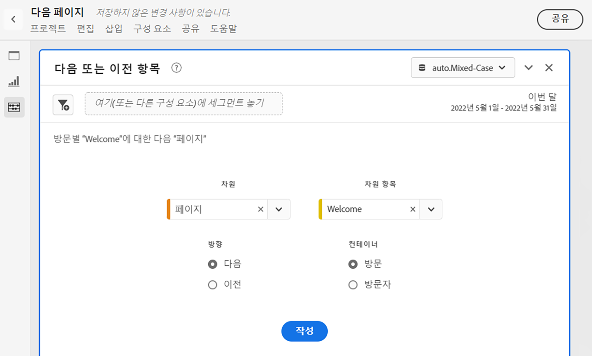
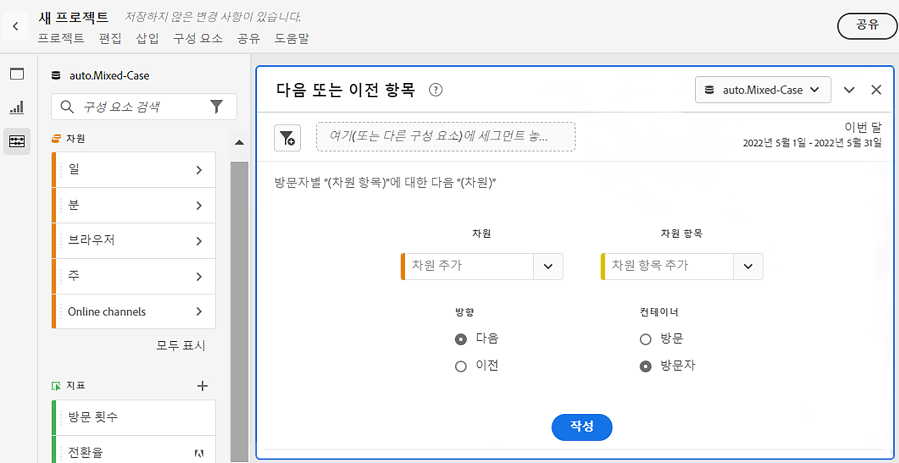
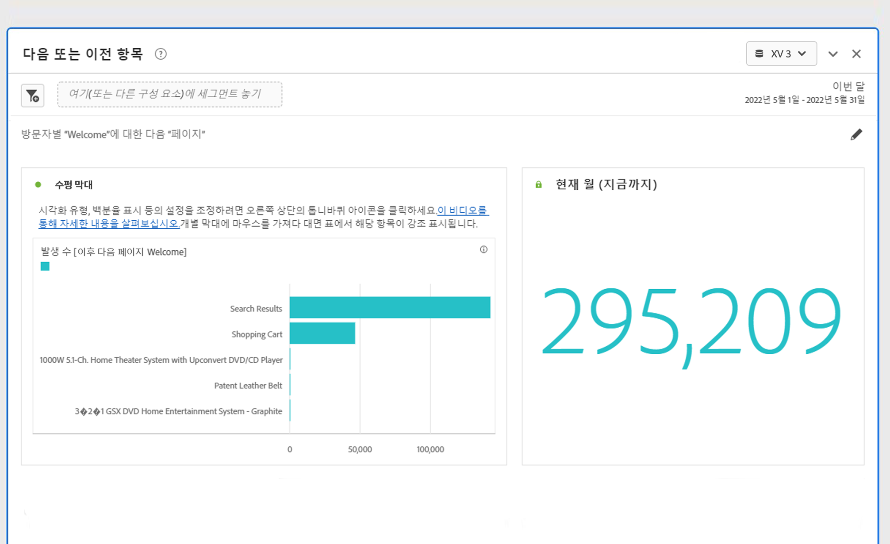
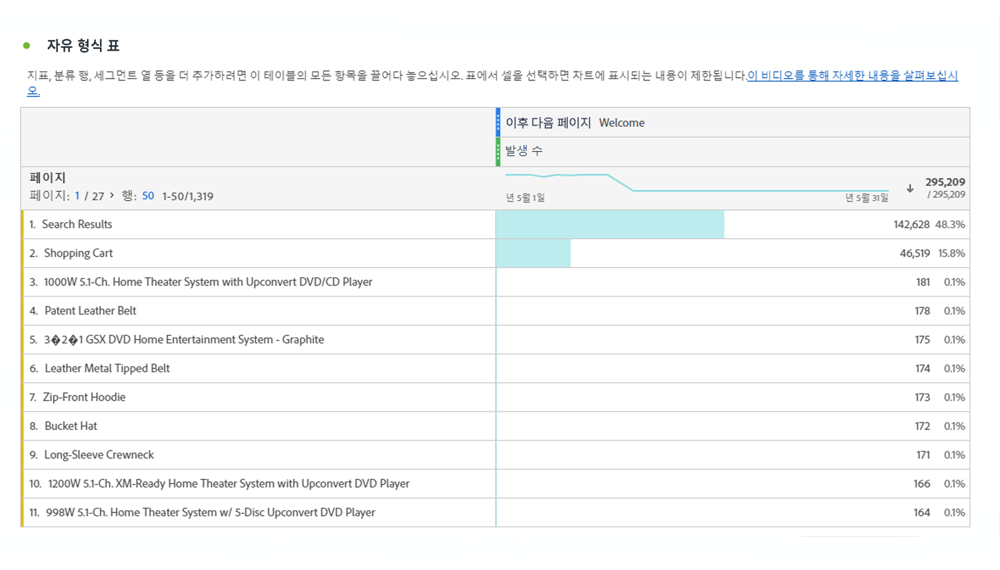

# 다음 또는 이전 항목 패널

다음 [!UICONTROL 다음 또는 이전 항목] 패널은 Reports &amp; Analytics의 [!UICONTROL 보고서] > [!UICONTROL 추천] > [!UICONTROL 다음 페이지/이전 페이지]. 이 작업 공간 패널에는 특정 차원에 대한 다음 또는 이전 차원 항목을 쉽게 식별할 수 있는 많은 표와 시각화가 포함되어 있습니다. 예,

## 패널 액세스

내에서 패널에 액세스할 수 있습니다 [!UICONTROL 보고서] 또는 [!UICONTROL 작업 공간].

| 액세스 포인트 | 설명 |
| --- | --- |
| [!UICONTROL 보고서] | <ul><li>패널이 이미 프로젝트에 드롭되었습니다.</li><li>왼쪽 레일이 축소되었습니다.</li><li>선택한 경우 [!UICONTROL 다음 페이지], 기본 설정은 이미 적용되었습니다(예: ). [!UICONTROL 페이지] 대상 [!UICONTROL Dimension]및 상단 페이지를 [!UICONTROL Dimension 항목], [!UICONTROL 다음] 대상 [!UICONTROL 방향] 및 [!UICONTROL 방문] 대상 [!UICONTROL 컨테이너]. 이러한 설정을 모두 수정할 수 있습니다.</li></ul> |
| 작업 영역 | 새 프로젝트를 만들고 왼쪽 레일에서 패널 아이콘을 선택합니다. 그런 다음 [!UICONTROL 다음 또는 이전 항목] 자유 형식 테이블 위의 패널. 다음 사항에 주의하십시오. [!UICONTROL Dimension] 및 [!UICONTROL Dimension 항목] 필드는 비어 있습니다. 드롭다운에서 차원을 선택합니다. [!UICONTROL Dimension 항목] 는 [!UICONTROL 차원] 선택하셨습니다. 상위 차원 항목이 추가되지만 다른 항목을 선택할 수 있습니다.
 |

## 패널 입력 {#Input}

을 구성할 수 있습니다 [!UICONTROL 다음 또는 이전 항목] 다음 입력 설정을 사용하는 패널:

| 설정 | 설명 |
| --- | --- |
| 세그먼트(또는 기타 구성 요소) 드롭 영역 | 세그먼트 또는 기타 구성 요소를 끌어다 놓아 패널 결과를 추가로 필터링할 수 있습니다. |
| 차원 | 다음 항목 또는 이전 항목을 탐색할 차원입니다. |
| 차원 항목 | 항목 |
| 방향 | 을 찾는지 여부를 지정합니다 [!UICONTROL 다음] 또는 [!UICONTROL 이전] 차원 항목. |
| 컨테이너 | [!UICONTROL 방문] 또는 [!UICONTROL 방문자] (기본값) 조회 범위를 결정합니다. |

클릭 **[!UICONTROL 빌드]** 패널을 빌드하려면 다음을 수행하십시오.

## 패널 출력 {#output}

다음 [!UICONTROL 다음 또는 이전 항목] 패널은 특정 차원 항목을 따르거나 이전 항목을 이해하는 데 도움이 되는 풍부한 데이터 및 시각화 세트를 반환합니다.

