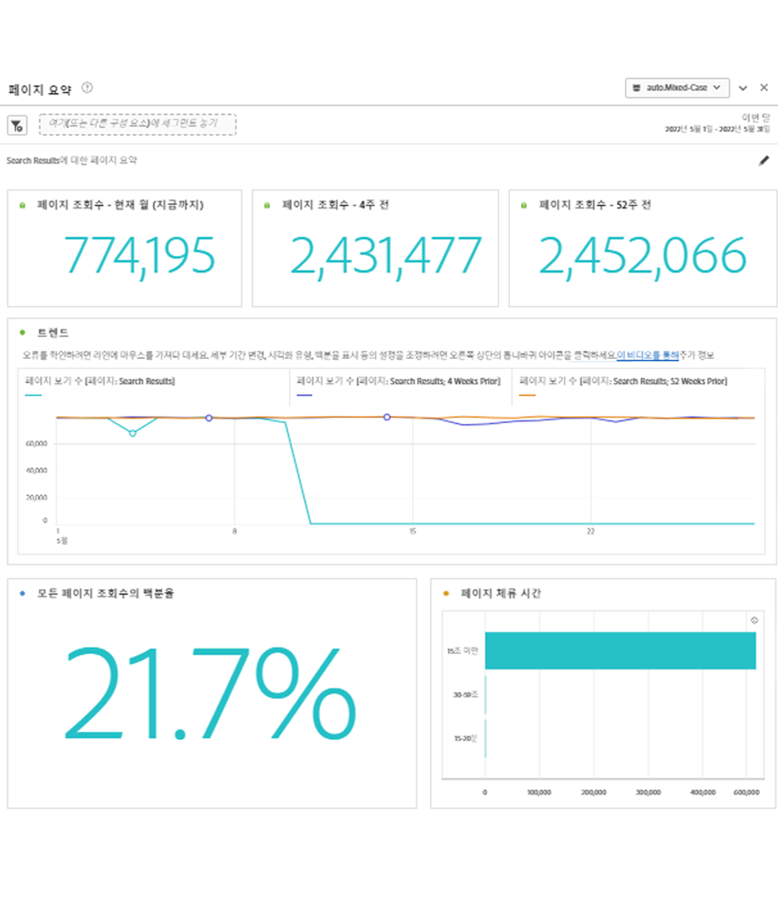
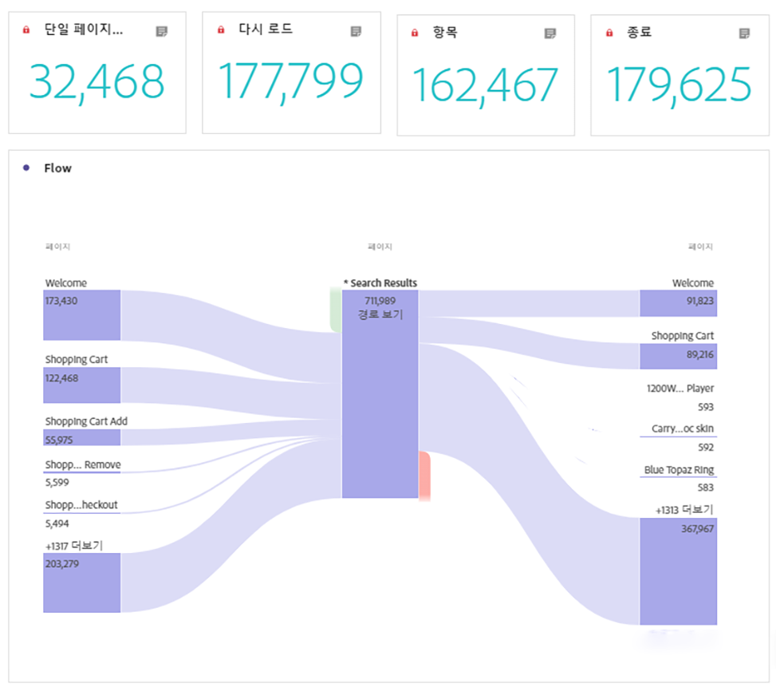

# 페이지 요약 패널

이 패널을 통해 특정 페이지에 대한 주요 통계를 쉽게 탐색할 수 있습니다.

## 패널 액세스

내에서 패널에 액세스할 수 있습니다 [!UICONTROL 보고서] 또는 다음 범위 내 [!UICONTROL 작업 영역].

| 액세스 지점 | 설명 |
| --- | --- |
| [!UICONTROL 보고서] | <ul><li>패널이 이미 프로젝트에 드롭되었습니다.</li><li>왼쪽 레일이 무너졌습니다.</li><li>페이지 차원만 지원됩니다.</li><li>기본 설정이 이미 적용되었습니다. 이 경우 의 상위 방문 페이지[!UICONTROL 페이지] 차원. 이 설정을 수정할 수 있습니다.</li></ul> |
| 작업 영역 | 새 프로젝트를 만들고 왼쪽 레일에서 패널 아이콘을 선택합니다. 드래그 [!UICONTROL 페이지 요약] 자유 형식 테이블 위의 패널입니다. 페이지에 주목합니다 [!UICONTROL Dimension 항목] 필드가 비어 있습니다. 드롭다운 목록에서 차원 항목을 선택합니다. |

## 패널 입력 {#Input}

다음을 구성할 수 있습니다. [!UICONTROL 페이지 요약] 다음 입력 설정을 사용하는 패널:

| 설정 | 설명 |
| --- | --- |
| 세그먼트(또는 기타 구성 요소) 드롭 영역 | 세그먼트 또는 다른 구성 요소를 드래그하여 놓아 패널 결과를 추가로 필터링할 수 있습니다. |
| 페이지 차원 항목 | 드롭다운 목록에서 주요 통계를 탐색할 페이지 차원 항목을 선택합니다. |

{style="table-layout:auto"}

클릭 **[!UICONTROL 빌드]** 패널을 빌드합니다.

## 패널 출력 {#output}

다음 [!UICONTROL 페이지 요약] panel은 특정 페이지에 대한 통계를 더 잘 이해하는 데 도움이 되는 풍부한 지표 데이터 및 시각화 세트를 반환합니다.

| 지표/시각화 | 설명 |
| --- | --- |
| [!UICONTROL 페이지 보기 수] - 이번 달, 지금까지 | 이번 달 이 페이지의 페이지 보기 횟수. |
| [!UICONTROL 페이지 보기 수] - 4주 전 | 지난 달 동안의 이 페이지에 대한 페이지 보기 수입니다. |
| [!UICONTROL 페이지 보기 수] - 52주 전 | 지난 1년 동안 이 페이지에 대한 페이지 보기 수입니다. |
| [!UICONTROL 트렌드] | 이번 달, 4주 전 및 52주 전의 트렌드 페이지 보기 차트. |
| [!UICONTROL 모든 페이지 조회수의 백분율] | 이 페이지로 이동한 모든 페이지 보기 수의 비율에 대한 요약 번호입니다. |
| [!UICONTROL 페이지에서 보낸 시간] | 이 페이지의 체류 시간을 보여 주는 가로 막대 차트. |
| [!UICONTROL 단일 페이지 방문 횟수] | 방문한 유일한 페이지인 페이지 보기 수를 나열하는 요약 번호입니다. |
| [!UICONTROL 다시 로드] | 다음 [!UICONTROL 다시 로드] 지표는 다시 로드 중 차원 항목이 있었던 횟수를 보여줍니다. 방문자가 브라우저를 새로 고치는 것이 다시 로드를 트리거하는 가장 일반적인 방법입니다. |
| [!UICONTROL 항목] | 다음 [!UICONTROL 항목] 지표는 주어진 차원 항목이 방문에서 첫 번째 값으로 캡처된 횟수를 보여줍니다. |
| [!UICONTROL 종료] | 다음 [!UICONTROL 종료] 지표는 주어진 차원 항목이 방문에서 마지막 값으로 캡처된 횟수를 보여줍니다. |
| [!UICONTROL 플로우] | 선택한 페이지를 초점으로 하는 흐름 다이어그램입니다. 다음과 같이 데이터를 자세히 드릴할 수 있습니다. [흐름 다이어그램](/help/analyze/analysis-workspace/visualizations/c-flow/create-flow.md). |

{style="table-layout:auto"}

