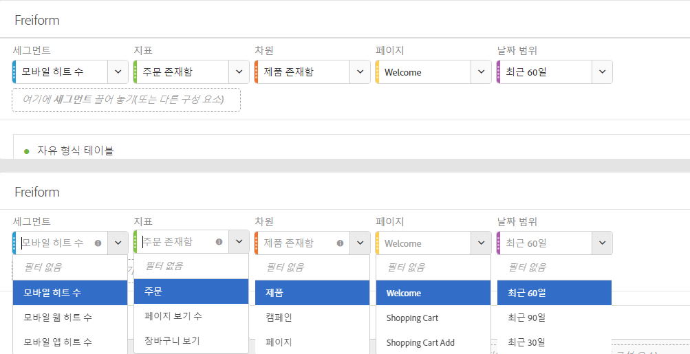
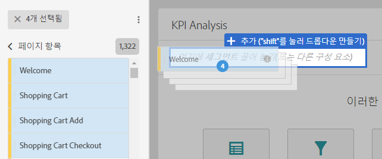
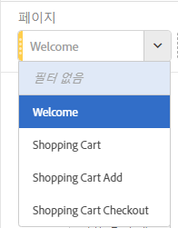
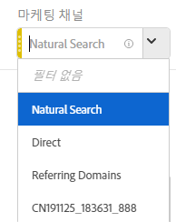

# 패널 개요

패널은 테이블과 시각화 요소의 컬렉션입니다. 작업 공간의 왼쪽 상단 아이콘에서 패널에 액세스할 수 있습니다. 기간, 사업 단위, 지역 등에 따라 프로젝트를 구성하려는 경우 패널이 유용합니다. 빈 패널, 속성, 자유 형식 패널, 세그먼트 비교와 같은 네 가지 유형의 패널은 Analysis Workspace에서 사용할 수 있습니다.

빈 패널 및 자유 형식 패널은 분석을 시작할 위치이며, 속성 IQ 및 세그먼트 비교는 고급 분석을 위해 자체 렌더링합니다. 또한 '+' 패널 단추를 추가하여 언제든지 빈 패널을 추가할 수 있습니다.

기본 시작 패널은 자유 형식 패널이지만 [빈 패널](../../../analyze/analysis-workspace/c-panels/blank-panel.md#concept_B0AD924A792F4166B13448AC253CE7E2)을 기본값으로 설정할 수 있습니다.

## 패널의 드롭다운 필터 {#section_D2828EEDD52944528E87F470EAB581CF}

패널 드롭 구역에 드롭다운 필터링 기능이 있습니다. 이러한 필터를 사용하면 제어된 방식으로 프로젝트 데이터와 상호 작용하여 심층 분석을 수행하고 프로젝트를 단순화하며 다른 사용자와 정보를 공유할 수 있습니다.

다음은 간소화된 프로젝트의 예입니다. 국가별 보고를 제공하기 위한 여러 버전의 프로젝트/패널이 있다고 가정해봅시다. 이제 이러한 프로젝트/패널을 단일 패널로 축소하고 다른 데이터 세트를 필터링하는 대신 국가 드롭다운에 추가할 수 있습니다.

다음 사항에 주의하십시오.

* 여러 구성 요소(또는 차원 항목)에 끌어 놓은 다음 드롭다운에서 전환하여 패널 컨텐츠를 필터링할 수 있습니다.
* 동일한 패널에서 여러 드롭다운 목록을 작성할 수도 있습니다.
* 제목을 클릭하고 수정하여 드롭다운 목록의 제목을 사용자 지정하거나, 옆에 있는 x를 클릭하여 제목을 모두 삭제할 수 있습니다.
* 구성 요소 유형(차원, 날짜 범위, 세그먼트 및 지표)을 사용하여 드롭다운 필터를 생성할 수 있습니다. 드롭다운 날짜 범위는 항상 패널 날짜 범위를 대체합니다.
* 왼쪽 레일의 구성 요소 색상을 유지 보수합니다. 차원 항목 드롭다운의 경우 노란색, 지표의 경우 녹색, 세그먼트의 경우 파란색, 날짜 범위의 경우 보라색으로 표시됩니다.
* 놓기 영역은 여전히 세그먼트로 드래그한 항목에 대한 히트 레벨 세그먼트를 생성합니다. 세그먼트 옆에 있는 정보 아이콘 (i)을 클릭하고 연필 모양의 편집 아이콘을 클릭한 후 세그먼트 빌더에서 편집하여 수정할 수 있습니다.

**드롭다운 필터 생성 및 사용:**

1. 왼쪽 레일에서 항목을 선택하고 **키**&#x200B;를 누른 채로 패널 드롭다운 영역에 놓으십시오.

   

   이렇게 하면 구성 요소가 세그먼트가 아닌 드롭다운 목록으로 전환됩니다. (또한   키를 길게 눌러 세그먼트를 추가할 수도 있습니다.)

   

1. 드롭다운에서 옵션 중 하나를 선택하여 아래 패널에서 데이터를 변경할 수 있습니다. (**[!UICONTROL 필터 없음을 선택하여 패널 데이터를 필터링하지 않도록 선택할 수도 있습니다]**.)
1. 예를 들어, 마케팅 채널별로 데이터를 분할하려는 경우 '마케팅 채널'이라는 다른 드롭다운을 추가할 수 있습니다.

   

