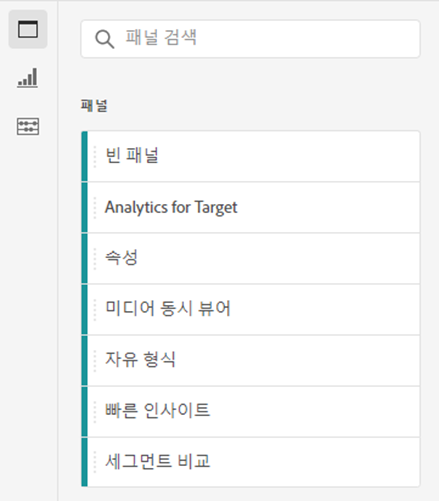
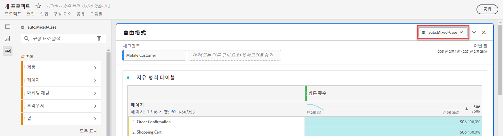
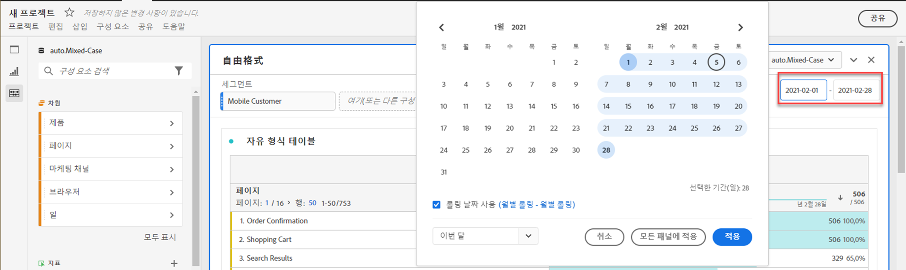
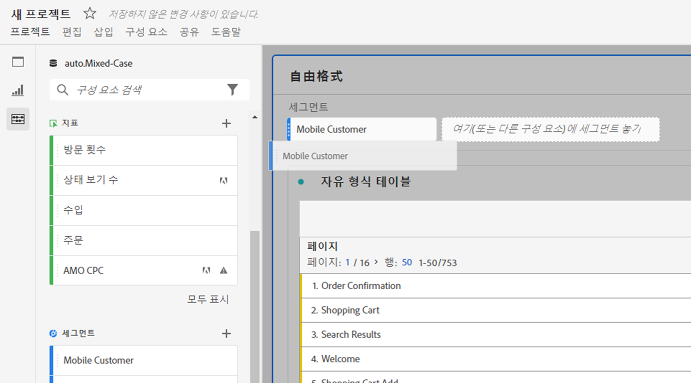
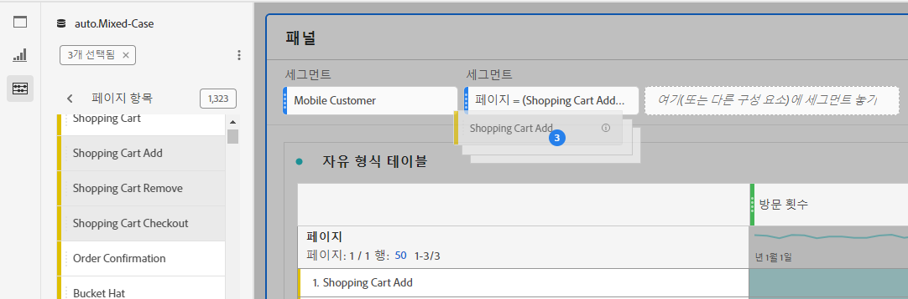
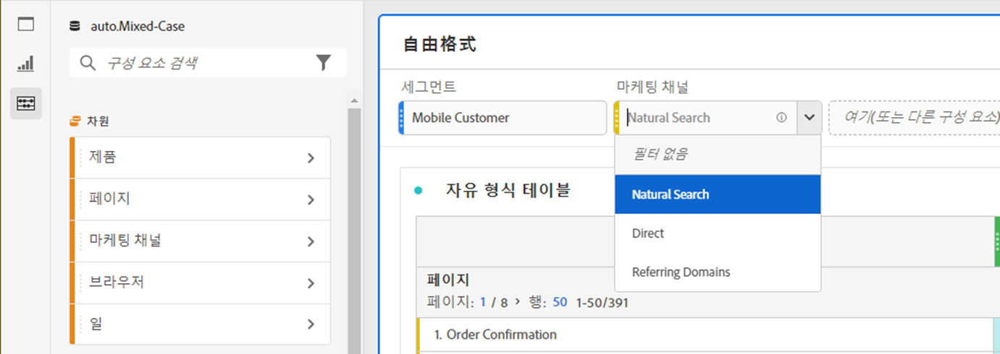

# 패널 개요

A [!UICONTROL panel] is a collection of tables and visualizations. 작업 공간의 왼쪽 상단 아이콘에서 패널에 액세스할 수 있습니다. 패널은 기간, 보고서 세트 또는 분석 사용 사례에 따라 프로젝트를 구성할 때 유용합니다. Analysis Workspace에서는 다음 패널 유형을 사용할 수 있습니다.

| 패널 이름 | 설명 |
|---|---|
| [빈 패널](blank-panel.md) | 사용 가능한 패널 및 시각화 중에서 선택하여 분석을 시작합니다. |
| [빠른 인사이트 패널](quickinsight.md) | 인사이트를 더 빨리 분석하고 발견할 수 있도록 자유 형식 테이블과 함께 제공되는 시각화를 신속하게 구축하십시오. |
| [Analytics for Target 패널](a4t-panel.md) | Analysis Workspace에서 타겟 활동 및 경험을 분석합니다. |
| [속성 패널](attribution.md) | 차원 및 변환 지표를 사용하여 여러 속성 모델을 빠르게 비교하고 시각화합니다. |
| [자유 형식 패널](freeform-panel.md) | 무제한 비교 및 분류를 수행한 다음 시각화를 추가하여 풍부한 데이터 스토리를 전달합니다. |
| [미디어 동시 뷰어 패널](media-concurrent-viewers.md) | 최대 동시성 및 분류 및 비교 기능에 대한 세부 정보로 시간 경과에 따른 동시 뷰어를 분석합니다. |
| [세그먼트 비교 패널](c-segment-comparison/segment-comparison.md) | 모든 데이터 포인트에서 두 개의 세그먼트를 신속하게 비교하여 연관성 있는 차이점을 자동으로 찾을 수 있습니다. |

[!UICONTROL 빠른 통찰력], [!UICONTROL 빈] 및 [!UICONTROL 자유 형식] 패널은 분석을 시작할 수 있는 좋은 곳이지만 Target에 대한 분석 [!UICONTROL , Attribution IQ, 동시]  미디어 뷰어 및 동시 미디어 비교고급 세그먼트 비교고급 분석을 위해 자신을 더 많이 빌려줍니다. 프로젝트에서 `"+"` 단추를 사용할 수 있으므로 언제든지 빈 패널을 추가할 수 있습니다.

The default starting panel is the [!UICONTROL Freeform] panel, but you can make the [blank panel](/help/analyze/analysis-workspace/c-panels/blank-panel.md) your default as well.

## 패널 보고서 세트 {#report-suite}

패널 내의 표 및 시각화는 패널 오른쪽 상단에서 선택한 [!UICONTROL 보고서 세트에서] 데이터를 가져옵니다. 보고서 세트는 왼쪽 레일에 사용할 수 있는 구성 요소도 결정합니다. 프로젝트 내에서 분석 사용 사례에 따라 하나 또는 [여러 보고서 세트를](https://docs.adobe.com/content/help/ko-KR/analytics/analyze/analysis-workspace/build-workspace-project/multiple-report-suites.html) 사용할 수 있습니다.

보고서 세트 목록은 연관성을 기준으로 정렬되며, Adobe은 현재 사용자가 해당 세트를 사용한 빈도 및 조직 내에서 해당 세트가 사용되는 빈도를 기준으로 정의됩니다.

## 패널 달력 {#calendar}

패널 달력은 패널 내의 표 및 시각화에 대한 보고 범위를 제어합니다.

참고:(자주색) 날짜 범위 구성 요소를 표, 시각화 또는 패널 드롭존 내에 사용하는 경우 패널 달력이 무시됩니다.

## 패널 드롭존 {#dropzone}

패널 드롭존을 사용하면 패널 내의 모든 테이블 및 시각화에 세그먼트 및 드롭다운 필터를 적용할 수 있습니다. 하나 이상의 필터를 패널에 적용할 수 있습니다. 각 필터 위의 제목은 연필 편집을 클릭하여 수정할 수도 있고, 마우스 오른쪽 단추를 클릭하여 모두 제거할 수도 있습니다.

### 세그먼트 필터

패널 필터링을 시작하려면 왼쪽 레일의 세그먼트를 패널 드롭 영역으로 드래그하여 놓습니다.

### 애드혹 세그먼트 필터

세그먼트가 아닌 구성 요소를 드롭 영역으로 바로 드래그하여 **애드혹 세그먼트를**&#x200B;만들 수도 있으므로 세그먼트 빌더로 이동하는 시간과 노력을 절약할 수 있습니다. 이렇게 만들어진 세그먼트는 히트 수준 세그먼트로 자동 정의됩니다. 세그먼트 옆에 있는 정보 아이콘(i)을 클릭한 다음 연필 모양 편집 아이콘을 클릭하고 세그먼트 빌더에서 편집하여 이 정의를 수정할 수 있습니다.

애드혹 세그먼트는 프로젝트의 로컬이며, 공개하지 않는 한 왼쪽 레일에 표시되지 않습니다.

### 드롭다운 필터 {#dropdown-filter}

세그먼트 필터 외에도 **드롭다운** 필터를 사용하면 제어된 방식으로 데이터와 상호 작용할 수 있습니다. 예를 들어 모바일 장치 유형에 대한 드롭다운 필터를 추가하여 태블릿, 휴대폰 또는 데스크탑별로 패널을 세그먼트화할 수 있습니다.

드롭다운 필터를 사용하여 여러 프로젝트를 하나로 통합할 수도 있습니다. 예를 들어 서로 다른 국가 세그먼트가 적용된 동일한 프로젝트의 여러 버전이 있는 경우 모든 버전을 단일 프로젝트에 통합하고 국가 드롭다운 필터를 추가할 수 있습니다.

**드롭다운 필터 만들기 및 사용:**

1. 마케팅 채널 [!UICONTROL 차원 내의 값 등]Dimension 항목을  사용하여 드롭다운 필터를 만들려면 왼쪽 레일의 차원 옆에 있는 오른쪽 화살표 아이콘을 클릭합니다. 사용 가능한 모든 항목이 표시됩니다. 왼쪽 레일에서 하나 이상의 구성 요소 항목을 선택하고 Shift 키를 누른 **상태에서 패널 드롭 영역에 놓습니다**. 이렇게 하면 구성 요소가 단일 세그먼트가 아닌 드롭다운 필터로 바뀝니다.
1. 지표, 세그먼트 또는 날짜 범위와 같은 다른 구성 요소를 사용하여 드롭다운 필터를 만들려면 왼쪽 레일의 구성 요소 유형 중 하나를 선택하고 Shift 키를 누른 **채 패널 드롭 영역에 드롭합니다**.
1. 드롭다운에서 옵션 중 하나를 선택하여 패널의 데이터를 변경합니다. You can also choose to not filter any of the panel data by selecting **[!UICONTROL No filter]**.

[이 비디오를](https://docs.adobe.com/content/help/en/analytics-learn/tutorials/analysis-workspace/using-panels/using-panels-to-organize-your-analysis-workspace-projects.html) 통해 프로젝트에 드롭다운 필터를 추가하는 방법에 대해 자세히 알아보십시오.

