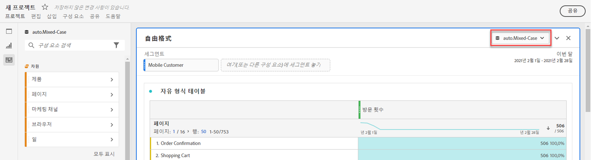
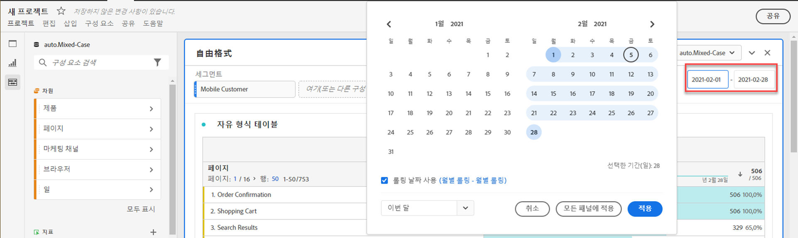
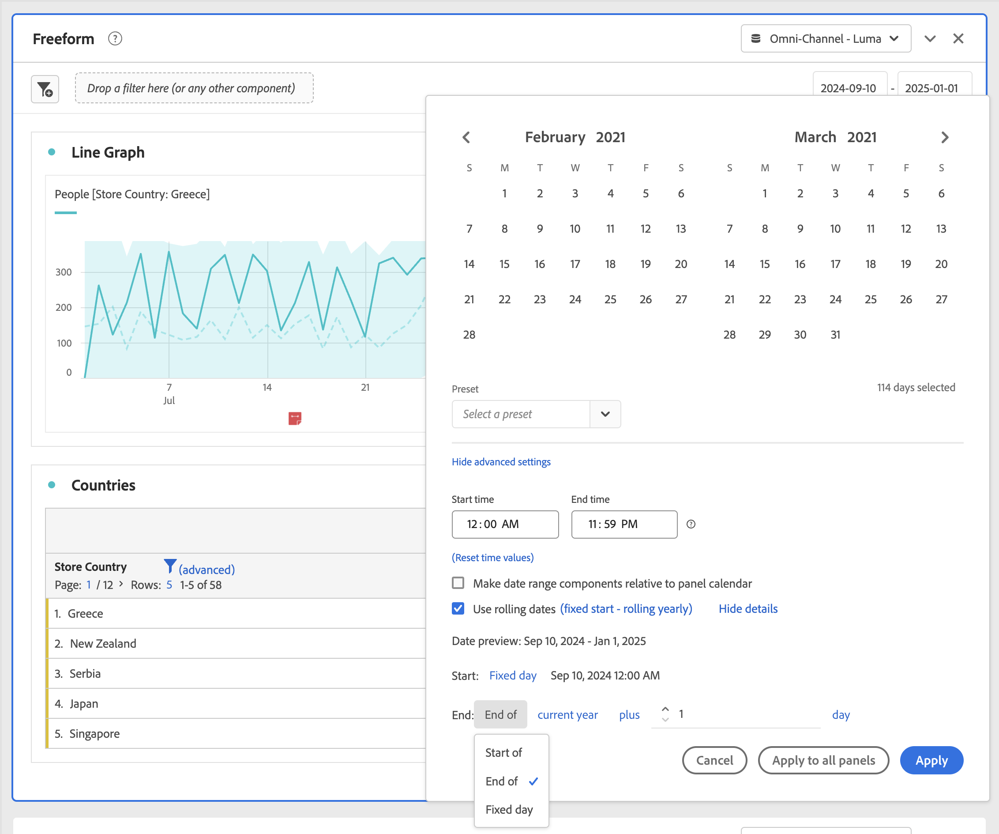
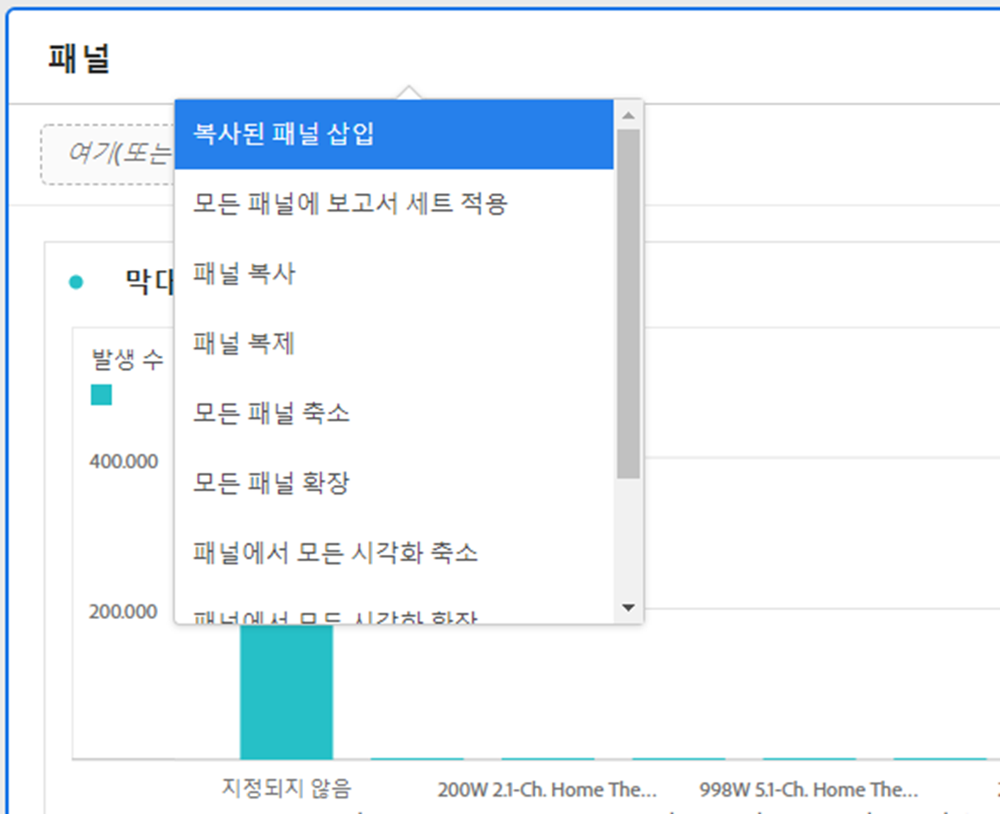

# 패널 개요

[!UICONTROL 패널]은 테이블 및 시각화 컬렉션입니다. Workspace의 왼쪽 상단 아이콘 또는 [빈 패널](/help/analyze/analysis-workspace/c-panels/blank-panel.md)에서 패널에 액세스할 수 있습니다. 패널은 기간, 보고서 세트 또는 분석 사용 사례에 따라 프로젝트를 구성하려는 경우 유용합니다.

## 패널 유형

[!UICONTROL Adobe Analytics]을 위한 Analysis Workspace에서 다음 패널 유형을 사용할 수 있습니다.

| 패널 이름 | 설명 |
| --- | --- |
| [빈 패널](/help/analyze/analysis-workspace/c-panels/blank-panel.md) | 사용 가능한 패널 및 시각화 중에서 선택하여 분석을 시작합니다. |
| [속성](attribution.md) | 차원 및 전환 지표를 사용하여 여러 기여도 모델을 빠르게 비교하고 시각화합니다. |
| [Target용 Analytics](a4t-panel.md) | Analysis Workspace에서 Target 활동 및 경험을 분석합니다. |
| [자유 형식](freeform-panel.md) | 무제한 비교 및 분석을 수행한 다음 시각화를 추가하여 풍부한 데이터 스토리를 전달합니다. |
| [미디어 평균 분당 시청 대상자](average-minute-audience-panel.md) | 특정 콘텐츠 또는 사용자 정의된 기간 전체에 대해 평균 분당 시청 대상자를 분석합니다. |
| [미디어 동시 뷰어](media-concurrent-viewers.md) | 최대 동시성 및 분류 및 비교 기능에 대한 세부 정보로 시간 경과에 따른 동시 뷰어를 분석합니다. |
| [미디어 재생 체류 시간](/help/analyze/analysis-workspace/c-panels/media-playback-time-spent.md) | 재생 체류 시간 분석을 통해 최대 동시 시청이 발생하는 위치 또는 시청 감소가 발생하는 위치를 파악합니다. |
| [다음 또는 이전 항목](next-previous.md) | 사용자가 이동하는 다음 또는 이전 페이지를 표시합니다. |
| [빠른 인사이트](quickinsight.md) | 인사이트를 더 빨리 분석하고 발견하려면 자유 형식 테이블과 함께 제공되는 시각화를 신속하게 빌드합니다. |
| [페이지 요약](page-summary.md) | 특정 페이지에 대한 주요 통계를 탐색합니다. |
| [세그먼트 비교](/help/analyze/analysis-workspace/c-panels/c-segment-comparison/segment-comparison.md) | 자동으로 모든 데이터 포인트에서 두 세그먼트를 빠르게 비교하여 관련 차이점을 찾습니다. |

[!UICONTROL 빠른 인사이트], [!UICONTROL 빈] 패널 및 [!UICONTROL 자유 형식] 패널은 분석을 시작하기에 좋은 위치이며 [!UICONTROL Attribution IQ]는 보다 고급 분석에 적합합니다. 캔버스 하단에서 을 사용할 수 있으므로 언제든지 빈 패널을 추가할 수 있습니다.

기본 시작 패널은 [!UICONTROL 자유 형식] 패널이지만 [빈 패널](/help/analyze/analysis-workspace/c-panels/blank-panel.md) 또는 [빠른 인사이트](/help/analyze/analysis-workspace/c-panels/quickinsight.md)도 기본값으로 설정할 수 있습니다. [프로젝트 및 분석 환경 설정](/help/analyze/analysis-workspace/user-preferences.md#projects--analyses-preferences)을 참조하십시오.

## 패널 만들기

패널을 만들려면 다음 작업을 수행하십시오.

* **[!UICONTROL 패널]** 왼쪽 패널의 패널을 캔버스에 드래그 앤 드롭합니다.
* [빈 패널](blank-panel.md)에서 패널을 선택합니다.
* Workspace에서 **[!UICONTROL 삽입]** 메뉴를 사용하고 패널을 선택합니다. 또는 [단축키](../build-workspace-project/fa-shortcut-keys.md)를 사용하여 패널을 삽입할 수 있습니다.

  

다음과 같은 작업을 수행할 수 있습니다.

* 모든 패널 **내** 을 선택하여 다른 시각화를 추가합니다. 시각화를 선택할 수 있는 팝업이 나타납니다.

  

  | 선택... | 다음을 만들려면... |
  |---|---|
  |  | [자유 형식 테이블](/help/analyze/analysis-workspace/visualizations/freeform-table/freeform-table.md) |
  |  | [라인](/help/analyze/analysis-workspace/visualizations/line.md) |
  |  | [막대](/help/analyze/analysis-workspace/visualizations/bar.md) |
  |  | [요약 번호](/help/analyze/analysis-workspace/visualizations/summary-number-change.md) |
  |  | [텍스트](/help/analyze/analysis-workspace/visualizations/text.md) |
  |  | [폴아웃](/help/analyze/analysis-workspace/visualizations/fallout/fallout-flow.md) |
  |  | [플로우](/help/analyze/analysis-workspace/visualizations/c-flow/flow.md) |
  |  | [스택 영역](/help/analyze/analysis-workspace/visualizations/area.md) |
  |  | [코호트 테이블](/help/analyze/analysis-workspace/visualizations/cohort-table/t-cohort.md) |
  |  | [글머리 기호](/help/analyze/analysis-workspace/visualizations/bullet-graph.md) |
  |  | [도넛](/help/analyze/analysis-workspace/visualizations/donut.md) |
  |  | [요약 변경](/help/analyze/analysis-workspace/visualizations/summary-number-change.md) |
  |  | [히스토그램](/help/analyze/analysis-workspace/visualizations/histogram.md) |
  |  | [산포도](/help/analyze/analysis-workspace/visualizations/scatterplot.md) |
  |  | [벤](/help/analyze/analysis-workspace/visualizations/venn.md) |
  |  | [트리맵](/help/analyze/analysis-workspace/visualizations/treemap.md) |

* Workspace의 마지막 패널 **외부**&#x200B;에서 을 선택하여 다른 [빈 패널](blank-panel.md)을 추가합니다.

## 패널 관리

다음과 같은 방법으로 패널을 관리할 수 있습니다.

* 패널을 숨기려면 을 선택합니다.
* 숨겨진 패널을 표시하려면 를 선택합니다.
* 패널을 삭제하려면 을(를) 선택하십시오. 실행을 취소하려면 **[!UICONTROL 편집]** > **[!UICONTROL 실행 취소]**(**[!UICONTROL *cmd *+*z *]**)를 선택하십시오. |**[!UICONTROL * ctrl *+* z *]**).
* 패널을 이동하려면 이 표시될 때마다(보통 헤더 위로 마우스를 가져갈 때) 패널을 끌어서 놓습니다.

## 보고서 세트

각 패널은 [리포트 세트](/help/admin/tools/manage-rs/report-suites-admin.md)와 연결되고, 패널 오른쪽 상단의 드롭다운 메뉴에서  **[!UICONTROL *리포트 세트&#x200B;*]**&#x200B;로 식별됩니다.

새 패널을 만들면 기본 리포트 세트는 Analysis Workspace 프로젝트에서 마지막으로 작업한 패널의 리포트 세트를 기반으로 합니다.

분석 사용 사례에 따라 프로젝트 내에서 하나 또는 [여러 보고서 세트](/help/analyze/analysis-workspace/build-workspace-project/multiple-report-suites.md)를 사용할 수 있습니다.

보고서 세트 목록은 관련성을 기준으로 정렬되며, Adobe은 현재 사용자가 제품군을 얼마나 최근에 그리고 얼마나 자주 사용했는지를 기준으로 정의합니다. 및 조직 내에서 제품군을 사용하는 빈도입니다.

>[!IMPORTANT]
>
>선택한 리포트 세트는 패널에서 시각화를 빌드할 수 있는 차원, 지표 및 세그먼트를 결정합니다.
>
>
>패널의 리포트 세트를 전환하면 해당 새 리포트 세트에서 일부 구성 요소를 사용하지 못할 수 있습니다. 전환되면 시각화가 제대로 렌더링되지 않을 수 있습니다. 다음과 같은 경고가 표시될 수 있습니다.
>
>* 이 패널에는 선택한 리포트 세트에서 활성화되지 않은 구성 요소가 포함됩니다. 보고서 세트를 변경하거나 보고서 세트에서 필요한 구성 요소를 활성화합니다.
>* 시각화를 렌더링할 수 없습니다. 열과 행을 확인하여 유효한 구성 요소가 포함되어 있는지 확인하십시오.
>

## 캘린더

패널 캘린더는 패널 내의 테이블 및 시각화에 대한 데이터 범위를 제어합니다.

>[!NOTE]
>
> 날짜 범위 구성 요소가 시각화 또는 패널 내에서 (예: 세그먼트로) 사용되면 날짜 범위 구성 요소가 패널 캘린더보다 우선 적용됩니다.
>

1. 시작 일자를 먼저 선택한 다음 종료 일자를 선택하여 날짜 범위를 선택합니다.
또는 [!UICONTROL *사전 설정 선택*] 드롭다운 메뉴에서 **[!UICONTROL 사전 설정]**&#x200B;을 선택할 수 있습니다.

1. 필요한 경우 **[!UICONTROL 고급 설정 표시]**&#x200B;를 선택하여 다음 작업을 수행하십시오.

   * 기본 `12:00 AM`(`0:00`) 및 `11:59 PM`(`23:59`)가 아닌 다른 **[!UICONTROL 시작 시간]** 및 **[!UICONTROL 종료 시간]**&#x200B;을 지정합니다. 종료 시간은 항상 59초를 포함합니다. 날짜 범위가 여러 날에 걸친 경우 시작 시간은 날짜 범위의 첫 번째 날에 적용되고 종료 시간은 날짜 범위의 마지막 날에 적용됩니다. **[!UICONTROL (시간 값 재설정)]**&#x200B;을 사용하여 시작 및 종료 시간을 기본값으로 재설정합니다.
   * **[!UICONTROL 패널 캘린더를 기준으로 날짜 범위 구성 요소 만들기]**. 비활성화되면 패널에서 사용되는 날짜 범위 구성 요소는 현재 시간을 기준으로 합니다. 활성화된 경우 패널에 사용되는 날짜 범위 구성 요소는 패널 달력을 기준으로 합니다.
   * **[!UICONTROL 순환 날짜 사용]**. 활성화된 경우 **[!UICONTROL 최근 7일 전체]**&#x200B;와 같은 사전 설정된 날짜 범위가 현재 날짜 및 시간 진행에 따라 동적으로 업데이트됩니다. 비활성화되면 해당 사전 설정이 적용되어 업데이트되지 않습니다.

     

     대괄호 안의 텍스트(예: **[!UICONTROL 고정된 시작 - 매일 롤링]**)를 선택하여 패널을 확장하고 **[!UICONTROL 시작]** 및 **[!UICONTROL 종료]**&#x200B;에 대한 세부 정보를 지정할 수 있습니다.

      1. **[!UICONTROL 시작]**, **[!UICONTROL 종료]** 또는 **[!UICONTROL 고정일]**&#x200B;을 선택합니다.
      1. **[!UICONTROL 시작]** 또는 **[!UICONTROL 종료]**&#x200B;를 선택한 경우 전체 표현식을 작성할 수 있습니다. 예: **[!UICONTROL 현재 연도]** **[!UICONTROL 종료]** **[!UICONTROL +]** `1` **[!UICONTROL 일]**. 표현식의 각 개별 부분에 적합한 값을 선택합니다.
         * 현재 값을 선택합니다. 예: **[!UICONTROL 현재 연도]**.
         * 추가 계산 값을 선택합니다. 예: **[!UICONTROL 더하기]**.
         * 추가 계산이 지정된 경우 값을 지정합니다. (예: `1`)
         * 추가 계산이 지정된 경우 계산에 사용할 기간을 선택합니다. 예: **[!UICONTROL 일]**.

     **[!UICONTROL 세부 정보 숨기기]**&#x200B;를 선택하여 순환 날짜 계산에 대한 세부 정보를 숨깁니다.

1. **[!UICONTROL 적용]**&#x200B;을 선택하여 캘린더를 호출한 패널에 날짜 범위를 적용합니다.
**[!UICONTROL 모든 패널에 적용]**&#x200B;을 선택하여 Workspace 프로젝트의 모든 패널에 날짜 범위를 적용합니다.

## 드롭 영역 {#dropzone}

**[!UICONTROL _데이터를 필터링하거나 분류할 구성 요소 놓기_]** 레이블이 지정된 패널 드롭 영역을 사용하면 패널에 대한 데이터를 필터링하거나 분류할 수 있습니다. 데이터를 필터링하거나 분류하는 데 사용하는 세그먼트 또는 분류는 패널 내의 모든 자유 형식 테이블 및 시각화에 적용됩니다.

세그먼트 및 분류를 사용하면 제어된 방식으로 데이터와 상호 작용할 수 있습니다. 예를 들어, 태블릿, 휴대폰 또는 데스크탑 을 선택하여 패널을 필터링할 수 있도록 모바일 디바이스 유형에 대한 세그먼트 드롭다운 메뉴를 추가할 수 있습니다.

또한 세그먼트를 사용하여 많은 프로젝트를 하나로 통합할 수도 있습니다. 예를 들어 서로 다른 국가 세그먼트가 각각 적용된 동일한 프로젝트의 서로 다른 버전이 있는 경우 모든 버전을 단일 프로젝트로 통합하고 국가 세그먼트 드롭다운 메뉴를 추가할 수 있습니다.

아래 그림은 드롭 영역에 구성 요소를 추가할 때 발생하는 (빠른) 세그먼트 또는 분류의 다양한 변형을 보여 줍니다.

패널의 

### 추가 또는 바꾸기

(빠른) 세그먼트 또는 분류를 추가하거나 바꾸려면 다음을 수행합니다.

1. 구성 요소 레일에서 하나 이상의 구성 요소를 선택합니다. 둘 이상의 구성 요소를 선택하려면 ⇧+ 또는 ^+을(를) 사용합니다.
1. 선택 항목을 드롭 영역으로 드래그하십시오. 레이블이 **[!UICONTROL _데이터를 필터링하거나 분류할 구성 요소 놓기_]** ❶ 또는 드롭 영역 근처에 이미 배치된 기존 구성 요소 위로 드래그합니다.
1.  **[!UICONTROL 추가(드롭다운을 만들려면 &quot;shift&quot; 누르기)]** 또는  **[!UICONTROL 바꾸기(드롭다운에 추가하려면 &quot;shift&quot; 누르기)]**&#x200B;를 보면 두 가지 옵션이 있습니다.

   

   * 선택 항목을 놓아 다음 구성 요소를 만듭니다.
      * ❷을(를) 놓는 모든 세그먼트 구성 요소에 대한 [세그먼트](#segment).
      * ❸을(를) 삭제한 세그먼트가 아닌 구성 요소(날짜 범위, 지표, 차원, 차원 항목)에 대한 [빠른 세그먼트](#quick-segment).
   * 다음 구성 요소를 만들려면 **누른 상태에서**⇧(Shift) 선택 항목을 드롭하십시오.
      * ❹을(를) 놓는 선택한 세그먼트에 대해 필터링할 항목이 있는 정적 세그먼트 [드롭다운 메뉴](#drop-down-menu)입니다.
      * ❺을(를) 삭제한 선택한 날짜 범위에 대해 필터링할 항목이 있는 정적 세그먼트 [드롭다운 메뉴](#drop-down-menu)입니다.
      * ❻을(를) 삭제한 선택한 지표에 대해 필터링할 항목이 있는 정적 세그먼트 [드롭다운 메뉴](#drop-down-menu)입니다.
      * ❼을(를) 삭제한 선택한 차원 *항목*&#x200B;에 대해 필터링하거나 분류할 항목이 있는 정적 세그먼트 [드롭다운 메뉴](#drop-down-menu) 또는 분류 [드롭다운 메뉴](#drop-down-menu).
      * ❽을(를) 놓는 선택한 차원에 대해 필터링하거나 분류할 항목이 있는 동적 세그먼트 [드롭다운 메뉴](#drop-down-menu) 또는 분류 [드롭다운 메뉴](#drop-down-menu).

### 세그먼트

놓는 모든 세그먼트 구성 요소는 패널을 세그먼트화하는 데 사용됩니다. 세그먼트를 사용하여 패널의 데이터 및 시각화에 대한 세그먼트화된 통찰력을 얻을 수 있습니다.

### 빠른 세그먼트

놓은 세그먼트가 아닌 구성 요소(차원, 차원 항목, 지표, 날짜 범위)는 패널을 세그먼트화할 [빠른 세그먼트](#quick-segment)를 정의합니다. 세그먼트가 아닌 구성 요소를 사용하여 [세그먼트 빌더](/help/components/segmentation/segmentation-workflow/seg-quick.md)를 사용하지 않고 빠른 세그먼트를 만드십시오. 이러한 방식으로 만들어진 세그먼트는 자동으로 이벤트 수준 세그먼트로 정의되며 기본적으로 **[!UICONTROL 빠른 세그먼트]** 레이블이 지정됩니다.

또는 를 사용하여 빠른 세그먼트를 만들 수 있습니다.

빠른 세그먼트를 만들고 관리하는 방법은 [빠른 세그먼트](/help/components/segmentation/segmentation-workflow/seg-quick.md)를 참조하세요.

### 드롭다운 메뉴

누른 상태에서 만드는 드롭다운 메뉴는 다음과 ⇧ 수 있습니다.

* [정적](#static) 또는 [동적](#dynamic) 항목 목록을 포함합니다.
* [패널 필터링](#filter) 또는 [패널 분류](#breakdown)를 수행합니다.

#### 정적

선택한 차원 *항목*, 지표, 세그먼트 및 날짜 범위에 대해 정적 드롭다운 메뉴가 만들어집니다. 정적 드롭다운 메뉴의 항목은 선택한 구성 요소를 기반으로 하며 구성 요소를 추가하거나 바꿀 때 항목이 변경되지 않습니다.

#### 동적

동적 드롭다운 메뉴는 차원 구성 요소를 놓을 때만 생성됩니다. 동적 드롭다운 메뉴는 레이블의 일부로 로 표시됩니다.

동적 드롭다운 메뉴의 사용 가능한 항목은 다음을 기반으로 합니다.

* 패널의 드롭 영역 내에 있는 다른 드롭다운 메뉴, 세그먼트 및 빠른 세그먼트에서 선택한 항목으로 인해 발생하는 데이터
* 패널의 보고 범위 내에서 사용할 수 있는 데이터입니다.

예를 들어 국가 차원과 도시 차원을 사용하여 두 개의 동적 드롭다운 메뉴를 추가할 수 있습니다. **[!UICONTROL 국가]** 드롭다운 메뉴에서 국가를 선택하면 **[!UICONTROL 도시]** 드롭다운 메뉴가 선택한 국가 내의 도시만 표시하도록 동적으로 조정됩니다. 추가 정적 드롭다운 메뉴가 있는 경우, 해당 드롭다운 메뉴에서 선택한 항목은 동적 드롭다운 메뉴의 사용 가능한 항목에도 영향을 줍니다. 동적 드롭다운 메뉴에서 선택한 항목은 정적 드롭다운 메뉴의 사용 가능한 항목에 영향을 주지 않습니다.

#### 패널 필터링

**⇧ 동안**&#x200B;놓는 지표, 세그먼트 또는 날짜 범위 구성 요소의 경우 세그먼트 드롭다운 메뉴가 만들어집니다. 이 드롭다운 메뉴를 사용하면 드롭된 구성 요소에 사용할 수 있는 항목을 기반으로 패널을 필터링할 수 있습니다.

**놓는 동안**⇧ 놓는 *차원* 구성 요소의 경우 세그먼트 드롭다운 메뉴가 만들어집니다. 이 드롭다운 메뉴를 사용하면 드롭된 차원 항목([정적](#static) 세그먼트 드롭다운 메뉴) 또는 차원 구성 요소([동적](#dynamic) 세그먼트 드롭다운 메뉴)에 사용할 수 있는 항목을 기반으로 패널을 필터링할 수 있습니다. 세그먼트를 사용하여 패널을 필터링하도록 드롭다운 메뉴를 명시적으로 구성하려면 다음을 수행합니다.

* 를 선택하고  **[!UICONTROL 세그먼트]**&#x200B;를 선택합니다. | **[!UICONTROL 구성 요소 ❾에 대한 컨텍스트 메뉴에서]** 패널의 데이터를 필터링합니다.

#### 패널 분류

**놓는 동안**⇧ 놓는 *차원* 구성 요소의 경우 세그먼트 드롭다운 메뉴가 만들어집니다. 드롭된 차원 항목([정적](#static) 분류 드롭다운 메뉴) 또는 차원 구성 요소([동적](#dynamic) 분류 드롭다운 메뉴)에 사용할 수 있는 항목을 기반으로 패널을 분류하도록 드롭다운 메뉴를 구성할 수 있습니다. 분류를 사용하여 패널을 분류하도록 드롭다운 메뉴를 명시적으로 구성하려면 다음을 수행합니다.

* 를 선택하고  **[!UICONTROL 분류]**&#x200B;를 선택합니다. | **[!UICONTROL 구성 요소 ❾에 대한 컨텍스트 메뉴에서]** 패널의 데이터를 분류합니다.

>[!IMPORTANT]
>
>분류는 세그먼트, 날짜 범위 또는 지표가 아닌 차원 및 차원 항목에만 사용할 수 있습니다.
>

#### 세그먼트와 분류

다음 시나리오에서 패널을 필터링하지 않고(세그먼트 사용) 패널을 분류해 보십시오.

* 패널 내에서 속성 활성화 지표를 사용하는 경우 세그먼트는 종종 속성 활성화 지표를 지웁니다. 분류는 패널에 대한 데이터를 검색하기 위해 실행되는 쿼리 내의 다른 지점에 적용됩니다. 따라서 분류는 이러한 속성 활성화 지표를 지우지 않습니다.

  예를 들어, **[!UICONTROL Luma: 제품 범주]**  **[!UICONTROL 여성]** 세그먼트를 사용할 때의 특성 기반 **[!UICONTROL 온라인 매출]** 지표와 **[!UICONTROL Luma: 제품 범주]**  **[!UICONTROL 여성]** 분류 간의 차이를 볼 수 있습니다.

  

* 분류 드롭다운 메뉴 내에서 하위 이벤트 수준 차원을 사용하는 경우 분류는 해당 하위 이벤트 수준에서 실행됩니다. 대신 세그먼트 드롭다운 메뉴 내의 세그먼트는 이벤트 수준에서 실행됩니다.

  예를 들어, **[!UICONTROL Luma: 제품 하위 범주]**  **[!UICONTROL Tops]** 세그먼트와 **[!UICONTROL Luma: 제품 하위 범주]**  **[!UICONTROL Tops]** 분류를 사용할 때의 **[!UICONTROL 온라인 매출]** 지표의 차이점을 참조하십시오. 분류는 하위 이벤트 수준에서 쿼리를 명시적으로 실행하는 반면 세그먼트는 이벤트 수준에서 쿼리를 실행합니다.

  

### 관리

놓기 영역의 구성 요소를 다음과 같이 관리할 수 있습니다.

| 패널 드롭 영역의 작업... | 방법... |
|---|---|
| 세그먼트 또는 빠른 세그먼트를 제거하려면 | 구성 요소에서 을(를) 선택하십시오. |
| 드롭다운 메뉴에서 선택한 항목을 제거하려면 다음과 같이 하십시오. | 항목 내에서 을(를) 선택하십시오. |
| 드롭다운 메뉴에서 선택한 모든 항목을 제거하려면 다음과 같이 하십시오. | 드롭다운 메뉴에서 을(를) 선택합니다. |
| 구성 요소의 레이블을 편집합니다. | 구성 요소의 레이블 위로 마우스를 가져간 후 을 선택합니다. |
| 구성 요소의 레이블을 삭제합니다. | 구성 요소의 레이블 위로 마우스를 가져간 후 구성 요소의 컨텍스트 메뉴에서 **[!UICONTROL 레이블 삭제]**&#x200B;를 선택합니다. |
| 놓기 영역에서 구성 요소를 삭제합니다. | 구성 요소의 컨텍스트 메뉴에서 **[!UICONTROL 삭제 드롭다운]**&#x200B;을(를) 선택합니다. |
| 세그먼트 또는 빠른 세그먼트에 대한 정보를 가져옵니다. | 구성 요소 내부를 마우스로 가리킨 다음 를 선택하여 구성 요소에 대한 정보가 있는 데이터 사전을 엽니다. |
| 드롭다운 메뉴를 정의하는 구성 요소에 대한 정보를 얻으려면 | 드롭다운 메뉴 내부를 마우스로 가리킨 다음 을(를) 선택하여 구성 요소에 대한 정보가 있는 데이터 사전을 엽니다. |
| 빠른 세그먼트를 편집하려면 다음을 수행하십시오. | 빠른 세그먼트 내부를 마우스로 가리킨 다음 을 선택합니다. 자세한 내용은 [빠른 세그먼트](/help/components/segmentation/segmentation-workflow/seg-quick.md)를 참조하세요. |
| 드롭다운 메뉴에 대한 선택이 필요합니다. | 구성 요소의 컨텍스트 메뉴에서 **[!UICONTROL 선택 필요]**&#x200B;를 선택합니다. |
| 드롭다운 메뉴에 대한 필터를 허용하지 않습니다. | 구성 요소의 컨텍스트 메뉴에서 **[!UICONTROL 필터 없음]**&#x200B;을 선택합니다. |
| 모든 구성 요소를 재설정하고 드롭다운 메뉴에 대한 모든 선택 항목을 지우려면 | **[!UICONTROL 모두 재설정]**&#x200B;을 선택합니다. |

>[!BEGINSHADEBOX]

데모 비디오는  [Analysis Workspace에서 필터 사용](https://experienceleague.adobe.com/ko/docs/analytics-learn/tutorials/analysis-workspace/using-panels/using-drop-down-filters){target="_blank"}을 참조하십시오.

>[!ENDSHADEBOX]

>[!BEGINSHADEBOX]

데모 비디오는  [동적 드롭다운 메뉴](https://experienceleague.adobe.com/ko/docs/customer-journey-analytics-learn/tutorials/analysis-workspace/tips-and-tricks/dynamic-drop-downs){target="_blank"}를 참조하십시오.

{{videocja}}

>[!ENDSHADEBOX]

## 컨텍스트 메뉴

패널 헤더의 컨텍스트 메뉴를 통해(마우스 오른쪽 버튼으로 클릭) 패널의 추가 기능을 사용할 수 있습니다.

다음 옵션을 사용할 수 있습니다.

| 옵션 | 설명 |
| --- | --- |
| **[!UICONTROL 복사된 패널 삽입]** | 복사한 패널을 프로젝트 내의 다른 위치 또는 다른 프로젝트에 붙여넣을 수 있습니다. |
| **[!UICONTROL 복사된 시각화 삽입]** | 복사한 시각화를 패널, 프로젝트 내 다른 위치 또는 다른 프로젝트에 붙여넣습니다. |
| **[!UICONTROL 모든 패널에 보고서 세트 적용]** | 이 패널에 대한 보고서 세트를 프로젝트의 다른 모든 패널에 적용합니다. |
| **[!UICONTROL 패널 복사]** | 패널을 복사하여 프로젝트 내의 다른 위치 또는 다른 프로젝트에 삽입할 수 있습니다. |
| **[!UICONTROL 패널 복제]** | 현재 패널의 정확한 복제본을 만들어서 수정할 수 있습니다. |
| **[!UICONTROL 모든 패널 축소]** | 모든 프로젝트 패널을 축소합니다. |
| **[!UICONTROL 모든 패널 확장]** | 모든 프로젝트 패널을 확장합니다. |
| **[!UICONTROL 패널에서 모든 시각화 축소]** | 현재 패널의 모든 시각화를 축소합니다. |
| **[!UICONTROL 패널에서 모든 시각화 확장]** | 현재 패널의 모든 시각화를 확장합니다. |
| **[!UICONTROL 설명 편집]** | 패널에 대한 텍스트 설명을 추가(또는 편집)합니다. |
| **[!UICONTROL 패널 링크 가져오기]** | 프로젝트 내의 특정 패널로 사용자를 안내합니다. 링크를 선택하면 연결된 정확한 패널로 이동하기 전에 먼저 수신자가 로그인해야 합니다. |

## 구성

일부 패널(예: [!UICONTROL 속성], [!UICONTROL 실험], [!UICONTROL 미디어 평균 분당 시청 대상자] 등)에는 시각화를 빌드할 수 있는 구성 대화 상자가 있습니다. 패널 상단의 을 사용하여 구성에 액세스하고 이를 변경합니다.

