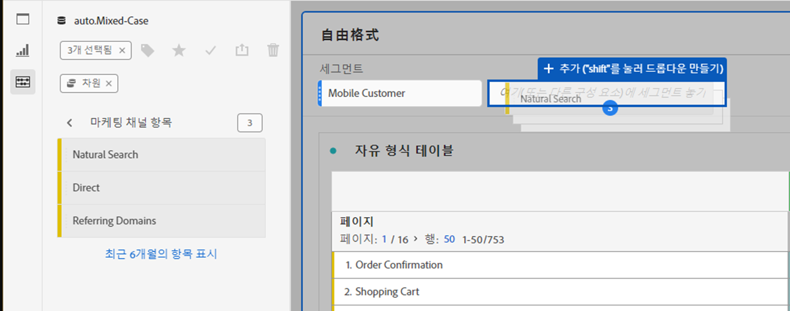

# 패널 개요

[!UICONTROL 패널]은 테이블 및 시각화 컬렉션입니다. Workspace의 왼쪽 상단 아이콘 또는 [빈 패널](blank-panel.md)에 액세스 할 수 있습니다. 패널은 기간, 보고서 세트 또는 분석 사용 사례에 따라 프로젝트를 구성하려는 경우 유용합니다. Analysis Workspace에서 다음 패널 유형을 사용할 수 있습니다.

| 패널 이름 | 설명 |
| --- | --- |
| [빈 패널](blank-panel.md) | 사용 가능한 패널 및 시각화 중에서 선택하여 분석을 시작합니다. |
| [빠른 인사이트 패널](quickinsight.md) | 인사이트를 더 빨리 분석하고 발견할 수 있도록 자유 형식 테이블과 함께 제공되는 시각화를 신속하게 구축하십시오. |
| [Analytics for Target 패널](a4t-panel.md) | Analysis Workspace에서 타겟 활동 및 경험을 분석합니다. |
| [속성 패널](attribution.md) | 파원 및 전환 지표를 사용하여 여러 기여도 모델을 빠르게 비교하고 시각화합니다. |
| [자유 형식 패널](freeform-panel.md) | 무제한 비교 및 분석을 수행한 다음 시각화를 추가하여 풍부한 데이터 스토리를 전달합니다. |
| [미디어 동시 뷰어 패널](media-concurrent-viewers.md) | 최대 동시성 및 분류 및 비교 기능에 대한 세부 정보로 시간 경과에 따른 동시 뷰어를 분석합니다. |
| [세그먼트 비교 패널](c-segment-comparison/segment-comparison.md) | 모든 데이터 포인트에서 두 세그먼트를 빠르게 비교하여 관련 차이점을 자동으로 찾습니다. |

[!UICONTROL 빠른 인사이트], [!UICONTROL 빈] 패널 및 [!UICONTROL 자유 형식] 패널은 분석을 시작하기에 좋은 위치이며 [!UICONTROL Analytics for Target], [!UICONTROL Attribution IQ], [!UICONTROL 미디어 동시 뷰어 ] 및 [!UICONTROL 세그먼트 비교]는 보다 고급 분석에 적합합니다. 프로젝트에서 `"+"` 단추를 사용할 수 있으므로 언제든지 빈 패널을 추가할 수 있습니다.

기본 시작 패널은 [!UICONTROL 자유 형식] 패널이지만 [빈 패널](/help/analyze/analysis-workspace/c-panels/blank-panel.md)도 기본값으로 설정할 수 있습니다.

## 보고서 세트 {#report-suite}

패널 내의 테이블 및 시각화는 패널의 오른쪽 상단에서 선택한 [!UICONTROL 보고서 세트]에서 데이터를 가져옵니다. 보고서 세트는 왼쪽 레일에서 사용할 수 있는 구성 요소도 결정합니다. 분석 사용 사례에 따라 프로젝트 내에서 하나 또는 [여러 보고서 세트](https://docs.adobe.com/content/help/ko-KR/analytics/analyze/analysis-workspace/build-workspace-project/multiple-report-suites.html)를 사용할 수 있습니다. 단일 보고서 세트를 프로젝트의 모든 패널에 적용하려면 **패널 헤더를 마우스 오른쪽 버튼으로 클릭 > 모든 패널에 보고서 세트 적용**&#x200B;을 선택합니다.

보고서 세트 목록은 관련성을 기준으로 정렬되며, Adobe는 현재 사용자가 제품군을 얼마나 최근에 그리고 얼마나 자주 사용했는지를 기준으로 정의합니다.

## 달력 {#calendar}

패널 달력은 패널 내의 테이블 및 시각화에 대한 보고 범위를 제어합니다.

참고:  (보라색) 날짜 범위 구성 요소가 테이블, 시각화 또는 패널 드롭 영역 내에서 사용되는 경우 패널 달력을 재정의합니다.

## 드롭 영역 {#dropzone}

패널 드롭 영역을 사용하면 패널 내의 모든 테이블 및 시각화에 세그먼트 및 드롭다운 필터를 적용할 수 있습니다. 패널에 하나 이상의 필터를 적용할 수 있습니다. 각 필터 위의 제목은 편집 연필을 클릭하여 수정할 수도 있고, 아니면 마우스 오른쪽 버튼으로 클릭하여 모두 제거할 수도 있습니다.

### 세그먼트 필터

패널 필터링을 시작하려면 왼쪽 레일에서 패널 드롭 영역으로 세그먼트를 끌어서 놓습니다.

### 임시 세그먼트 필터

세그먼트가 아닌 구성 요소를 드롭 영역으로 직접 끌어와 임시 세그먼트를 만들 수도 있으므로 세그먼트 빌더로 이동하는 데 드는 시간과 노력을 절약할 수 있습니다. 이러한 방식으로 생성된 세그먼트는 자동으로 히트 수준 세그먼트로 정의됩니다. 이 정의는 세그먼트 옆에 있는 정보 아이콘 (i)을 클릭한 다음 연필 모양의 편집 아이콘을 클릭하고 세그먼트 빌더에서 편집하여 수정할 수 있습니다.

임시 세그먼트는 프로젝트의 로컬이며 공개로 설정하지 않는 한 왼쪽 레일에 표시되지 않습니다.

### 드롭다운 필터 {#dropdown-filter}

세그먼트 필터 외에도 드롭다운 필터를 사용하여 제어된 방식으로 데이터와 상호 작용할 수 있습니다. 예를 들어, 태블릿, 휴대폰 또는 데스크탑 별로 패널을 분할할 수 있도록 모바일 장치 유형에 대한 드롭다운 필터를 추가할 수 있습니다.

드롭다운 필터를 사용하여 여러 프로젝트를 하나로 통합할 수도 있습니다. 예를 들어 다른 국가 세그먼트가 적용된 동일한 프로젝트의 여러 버전이 있는 경우 모든 버전을 단일 프로젝트로 통합하고 국가 드롭다운 필터를 추가할 수 있습니다.

드롭다운 필터를 만들려면 다음을 수행하십시오.

1. [!UICONTROL 마케팅 채널] 차원 내의 값과 같은 [!UICONTROL 차원 항목]을 사용하여 드롭다운 필터를 생성하려면 왼쪽 레일에서 차원 옆에 있는 오른쪽 화살표 아이콘을 클릭합니다. 그러면 사용 가능한 모든 항목이 표시됩니다. 왼쪽 레일에서 하나 이상의 구성 요소 항목을 선택하고 **Shift 키를 누른 상태에서** 패널 드롭 영역에 드롭합니다. 이렇게 하면 구성 요소가 단일 세그먼트가 아닌 드롭다운 필터로 전환됩니다.
1. 지표, 세그먼트 또는 날짜 범위와 같은 다른 구성 요소를 사용하여 드롭다운 필터를 만들려면 왼쪽 레일에서 하나의 구성 요소 유형을 선택하고 **Shift 키를 누른 상태에서** 패널 드롭 영역에 드롭합니다.
1. 드롭다운에서 옵션 중 하나를 선택하여 패널의 데이터를 변경합니다. **[!UICONTROL 필터 없음]**&#x200B;을 선택하여 패널 데이터를 필터링하지 않도록 선택할 수도 있습니다.

프로젝트에 드롭다운 필터를 추가하는 방법에 대해 자세히 알아보려면 [비디오를 시청하십시오](https://docs.adobe.com/content/help/ko-KR/analytics-learn/tutorials/analysis-workspace/using-panels/using-panels-to-organize-your-analysis-workspace-projects.html).

## 마우스 오른쪽 버튼 클릭 메뉴 {#right-click}

패널 헤더를 마우스 오른쪽 버튼으로 클릭하면 패널을 위한 추가 기능을 사용할 수 있습니다.

다음 설정을 사용할 수 있습니다.

| 설정 | 설명 |
| --- | --- |
| 복사한 패널/시각화 삽입 | 복사한 패널 또는 시각화를 프로젝트 내의 다른 위치 또는 완전히 다른 프로젝트에 붙여넣을 (“삽입”) 수 있습니다. |
| 패널 복사 | 패널을 마우스 오른쪽 버튼으로 클릭하고 복사하여 프로젝트 내의 다른 위치 또는 완전히 다른 프로젝트에 삽입할 수 있습니다. |
| 모든 패널에 보고서 세트 적용 | 프로젝트의 모든 패널에 활성 패널 보고서 세트를 적용할 수 있습니다. |
| 패널 복제 | 현재 패널의 정확한 복제본을 만들어서 수정할 수 있습니다. |
| 모든 패널 축소/확장 | 모든 프로젝트 패널을 축소 및 확장합니다. |
| 패널의 모든 시각화 축소 및 확장 | 현재 패널의 모든 시각화를 축소 및 확장합니다. |
| 설명 편집 | 패널에 대한 텍스트 설명을 추가 (또는 편집)합니다. |
| 패널 링크 가져오기 | 프로젝트 내의 특정 패널로 사용자를 안내할 수 있습니다. 링크를 클릭하면 연결된 정확한 패널로 이동하기 전에 먼저 수신자가 로그인해야 합니다. |
