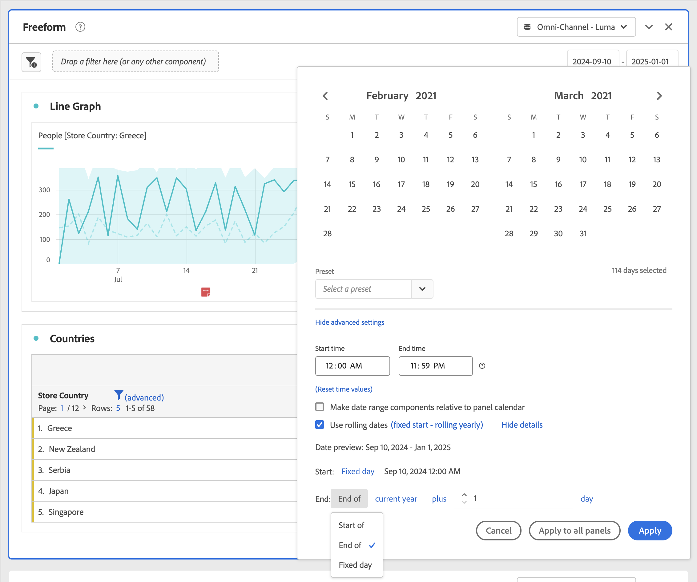

# 패널 개요

[!UICONTROL 패널]은 테이블 및 시각화 컬렉션입니다. Workspace의 왼쪽 상단 아이콘 또는 [빈 패널](/help/analyze/analysis-workspace/c-panels/blank-panel.md)에서 패널에 액세스할 수 있습니다. 패널은 기간, 보고서 세트 또는 분석 사용 사례에 따라 프로젝트를 구성하려는 경우 유용합니다.

## 패널 유형

[!UICONTROL Adobe Analytics]을 위한 Analysis Workspace에서 다음 패널 유형을 사용할 수 있습니다.

| 패널 이름 | 설명 |
| --- | --- |
| [빈 패널](/help/analyze/analysis-workspace/c-panels/blank-panel.md) | 사용 가능한 패널 및 시각화 중에서 선택하여 분석을 시작합니다. |
| [속성](attribution.md) | 차원 및 전환 지표를 사용하여 여러 속성 모델을 빠르게 비교하고 시각화합니다. |
| [Target용 Analytics](a4t-panel.md) | Analysis Workspace에서 Target 활동 및 경험을 분석합니다. |
| [자유 형식](freeform-panel.md) | 무제한 비교 및 분석을 수행한 다음 시각화를 추가하여 풍부한 데이터 스토리를 전달합니다. |
| [미디어 평균 분당 시청 대상자](average-minute-audience-panel.md) | 특정 콘텐츠 또는 사용자 정의된 기간 전체에 대해 평균 분당 시청 대상자를 분석합니다. |
| [미디어 동시 뷰어](media-concurrent-viewers.md) | 최대 동시성 및 분류 및 비교 기능에 대한 세부 정보로 시간 경과에 따른 동시 뷰어를 분석합니다. |
| [미디어 재생 체류 시간](/help/analyze/analysis-workspace/c-panels/media-playback-time-spent.md) | 재생 체류 시간 분석을 통해 최대 동시 시청이 발생하는 위치 또는 시청 감소가 발생하는 위치를 파악합니다. |
| [다음 또는 이전 항목](next-previous.md) | 사용자가 이동하는 다음 또는 이전 페이지를 표시합니다. |
| [빠른 인사이트](quickinsight.md) | 인사이트를 더 빨리 분석하고 발견하려면 자유 형식 테이블과 함께 제공되는 시각화를 신속하게 빌드합니다. |
| [페이지 요약](page-summary.md) | 특정 페이지에 대한 주요 통계를 탐색합니다. |
| [세그먼트 비교](/help/analyze/analysis-workspace/c-panels/c-segment-comparison/segment-comparison.md) | 모든 데이터 포인트에서 두 세그먼트를 빠르게 비교하여 관련 차이점을 자동으로 찾습니다. |

[!UICONTROL 빠른 인사이트], [!UICONTROL 빈] 패널 및 [!UICONTROL 자유 형식] 패널은 분석을 시작하기에 좋은 위치이며 [!UICONTROL Attribution IQ]는 보다 고급 분석에 적합합니다. 캔버스 하단에서 을 사용할 수 있으므로 언제든지 빈 패널을 추가할 수 있습니다.

기본 시작 패널은 [!UICONTROL 자유 형식] 패널이지만 [빈 패널](/help/analyze/analysis-workspace/c-panels/blank-panel.md) 또는 [빠른 인사이트](/help/analyze/analysis-workspace/c-panels/quickinsight.md)도 기본값으로 설정할 수 있습니다. [프로젝트 및 분석 환경 설정](/help/analyze/analysis-workspace/user-preferences.md#projects--analyses-preferences)을 참조하십시오.

## 패널 만들기

패널을 만드는 방법:

* **[!UICONTROL 패널]** 왼쪽 패널의 패널을 캔버스에 드래그 앤 드롭합니다.
* [빈 패널](blank-panel.md)에서 패널을 선택합니다.
* Workspace에서 **[!UICONTROL 삽입]** 메뉴를 사용하고 패널을 선택합니다. 또는 [단축키](../build-workspace-project/fa-shortcut-keys.md)를 사용하여 패널을 삽입할 수 있습니다.

  

다음과 같은 작업을 수행할 수 있습니다.

* 모든 패널 **내** 을 선택하여 다른 시각화를 추가합니다. 시각화를 선택할 수 있는 팝업이 나타납니다.

  

  | 선택... | 다음을 만들려면... |
  |---|---|
  |  | [자유 형식 테이블](/help/analyze/analysis-workspace/visualizations/freeform-table/freeform-table.md) |
  |  | [라인](/help/analyze/analysis-workspace/visualizations/line.md) |
  |  | [막대](/help//analyze/analysis-workspace/visualizations/bar.md) |
  |  | [요약 번호](/help/analyze/analysis-workspace/visualizations/summary-number-change.md) |
  |  | [텍스트](/help/analyze/analysis-workspace/visualizations/text.md) |
  |  | [폴아웃](/help/analyze/analysis-workspace/visualizations/fallout/fallout-flow.md) |
  |  | [플로우](/help/analyze/analysis-workspace/visualizations/c-flow/flow.md) |
  |  | [스택 영역](/help/analyze/analysis-workspace/visualizations/area.md) |
  |  | [코호트 테이블](/help/analyze/analysis-workspace/visualizations/cohort-table/t-cohort.md) |
  |  | [글머리 기호](/help/analyze/analysis-workspace/visualizations/bullet-graph.md) |
  |  | [도넛](/help/analyze/analysis-workspace/visualizations/donut.md) |
  |  | [요약 변경](/help/analyze/analysis-workspace/visualizations/summary-number-change.md) |
  |  | [히스토그램](/help/analyze/analysis-workspace/visualizations/histogram.md) |
  |  | [분산](/help/analyze/analysis-workspace/visualizations/scatterplot.md) |
  |  | [벤](/help/analyze/analysis-workspace/visualizations/venn.md) |
  |  | [트리맵](/help/analyze/analysis-workspace/visualizations/treemap.md) |

* Workspace의 마지막 패널 **외부**&#x200B;에서 을 선택하여 다른 [빈 패널](blank-panel.md)을 추가합니다.

## 보고서 세트

각 패널은 [리포트 세트](/help/admin/admin/c-manage-report-suites/report-suites-admin.md)와 연결되고, 패널 오른쪽 상단의 드롭다운 메뉴에서  **[!UICONTROL *리포트 세트&#x200B;*]**&#x200B;로 식별됩니다.

새 패널을 만들면 기본 리포트 세트는 Analysis Workspace 프로젝트에서 마지막으로 작업한 패널의 리포트 세트를 기반으로 합니다.

분석 사용 사례에 따라 프로젝트 내에서 하나 또는 [여러 보고서 세트](https://experienceleague.adobe.com/docs/analytics/analyze/analysis-workspace/build-workspace-project/multiple-report-suites.html?lang=ko)를 사용할 수 있습니다.

보고서 세트 목록은 관련성을 기준으로 정렬되며, Adobe는 현재 사용자가 제품군을 얼마나 최근에 그리고 얼마나 자주 사용했는지를 기준으로 정의합니다.

>[!IMPORTANT]
>
>선택한 리포트 세트는 패널에서 시각화를 빌드할 수 있는 차원, 지표 및 세그먼트를 결정합니다.
>
>
>패널의 리포트 세트를 전환하면 해당 새 리포트 세트에서 일부 구성 요소를 사용하지 못할 수 있습니다. 전환되면 시각화가 제대로 렌더링되지 않을 수 있습니다. 다음과 같은 경고가 표시될 수 있습니다.
>
>* 이 패널에는 선택한 리포트 세트에서 활성화되지 않은 구성 요소가 포함됩니다. 보고서 세트를 변경하거나 보고서 세트에서 필요한 구성 요소를 활성화합니다.
>* 시각화를 렌더링할 수 없습니다. 열과 행을 확인하여 유효한 구성 요소가 포함되어 있는지 확인하십시오.
>

## 캘린더

패널 캘린더는 패널 내의 테이블 및 시각화에 대한 데이터 범위를 제어합니다.

>[!NOTE]
>
> 날짜 범위 구성 요소가 시각화 또는 패널 내에서 (예: 세그먼트로) 사용되면 날짜 범위 구성 요소가 패널 캘린더보다 우선 적용됩니다.
>

1. 시작 일자를 먼저 선택한 다음 종료 일자를 선택하여 날짜 범위를 선택합니다.
또는 [!UICONTROL *사전 설정 선택*] 드롭다운 메뉴에서 **[!UICONTROL 사전 설정]**&#x200B;을 선택할 수 있습니다.

1. 필요한 경우 **[!UICONTROL 고급 설정 표시]**&#x200B;를 선택하여 다음 작업을 수행하십시오.

   * 기본 `12:00 AM`(`0:00`) 및 `11:59 PM`(`23:59`)가 아닌 다른 **[!UICONTROL 시작 시간]** 및 **[!UICONTROL 종료 시간]**&#x200B;을 지정합니다. 종료 시간은 항상 59초를 포함합니다. 날짜 범위가 여러 날에 걸친 경우 시작 시간은 날짜 범위의 첫 번째 날에 적용되고 종료 시간은 날짜 범위의 마지막 날에 적용됩니다. **[!UICONTROL (시간 값 재설정)]**&#x200B;을 사용하여 시작 및 종료 시간을 기본값으로 재설정합니다.
   * **[!UICONTROL 패널 캘린더를 기준으로 날짜 범위 구성 요소 만들기]**. 비활성화되면 패널에 사용된 날짜 범위 구성 요소는 현재 시간을 기준으로 합니다. 활성화되면 패널에 사용된 날짜 범위 구성 요소는 패널 캘린더를 기준으로 합니다.
   * **[!UICONTROL 순환 날짜 사용]**. 활성화되면 현재 날짜와 시간이 경과함에 따라 **[!UICONTROL 지난 7일]**&#x200B;과 같은 사전 설정 날짜 범위가 동적으로 업데이트됩니다. 비활성화되면 해당 사전 설정이 적용되어 업데이트되지 않습니다.

     

     대괄호 안의 텍스트를 선택하여(예: **[!UICONTROL 고정된 시작 - 일별 롤링]**) 패널을 확장하고 **[!UICONTROL 시작]** 및 **[!UICONTROL 종료]**&#x200B;에 대한 세부 정보를 지정할 수 있습니다.

      1. **[!UICONTROL 시작]**, **[!UICONTROL 종료]** 또는 **[!UICONTROL 고정일]**&#x200B;을 선택합니다.
      1. **[!UICONTROL 시작]** 또는 **[!UICONTROL 종료]**&#x200B;를 선택한 경우 전체 표현식을 작성할 수 있습니다. 예: **[!UICONTROL 현재 연도]** **[!UICONTROL 종료]** **[!UICONTROL +]** `1` **[!UICONTROL 일]**. 표현식의 각 개별 부분에 적합한 값을 선택합니다.
         * 현재 값을 선택합니다. 예: **[!UICONTROL 현재 연도]**.
         * 추가 계산 값을 선택합니다. 예: **[!UICONTROL 더하기]**.
         * 추가 계산이 지정된 경우 값을 지정합니다. 예 `1`.
         * 추가 계산이 지정된 경우 계산에 사용할 기간을 선택합니다. 예: **[!UICONTROL 일]**.

     **[!UICONTROL 세부 정보 숨기기]**&#x200B;를 선택하여 순환 날짜 계산에 대한 세부 정보를 숨깁니다.

1. **[!UICONTROL 적용]**&#x200B;을 선택하여 캘린더를 호출한 패널에 날짜 범위를 적용합니다.
**[!UICONTROL 모든 패널에 적용]**&#x200B;을 선택하여 Workspace 프로젝트의 모든 패널에 날짜 범위를 적용합니다.

## 드롭 영역 {#dropzone}

패널 드롭 영역을 사용하면 패널 내의 모든 테이블 및 시각화에 세그먼트 및 드롭다운 세그먼트를 적용할 수 있습니다. 패널에 하나 이상의 세그먼트를 적용할 수 있습니다.

### 세그먼트

패널 세그먼트화를 시작하려면 왼쪽 패널에서 패널 드롭 영역으로 세그먼트를 끌어다 놓습니다. 패널에 세그먼트를 추가하려면 이 과정을 반복하십시오. 세그먼트는 패널 상단에 나란히 표시됩니다.

#### 빠른 세그먼트

세그먼트가 아닌 구성 요소를 드롭 영역으로 직접 끌어와 빠른 세그먼트를 만들 수도 있으므로 [세그먼트 빌더](/help/components/segmentation/segmentation-workflow/seg-build.md)로 이동하는 데 드는 시간과 노력을 절약할 수 있습니다. 이러한 방식으로 생성된 세그먼트는 자동으로 이벤트 수준 세그먼트로 정의됩니다. 세그먼트 이름 옆의 을 선택하여 이 정의를 빠르게 수정할 수 있습니다.

<!-- For more information, see [Quick segments](/help/components/segmentation/). -->

### 드롭다운 세그먼트

>[!BEGINSHADEBOX]

데모 비디오는  [드롭다운 세그먼트](https://video.tv.adobe.com/v/30913?quality=12&learn=on&captions=kor){target="_blank"}를 참조하십시오.

>[!ENDSHADEBOX]

#### 정적 드롭다운 세그먼트

정적 드롭다운 세그먼트를 통해 제어된 방식으로 데이터와 상호 작용할 수 있습니다. 예를 들어 태블릿, 휴대폰 또는 데스크탑 별로 패널을 분할할 수 있도록 모바일 디바이스 유형에 대한 드롭다운 세그먼트를 추가할 수 있습니다.

정적 드롭다운 세그먼트를 사용하여 여러 프로젝트를 하나로 통합할 수도 있습니다. 예를 들어 다른 국가 세그먼트가 적용된 동일한 프로젝트의 여러 버전이 있는 경우 모든 버전을 단일 프로젝트로 통합하고 국가 드롭다운 세그먼트를 추가할 수 있습니다.

##### 정적 드롭다운 세그먼트 만들기

* 차원 항목을 사용하는 드롭다운 세그먼트의 경우 왼쪽 패널에서 단일 차원을 선택하여 ⇧(*Shift*) 키를 누른 상태에서 차원을 패널 드롭 영역에 놓습니다. 이 액션을 수행하면 해당 차원과 연결된 모든 차원 항목이 포함된 드롭다운 세그먼트가 생성됩니다.

  또는 차원과 연결된 특정 차원 항목만 드롭다운 세그먼트에 포함하려면 왼쪽 패널에서 원하는 차원 옆에 있는 오른쪽 화살표 아이콘을 선택합니다. 이 액션을 수행하면 사용 가능한 모든 차원 항목이 표시됩니다. ⇧+(*Shift* + *선택*) 또는 ^+(*제어* + *선택*)을 사용하여 이 목록에서 여러 차원 항목을 선택한 다음 ⇧ 키를 **누른 상태**&#x200B;에서 패널 드롭 영역에 놓습니다.

* 단일 구성 요소 유형을 사용하는 드롭다운 세그먼트(예: 차원, 세그먼트 또는 지표만 사용)의 경우 왼쪽 패널에서 ⇧+ 또는 ^+을 사용하여 동일한 유형의 여러 항목을 선택합니다. 그런 다음 ⇧ 키를 **누른 상태**&#x200B;에서 항목을 패널 드롭 영역에 놓습니다.

  선택한 구성 요소로 단일 드롭다운 세그먼트가 생성됩니다.

* 구성 요소 유형을 혼합하여 사용하는 드롭다운 세그먼트(예: 지표 2개와 세그먼트 3개)의 경우 ⇧+ 또는 ^+을 사용하여 여러 구성 요소를 선택합니다. ⇧ 키를 **누른 상태**&#x200B;에서 선택 항목을 패널 드롭 영역에 놓습니다. 이 컨텍스트에서는 모든 구성 요소 유형이 별도의 드롭다운 세그먼트로 처리됩니다. 예를 들어 선택 항목에 지표와 차원 항목을 모두 포함하면 두 개의 별도 드롭다운 세그먼트가 생성됩니다. 드롭다운 필터 하나에는 차원 항목이 포함되고 다른 드롭다운 세그먼트에는 지표가 포함됩니다.

드롭다운 세그먼트를 클릭하면 다음 컨텍스트 메뉴 옵션이 제공됩니다.

* **[!UICONTROL 드롭다운 삭제]**: 패널에서 드롭다운 세그먼트를 제거합니다.
* **[!UICONTROL 레이블 삭제]**: 드롭다운 세그먼트 위에 표시된 텍스트를 제거합니다. 레이블을 수정하려면 레이블 위로 마우스를 가져가 을 선택합니다.
* **[!UICONTROL 레이블 추가]**: 프로젝트에 드롭다운 세그먼트를 추가하면 구성 요소 이름에 레이블이 자동으로 설정됩니다. 레이블을 삭제한 경우 이 옵션을 사용하여 다시 추가할 수 있습니다.
* **[!UICONTROL 선택 필수]**: 패널에 세그먼트가 설정되어 있어야 합니다.

##### 정적 드롭다운 세그먼트 사용

사용자는 다음 방법 중 하나로 드롭다운 세그먼트 메뉴를 사용하여 패널을 세그먼트화할 수 있습니다.

* 드롭다운 세그먼트에서 세그먼트를 선택하여 패널에 단일 세그먼트를 적용합니다.

* 드롭다운 세그먼트에서 두 개 이상의 세그먼트를 선택하여 패널에 여러 세그먼트를 적용합니다. 선택된 세그먼트를 포함하도록 패널이 세그먼트화됩니다.

#### 동적 드롭다운 세그먼트

동적 드롭다운 세그먼트를 사용하면 패널의 보고 범위 내의 데이터 및 기타 드롭다운 세그먼트의 값을 기반으로 사용 가능한 값을 결정할 수 있습니다. 예를 들어 국가 차원과 도시 차원을 사용하여 두 개의 동적 드롭다운을 만들 수 있습니다. **[!UICONTROL 국가]** 드롭다운 목록에서 국가를 선택하면 **[!UICONTROL 도시]** 드롭다운 목록이 해당 국가 내의 도시만 표시하도록 동적으로 조정됩니다.

이와 동일한 개념이 모든 차원에 적용됩니다. 즉, 패널의 날짜 범위 및 선택한 세그먼트 내에 나타나는 차원 항목만 표시됩니다. 정적 드롭다운 세그먼트에서 선택한 차원 항목은 동적 드롭다운 세그먼트에서 사용 가능한 값에 영향을 줍니다. 그러나 그 반대로는 그렇지 않습니다. 즉, 동적 드롭다운 세그먼트에서 선택한 차원 항목은 정적 드롭다운 세그먼트에서 사용 가능한 값에 영향을 주지 않습니다.

나중에 특정 차원 항목을 수집할 것으로 예상되는 경우 차원 항목을 수동으로 선택할 수 있습니다. 값이 포함되지 않도록 동적 드롭다운 세그먼트를 지워서 다른 동적 드롭다운 세그먼트에 더 많은 값이 포함되도록 할 수도 있습니다. 해당 패널의 모든 드롭다운 세그먼트에서 선택 항목을 지우려면 **[!UICONTROL 모두 재설정]**&#x200B;을 선택합니다.

동적 드롭다운 세그먼트를 만드는 방법:

* ⇧**를 누른 상태**&#x200B;에서 단일 차원을 패널 드롭 영역으로 끌어다 놓습니다.

참고: 지표, 세그먼트 또는 날짜 범위에는 동적 드롭다운 세그먼트를 사용할 수 없습니다.

동적 드롭다운 세그먼트를 클릭하면 정적 드롭다운 세그먼트와 동일한 컨텍스트 메뉴 옵션이 제공됩니다.

## 컨텍스트 메뉴

패널 헤더의 컨텍스트 메뉴를 통해(마우스 오른쪽 버튼으로 클릭) 패널의 추가 기능을 사용할 수 있습니다.

다음 옵션을 사용할 수 있습니다.

| 옵션 | 설명 |
| --- | --- |
| **[!UICONTROL 복사된 패널 삽입]** | 복사한 패널을 프로젝트 내의 다른 위치 또는 다른 프로젝트에 붙여넣을 수 있습니다. |
| **[!UICONTROL 복사된 시각화 삽입]** | 복사한 시각화를 패널, 프로젝트 내 다른 위치 또는 다른 프로젝트에 붙여넣습니다. |
| **[!UICONTROL 모든 패널에 보고서 세트 적용]** | 이 패널의 보고서 세트를 프로젝트의 모든 다른 패널에 적용합니다. |
| **[!UICONTROL 패널 복사]** | 패널을 복사하여 프로젝트 내의 다른 위치 또는 다른 프로젝트에 삽입할 수 있습니다. |
| **[!UICONTROL 패널 복제]** | 현재 패널의 정확한 복제본을 만들어서 수정할 수 있습니다. |
| **[!UICONTROL 모든 패널 축소]** | 모든 프로젝트 패널을 축소합니다. |
| **[!UICONTROL 모든 패널 확장]** | 모든 프로젝트 패널을 확장합니다. |
| **[!UICONTROL 패널에서 모든 시각화 축소]** | 현재 패널의 모든 시각화를 축소합니다. |
| **[!UICONTROL 패널에서 모든 시각화 확장]** | 현재 패널의 모든 시각화를 확장합니다. |
| **[!UICONTROL 설명 편집]** | 패널에 대한 텍스트 설명을 추가(또는 편집)합니다. |
| **[!UICONTROL 패널 링크 가져오기]** | 프로젝트 내의 특정 패널로 사용자를 안내합니다. 링크를 선택하면 연결된 정확한 패널로 이동하기 전에 먼저 수신자가 로그인해야 합니다. |

## 구성

일부 패널(예: [!UICONTROL 속성], [!UICONTROL 실험], [!UICONTROL 미디어 평균 분당 시청 대상자] 등)에는 시각화를 빌드할 수 있는 구성 대화 상자가 있습니다. 패널 상단의 을 사용하여 구성에 액세스하고 이를 변경합니다.

<!--
## Panel types

The following panel types are available in Analysis Workspace:

| Panel name | Description |
| --- | --- |
| [Blank panel](blank-panel.md) | Choose from available panels and visualizations to start your analysis. |
| [Quick Insights panel](quickinsight.md) | Quickly build a freeform table and an accompanying visualization in order to analyze and uncover insights faster. |
| [Analytics for Target panel](a4t-panel.md) | Analyze Target activities and experiences in Analysis Workspace. |
| [Attribution panel](attribution.md) | Quickly compare and visualize any number of attribution models using any dimension and conversion metric. |
| [Freeform panel](freeform-panel.md) | Perform unlimited comparisons and breakdowns, then add visualizations to tell a rich data story. |
| [Media Average Minute Audience panel](average-minute-audience-panel.md) | Analyze average minute audience over time, with details on peak views and the ability to break down and compare. |
| [Media Concurrent Viewers panel](media-concurrent-viewers.md) | Analyze concurrent viewers over time, with details on peak concurrency and the ability to break down and compare. |
| [Media Playback Timespent panel](/help/analyze/analysis-workspace/c-panels/media-playback-time-spent.md) | Analyze concurrent viewers over time, with details on peak concurrency and the ability to break down and compare. |
| [Segment Comparison panel](c-segment-comparison/segment-comparison.md) | Quickly compare two segments across all data points to automatically find relevant differences. |

[!UICONTROL Quick Insights], [!UICONTROL Blank] and [!UICONTROL Freeform] panels are great places to start your analysis, while [!UICONTROL Analytics for Target], [!UICONTROL Attribution], [!UICONTROL Media Concurrent Viewers] and [!UICONTROL Segment Comparison] lend themselves to more advanced analyses. A `"+"` button is available in projects so you can add blank panels at any time.

The default starting panel is the [!UICONTROL Freeform] panel, but you can make the [blank panel](/help/analyze/analysis-workspace/c-panels/blank-panel.md) your default as well.

## Report suite {#report-suite}

Tables and visualizations within a panel derive data from the [!UICONTROL report suite] selected in the top right of the panel. The report suite also determines what components are available in the left rail. Within a project, you can use one or [many report suites](https://experienceleague.adobe.com/docs/analytics/analyze/analysis-workspace/build-workspace-project/multiple-report-suites.html?lang=ko) depending on your analysis use cases. To apply a single report suite to all panels in a project, **right-click panel header > Apply report suite to all panels**.

The list of report suites is sorted on relevancy, which Adobe defines based on how recently and frequently the suite has been used by the current user, and how frequently the suite is used within the organization.

## Calendar {#calendar}

The panel calendar controls the reporting range for tables and visualizations within a panel.

>[!NOTE]
>If a (purple) date range component is used within a table, visualization or panel drop zone, it overrides the panel calendar.

You can apply a minute-level date range under the advanced settings of your panel calendar. If you are reporting on a date range that spans many days, start time applies to the first day and end time applies to the last day in your range.

## Drop zone {#dropzone}

The panel drop zone enables you to apply segment and drop-down filters to all tables and visualizations within a panel. You can apply one or many filters to a panel. 

### Segment filters

Drag and drop any segments from the left rail into the panel drop zone to begin filtering your panel. Repeat this process to add additional filters to the panel. Filters appear side by side at the top of the panel.

### Ad hoc segment filters

Non-segment components can also be dragged directly into the drop zone to create ad hoc segments, saving you the time and effort of going to the Segment Builder. Segments created in this way are automatically defined as hit-level segments. This definition can be modified by clicking the information icon (i) next to the segment, then the pencil-shaped edit icon and editing it in the Segment Builder.

Ad hoc segments are a type of quick segment, and are local to the project. They do not show up in the left rail unless you make them public.

For more information, see [Quick segments](/help/analyze/analysis-workspace/components/segments/quick-segments.md).

### Static drop-down segments

Static drop-down segments enable you to interact with the data in a controlled way. For example, you can add a drop-down segment for Mobile Device Types so that you can segment the panel by Tablet, Mobile Phone, or Desktop.

Static drop-down segments can also be used to consolidate many projects into one. For example, if you have many versions of the same project with different Country segments applied, you can consolidate all versions into a single project and add a Country drop-down segment.

#### Create static drop-down segments

* For drop-down segments using dimension items, select a single dimension from the left rail and drop it into the panel dropzone **while holding `[Shift]`**. This creates a drop-down segment with all the dimension items that are associated with that dimension. 

  Or, if you want the drop-down segment to include only specific dimension items that are associated with a dimension, click the right arrow icon next to the desired dimension in the left rail. This action exposes all available dimension items. Select multiple dimension items from this list using `[Shift + Click]` or `[Ctrl + Click]`, then drop them into the panel dropzone **while holding** `[Shift]`.

* For drop-down segments using a single component type (for example, only dimensions, or only segments, or only metrics), select multiple items of the same type in the left rail using `[Shift + Click]` or `[Ctrl + Click]`, then drop them into the panel dropzone **while holding `[Shift]`**.

  A single drop-down segment is created with components that you selected.

* For drop-down segments using a mix of component types (such as 2 metrics and 3 filters), select multiple components using `[Shift + Click]` or `[Ctrl + Click]`. Drop the selection into the panel dropzone **while holding `[Shift]`**. In this context, all component types are treated as separate drop-down segments. For example, if you include both metrics and dimension items in your selection, two separate drop-down segments are created: one drop-down segments includes dimension items, and the other includes metrics.

  

Right-clicking a drop-down segment provides the following options:

* **[!UICONTROL Delete drop-down]**: Removes the drop-down segment from the panel. 
* **[!UICONTROL Delete label]**: Remove the text above a drop-down segment. To modify the label, select the pencil icon.
* **[!UICONTROL Add label]**: When you add a drop-down segment to a project, a label is automatically set to the component name. If you delete the label, you can add it again with this option.
* **[!UICONTROL Require selection]**: Requires that a segment is set on the panel. 

[Watch the video](https://experienceleague.adobe.com/docs/analytics-learn/tutorials/analysis-workspace/using-panels/using-panels-to-organize-your-analysis-workspace-projects.html?lang=ko) to learn more about how to add drop-down filters to your project.

#### Use static drop-down segments

Use the drop-down segments menu in any of the following ways in order to filter the panel:
     
* Apply a single segment to the panel by selecting the segment from the drop-down menu.

* Apply multiple segments to the panel by selecting more than one segment from the drop-down menu. The panel is filtered to include any of the selected segments. 

  To remove a segment from the list, select it again in the drop-down menu.

  

### Dynamic drop-down segments

Dynamic drop-down segments allow you to determine available values based on data within the panel's reporting range and values in other drop-down segments. For example, you can create two dynamic drop-downs using the [Countries](/help/components/dimensions/countries.md) dimension and [Cities](/help/components/dimensions/cities.md) dimension. When you select a country from the [!UICONTROL Countries] drop-down list, the [!UICONTROL Cities] drop-down list dynamically adjusts to only show cities within that country.

This same concept applies to all dimensions; only dimension items that appear within the panel's date range and selected segments are visible. Dimension items selected in static drop-down segments affect available values in dynamic drop-down segments. However, the inverse is not true; Dimension items selected in dynamic drop-down segments do not affect available values in static drop-down segments.

Manual selection of dimension items is available if you anticipate a certain dimension item to be collected in the future. You can also clear a dynamic drop-down segment so that it does not contain a value, allowing other dynamic drop-down segments to contain more values. Select **[!UICONTROL Reset all]** to clear the selection from all drop-down segments for that panel.

To create a dynamic drop-down segment:

* Drag and drop a single dimension into the panel dropzone **while holding `[Shift]`**.
* Dynamic drop-down segments are not available for metrics, segments, or date ranges.
* Right-click a drop-down segment and select **[!UICONTROL Delete dropdown]** to delete it.

Right-clicking a dynamic drop-down filter provides the same options as static drop-down filters.

## Right-click menu {#right-click}

Additional functionality for a panel is available by right-clicking on the panel header.

The following settings are available:

| Setting | Description |
| --- | --- |
| Insert Copied Panel/Visualization|Lets you paste ("insert") a copied panel or visualization to another place within the project, or into a different project.|
| Copy Panel | Lets you right-click and copy a panel, so that you can insert it to another place within the project, or into a different project.|
| Apply Report Suite to all panels | Lets you apply the active panel report suite to all panels in the project.|
| Duplicate Panel | Makes an exact duplicate of the current panel, which you can then modify. |
| Collapse/Expand all Panels | Collapses and expands all project panels. |
| Collapse/Expand all Visualizations in Panel | Collapses and expands all visualizations in the current panel. |
| Edit Description | Add (or edit) a text description for the panel. |
| Get Panel Link | Lets you direct someone to a specific panel within a project. When the link is clicked, the recipient will be required to login before being directed to the exact panel linked to. |

-->
