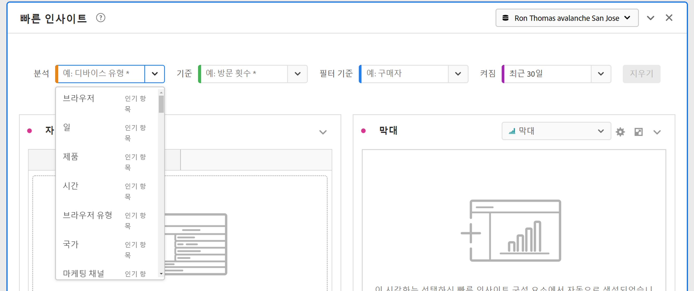
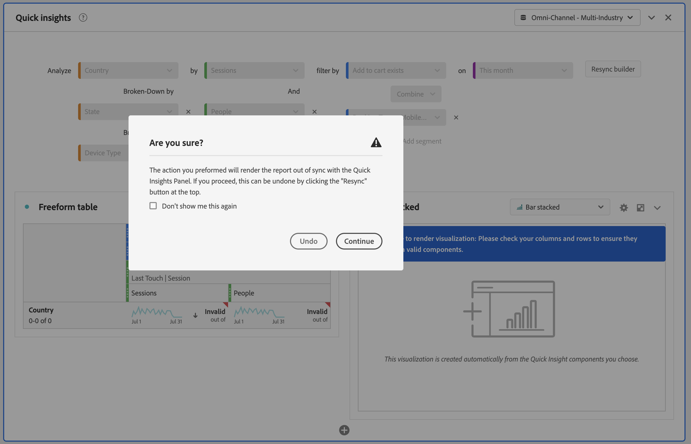

# 빠른 인사이트 패널 {#quick-insights-panel}

<!-- markdownlint-disable MD034 -->

>[!CONTEXTUALHELP]
>id="workspace_quickinsights_button"
>title="빠른 인사이트"
>abstract="인사이트를 더 빨리 분석하고 발견할 수 있도록 자유 형식 테이블과 함께 제공되는 시각화를 신속하게 빌드하는 패널을 만듭니다."

<!-- markdownlint-enable MD034 -->

>[!BEGINSHADEBOX]

_이 문서에서는_ _&#x200B;**Adobe Analytics**&#x200B;의 빠른 인사이트 패널에 대해 설명합니다._ _이 문서의 [&#128279;](/help/analyze/analysis-workspace/c-panels/quickinsight.md)CustomerJourneyAnalytics_  버전에 대한 _&#x200B;**빠른 인사이트 패널**&#x200B;을 참조하세요._

>[!ENDSHADEBOX]

[!UICONTROL 빠른 인사이트]는 [!UICONTROL Analysis Workspace]의 비분석가 및 새 사용자에게 비즈니스 관련 질문에 빠르고 쉽게 답변할 수 있는 방법을 배울 수 있도록 지침을 제공합니다. 또한 고급 사용자가 테이블을 직접 만들지 않고도 간단한 질문에 빠르게 답할 수 있는 훌륭한 도구입니다.

이 [!UICONTROL Analysis Workspace]를 처음 사용할 때

* 어떤 시각화가 가장 유용한지,
* 어떤 차원 및 지표가 인사이트를 용이하게 하는지,
* 항목을 끌어다 놓을 위치,
* 필터를 만들 위치 등을
* 궁금해 할 수 있습니다.

이러한 질문에 도움이 되도록 [!UICONTROL 빠른 인사이트]에서는 회사에서 사용하는 가장 인기 있는 차원, 지표, 세그먼트 및 날짜 범위를 제공하는 알고리즘을 활용합니다. 이 알고리즘은 [!UICONTROL Analysis Workspace]에서 귀사의 데이터 구성 요소 사용을 기반으로 합니다. 실제로 다음과 같이 드롭다운 목록에서 [!UICONTROL 인기]로 태그가 지정된 차원, 지표 및 세그먼트가 표시됩니다.

[!UICONTROL 빠른 인사이트]는 다음과 같은 지원을 제공합니다.

* [!UICONTROL Analysis Workspace]에서 데이터 테이블 및 관련 시각화를 올바르게 작성합니다.
* 기본 구성 요소 및 [!UICONTROL Analysis Workspace]조각에 대한 용어 및 용어를 알아봅니다.
* 간단하게 차원을 분류하거나, 여러 지표를 추가하거나, [!UICONTROL 자유 형식 테이블] 내에서 세그먼트를 쉽게 비교할 수 있습니다.
* 다양한 시각화 유형을 변경하거나 테스트하여 분석에 필요한 찾기 툴을 빠르고 직관적으로 찾을 수 있습니다.

## 기본 핵심 용어

다음은 알아두어야 할 몇 가지 기본 용어입니다. 각 데이터 테이블은 데이터 스토리 전달에 사용하는 2개 이상의 빌딩 블록(구성 요소)으로 구성됩니다.

| 빌딩 블록(구성 요소) | 정의 |
|---|---|
| **[!UICONTROL 차원]** | 차원은 프로젝트에서 보고, 분류하고 비교할 수 있는 지표 데이터에 대한 설명 또는 특성입니다. 숫자가 아닌 값 및 차원 항목으로 분류되는 날짜입니다. 예를 들어 *브라우저* 또는 *페이지*&#x200B;는 차원입니다. |
| **[!UICONTROL 차원 항목]** | 차원 항목은 차원의 개별 값입니다. 예를 들어 브라우저 차원의 차원 항목은 *Chrome*, *Firefox*, *Edge* 등이 됩니다. |
| **[!UICONTROL 지표]** | 지표는 보기 수, 클릭스루 횟수, 다시 로드 횟수, 평균 체류 시간, 판매량, 주문 수, 매출액 등과 같은 방문자 활동에 대한 수량 정보입니다. |
| **[!UICONTROL 시각화]** | Workspace에서는 데이터를 시각적으로 나타낼 수 있도록 해 주는 [다양한 시각화](/help/analyze/analysis-workspace/visualizations/freeform-analysis-visualizations.md)를 제공합니다. 막대 그래프, 도넛 차트, 히스토그램, 선 차트, 맵, 산점도 등과 같은 데이터. |
| **[!UICONTROL 차원 분류]** | 차원 분류는 차원을 다른 차원으로 분류하는 방법입니다. 예를 들어 미국 주를 모바일 디바이스별로 분류하여 주별 모바일 디바이스 방문수를 확인할 수 있습니다. 또는 모바일 디바이스 유형별로, 지역별, 내부 캠페인 등으로 분류할 수 있습니다. |
| **[!UICONTROL 세그먼트]** | 세그먼트를 사용하여 특성 또는 웹 사이트 상호 작용에 따라 방문자 하위 세트를 식별할 수 있습니다. 예를 들어 다음 속성을 기반으로 [!UICONTROL 방문자] 세그먼트를 만들 수 있음: <li>속성: 브라우저 유형, 디바이스, 방문 수, 국가, 성별 또는</li><li>상호 작용: 캠페인, 키워드 검색, 검색 엔진 또는</li><li>종료 및 진입: Facebook 방문자, 정의된 랜딩 페이지, 참조 도메인 또는</li><li> 사용자 정의 변수: 양식 필드, 정의된 카테고리, 고객 ID. |

## 사용

**[!UICONTROL 빠른 인사이트]** 패널을 사용하는 방법:

1. **[!UICONTROL 빠른 인사이트]** 패널을 만듭니다. 패널을 만드는 방법에 대한 자세한 내용은 [패널 만들기](panels.md#create-a-panel)를 참조하십시오.

1. **[!UICONTROL 빠른 인사이트]** 패널을 처음 사용할 때 기본 사항을 설명하는 [!UICONTROL 소개 튜토리얼]을 살펴볼 수도 있습니다. 빠른 인사이트 패널 제목 옆의 를 선택한 다음 팝업에서 **[!UICONTROL 소개 튜토리얼]**&#x200B;을 선택합니다.

1. 패널의 [입력](#panel-input)을 지정합니다.

1. 패널의 [출력](#panel-output)을 확인합니다.

### 패널 입력

빌딩 블록 선택:

* **[!UICONTROL 분석]** - 차원 지정(주황색)
* **[!UICONTROL 지표 기준]** - 지표 지정(녹색)
* **[!UICONTROL 필터 기준]** - 세그먼트 지정(파란색)
* **[!UICONTROL 범위]** - 날짜 범위를 지정합니다(자주색).

시각화가 올바르게 작동하도록 하나 이상의 차원과 지표를 선택해야 합니다.

다음 세 가지 방법으로 빌딩 블록을 지정할 수 있습니다.

* 왼쪽 패널에서 구성 요소를 드래그 앤 드롭합니다.
* 빌딩 블록 필드 중 하나에 입력을 시작합니다. 입력이 발견되면 가능한 값이 빌딩 블록 필드에 자동으로 채워집니다.
* 빌딩 블록 드롭다운(예: **[!UICONTROL Analyze]**&#x200B;의 **[!UICONTROL Country]**)을 지정하고 사용할 값(예: )에 대해 가능한 값 목록(**[!UICONTROL V자형 화살표]** 사용)을 검색합니다.

**[!UICONTROL 지우기]**&#x200B;를 선택하여 입력 필드를 모두 지웁니다.

### 패널 출력

1. 하나 이상의 차원과 지표를 추가한 경우 결과를 조회할 수 있습니다.

   

   * [!UICONTROL 최근 12개월] 동안 [!UICONTROL 검색 엔진] [!UICONTROL 방문 수]에 따라 세그먼트화된 차원([!UICONTROL 국가 사이트])과 지표([!UICONTROL 방문 수])가 포함된 자유 형식 테이블.

   * 함께 제공되는 시각화(이 경우 [막대 그래프](/help/analyze/analysis-workspace/visualizations/bar.md)) 생성된 시각화는 테이블에 추가한 데이터 유형을 기반으로 합니다. 시간 기반 데이터(예: 일/개월당 [!UICONTROL 방문 수])는 기본적으로 [!UICONTROL 라인] 차트로 설정됩니다. 시간 기반이 아닌 데이터(예: [!UICONTROL 디바이스]당 [!UICONTROL 방문 수])는 기본적으로 [!UICONTROL 막대] 차트로 제공됩니다. 시각화 유형 옆의 드롭다운 화살표를 클릭하여 시각화 유형을 변경할 수 있습니다.

1. 아래의 [추가 팁](#more-tips)에 설명된 대로 세부 사항을 추가해 보십시오.

1. **[!UICONTROL 프로젝트 > 저장]**&#x200B;을 사용하여 프로젝트를 저장할 수도 있습니다.

## 추가 팁

다른 유용한 힌트는 [!UICONTROL 빠른 인사이트 빌더]에 표시되며, 일부는 마지막 액션에 따라 표시됩니다.

* 먼저 **[!UICONTROL 추가 팁]** 튜토리얼을 완료할 수 있습니다. 이 튜토리얼은 하나 이상의 차원과 지표가 있는 프로젝트를 만든 후 24시간을 보여 줍니다. 빠른 인사이트 패널 제목 옆의 를 선택한 다음 팝업에서 **[!UICONTROL 추가 팁]**&#x200B;을 선택합니다.

  

* 여러 차원 및 지표를 분석하고, 세그먼트를 결합하거나 비교하고, 날짜 범위를 지정할 수 있습니다.

  

   * **[!UICONTROL 별로 분류된]** 차원 **[!UICONTROL 분석]**: 차원에서 최대 3개의 분류 수준을 사용하여 필요한 데이터로 드릴다운할 수 있습니다. ➊, ➋ 및 ➌을(를) 참조하십시오.

   * 더 많은 지표 **[!UICONTROL 기준]** 추가: 최대 2개의 지표를 추가할 수 있습니다. ➍ 및 ➎을(를) 참조하십시오.

   * **[!UICONTROL 필터링 기준]**: 최대 2개의 세그먼트를 추가할 수 있습니다. 예를 들어 예약을 세그먼트로 추가하고, 해당 세그먼트를 자주 방문하는 예약자 세그먼트, 처음 여행하는 고객 세그먼트와 결합하여 비교합니다. ➏, ➐ 및 ➑을(를) 참조하십시오.

   * 범위: 날짜 범위를 지정할 수 있습니다. 자세한 내용은 ➒를 참조하십시오.

## 알려진 제한 사항

테이블 내에서 바로 편집하는 경우 [!UICONTROL 빠른 인사이트] 패널이 동기화되지 않을 수 있습니다. 패널 오른쪽 상단의 **[!UICONTROL 빌더 재동기화]**&#x200B;를 선택하여 이전 [!UICONTROL 빠른 인사이트] 설정으로 복원합니다.

테이블에 직접 추가하기 전에 경고가 표시됩니다.

그렇게 하지 않고 직접 빌드하면 신규 사용자에게 유용한 기능 없이 테이블이 기존의 자유 형식 테이블로 동작하게 됩니다.

>[!MORELIKETHIS]
>
>[패널 만들기](/help/analyze/analysis-workspace/c-panels/panels.md#create-a-panel)
>
<!--
# Quick Insights panel

[!UICONTROL Quick Insights] provides guidance for non-analysts and new users of [!UICONTROL Analysis Workspace] to learn how to answer business questions quickly and easily. It is also a great tool for advanced users who want to answer a simple question quickly without having to build a table themselves.

When you first start using this [!UICONTROL Analysis Workspace], you might wonder what visualizations would be most useful, which dimensions and metrics might facilitate insights, where to drag and drop items, where to create a segment, etc. 

To help with this, and based on your own company's usage of data components in [!UICONTROL Analysis Workspace], [!UICONTROL Quick Insights] leverages an algorithm that will present you with the most popular dimensions, metrics, segments, and date ranges your company uses. In fact, you will see dimensions, metrics, and segments tagged as [!UICONTROL Popular] in the drop-down list, as shown here:

[!UICONTROL Quick Insights] helps you

* Properly build a data table and an accompanying visualization in [!UICONTROL Analysis Workspace].
* Learn the terminology and vocabulary for basic components and pieces of [!UICONTROL Analysis Workspace].
* Do simple breakdowns of dimensions, add multiple metrics, or compare segments easily within a [!UICONTROL Freeform table].
* Change or try out various visualization types to find the find tool for your analysis quickly and intuitively.

Here is a video overview of the [!UICONTROL Quick Insights] panel:

>[!VIDEO](https://video.tv.adobe.com/v/37248/?quality=12)

## Basic key terminology

Following are some of the basic terms you need to be familiar with. Each data table consists of 2 or more building blocks (components) that you utilize to tell your data story.

|Building block (Component)|Definition|
|---|---|
|[!UICONTROL Dimension]|Dimensions are descriptions or characteristics of metric data that can be viewed, broken down, and compared in a project. They are non-numeric values and dates that break down into dimension items. For example, "browser", or "page" are dimensions.|
|[!UICONTROL Dimension item]|Dimension items are individual values for a dimension. For example, dimension items for the browser dimension would be "Chrome", "Firefox", "Edge", etc.|
|[!UICONTROL Metric]|Metrics are quantitative information about visitor activity, such as views, click-throughs, reloads, average time spent, units, orders, revenue, and so on.|
|[!UICONTROL Visualization]|Workspace offers [a number of visualizations](/help/analyze/analysis-workspace/visualizations/freeform-analysis-visualizations.md) to build visual representations of your data, such as bar charts, donut charts, histograms, line charts, maps, scatterplots, and others.|
|[!UICONTROL Dimension Breakdown]|A dimension breakdown is a way to literally break down a dimension by other dimensions. In our example, you could break down US States by Mobile Devices to get the mobile device visits per state, or you could break Mobile Devices down by Mobile Device types, by Regions, by Internal Campaigns, etc..|
|[!UICONTROL Segment]|Segments let you identify subsets of visitors based on characteristics or website interactions. For example, you can build [!UICONTROL Visitor] segments based on attributes: browser type, device, number of visits, country, gender, or based on interactions: campaigns, keyword search, search engine, or based on exits and entries: visitors from Facebook, a defined landing page, referring domain, or based on custom variables: form field, defined categories, customer ID.  |

## Get started with Quick Insights

1. Log in to Adobe Analytics using the credentials you have been provided with.
1. Go to [!UICONTROL Workspace] and click **[!UICONTROL Create New Project]** and then click **[!UICONTROL Quick Insights]**. (You can also access this panel from the **[!UICONTROL Panel]** menu in the left rail.)

    

    

1. When you first start out, go through the short tutorial that teaches you some of the [!UICONTROL Quick Insights panel] basics. Or, click to **[!UICONTROL Skip Tutorial]**.
1. Select your building blocks (also known as components): dimensions (orange), metrics (green), segments (blue), or date ranges (purple) You have to select at least one dimension and one metric for a table to be built automatically. 

    

    You have three ways of selecting the building blocks:
    * Drag and drop them from the left rail.
    * If you know what you are looking for: Start typing and [!UICONTROL Quick Insights] will fill in the blanks for you.
    * Click on the drop-down and search the list.

1. When you have added at least one dimension and one metric, the following will be created for you:

    * A Freeform table with the dimension (here, US States) vertically and the metric (here, Visits) horizontally at the top. Check out this table: 

    

    * An accompanying visualization, in this case a [bar chart](/help/analyze/analysis-workspace/visualizations/bar.md). The visualization that is generated is based on the type of data you added to the table. Any time-based data (such as [!UICONTROL Visits] per Day/Month) defaults to a [!UICONTROL Line] chart. Any non-time-based data (such as [!UICONTROL Visits] per [!UICONTROL Device]) defaults to a [!UICONTROL Bar] chart. You can change the type of visualization by clicking on the drop-down arrow next to the visualization type.

1. (Optional) Drill down on dimensions and see dimension items by clicking the > right-arrow next to the dimension.

1. Try adding some more refinements as described below under "More tips."

1. Save your project by clicking **[!UICONTROL Project > Save]**.

## More tips

Other useful hints will pop up in the [!UICONTROL Quick Insights Builder], some of them depending on your last action.

* First, complete the **[!UICONTROL More tips]** tutorial: Access it via the Help (?) icon next to the [!UICONTROL Quick Insights] title. This tutorial shows up 24 hours after you have created a project with at least one dimension and one metric.

    

* **Breakdown by**: You can use up to 3 levels of breakdowns on dimensions to drill down to the data you really need.

    

* **Add more metrics**: You can add up to 2 more metrics by using the AND operator to add them the table.

    

* **Add more segments**: You can add up to 2 more segments by using the AND or OR operators to add them the table. Look at what happens to the table when you add Mobile Users OR Loyal Visitors. They are next to each other, above the metrics. If you added Mobile Users AND Loyal Visitors, you would see results from both segments together, and they would be stacked on top of each other in the table.

    

## Known limitations

If you try to edit directly within the table, it will cause the [!UICONTROL Quick Insights] panel to become out of sync. You can restore it to the previous [!UICONTROL Quick Insights] settings by clicking **[!UICONTROL Resync Builder]** at the top right of the panel.

 

You will get a warning before adding anything directly to the table:

 

Otherwise, building directly will cause the table to now behave as a traditional Freeform table, without the helpful features for new users.

-->