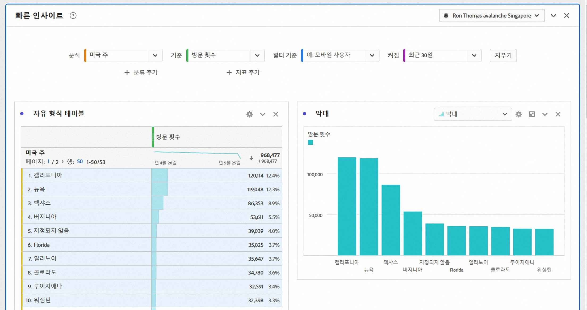

# Quick Insights 빌더

>[!IMPORTANT]
>
>**[!UICONTROL 빠른 인사이트]** 테스트는 현재 제한적입니다. [추가 정보...](https://docs.adobe.com/content/help/en/analytics/landing/an-releases.html)

[!UICONTROL 빠른 통찰력] 은 분석 작업 공간의 비분석가 및 새로운 사용자가 비즈니스 질문에 빠르고 손쉽게 대답하는 방법을  배울 수 있도록 도움을 줍니다. 또한 표 자체를 만들지 않고도 간단한 질문에 신속하게 답변하고자 하는 고급 사용자에게는 탁월한 툴입니다.

이 [!UICONTROL 분석 작업 공간]사용을 처음 시작할 때 어떤 시각화가 가장 유용한지, 어떤 차원과 지표를 통해 통찰력을 얻을 수 있는지, 항목을 드래그 앤 드롭할 위치, 세그먼트를 만들 위치 등이 궁금해질 수 있습니다.

이를 돕기 위해 [!UICONTROL 분석 작업 공간에서]자체 회사의 데이터 구성 요소 사용을 기반으로 [!UICONTROL 빠른 통찰력은] 회사에서 사용하는 가장 인기 있는 차원, 지표, 세그먼트 및 날짜 범위를 제공하는 알고리즘을 활용합니다.

[!UICONTROL 빠른 인사이트를] 통해

* 분석 작업 공간에서 데이터 테이블 및 관련 시각화를 [!UICONTROL 올바르게 작성합니다].
* 분석 작업 공간의 기본 구성 요소 및 부분에 대한 용어 및 [!UICONTROL 용어를 알아봅니다].
* 간단하게 차원을 분류하거나, 여러 지표를 추가하거나, 자유 형식 테이블 내에서 세그먼트를 쉽게 비교할 [!UICONTROL 수 있습니다].
* 다양한 시각화 유형을 변경하거나 테스트하여 분석에 필요한 찾기 툴을 빠르고 직관적으로 찾을 수 있습니다.

## 기본 키 용어

다음은 익숙해야 하는 몇 가지 기본 용어입니다. 각 데이터 테이블은 데이터 스토리를 전달하는 데 사용하는 2개 이상의 구성 요소(구성 요소)로 구성됩니다.

| 빌딩 블록(구성 요소) | 정의 |
|---|---|
| [!UICONTROL 차원] | 차원은 프로젝트에서 보고 분류하고 비교할 수 있는 지표 데이터의 설명 또는 특성입니다. 숫자가 아닌 값 및 차원 항목으로 분류되는 날짜입니다. 예를 들어 &quot;browser&quot; 또는 &quot;page&quot;는 차원입니다. |
| [!UICONTROL 차원 항목] | 차원 항목은 차원의 개별 값입니다. 예를 들어 브라우저 차원의 차원 항목은 &quot;Chrome&quot;, &quot;Firefox&quot;, &quot;Edge&quot; 등이 됩니다. |
| [!UICONTROL 지표] | 지표는 보기 수, 클릭스루 횟수, 다시 로드 횟수, 평균 체류 시간, 판매량, 주문 수, 매출액 등과 같은 방문자 활동에 대한 수량 정보입니다. |
| [!UICONTROL 시각화] | Workspace offers [a number of visualizations](/help/analyze/analysis-workspace/visualizations/freeform-analysis-visualizations.md) to build visual representations of your data, such as bar charts, donut charts, histograms, line charts, maps, scatterplots, and others. |
| [!UICONTROL 차원 분류] | 차원 분류는 차원을 다른 차원으로 문자 그대로 분류하는 방법입니다. 이 예에서는 미국 주를 모바일 장치별로 분류하여 주별 모바일 장치 방문을 받거나 모바일 장치 유형별로, 지역별, 내부 캠페인 등으로 분류할 수 있습니다. |
| [!UICONTROL 세그먼트] | 세그먼트를 사용하면 특성 또는 웹 사이트 상호 작용을 기반으로 방문자의 하위 집합을 식별할 수 있습니다. 예를 들어 속성을 기반으로 [!UICONTROL 방문자] 세그먼트를 만들 수 있습니다. 브라우저 유형, 장치, 방문 횟수, 국가, 성별 또는 상호 작용에 따라 다릅니다. 캠페인, 키워드 검색, 검색 엔진 또는 종료 및 항목 기반: Facebook의 방문자, 정의된 랜딩 페이지, 참조 도메인 또는 사용자 지정 변수 기반: 양식 필드, 정의된 카테고리, 고객 ID. |

## 빠른 인사이트 시작하기

1. 제공된 자격 증명을 사용하여 Adobe Analytics에 로그인합니다.
1. 작업 [!UICONTROL 공간] 으로 **[!UICONTROL 이동하고]** 새 프로젝트 **[!UICONTROL 만들기를 클릭한 다음]**&#x200B;빠른 통찰력을 클릭합니다. (왼쪽 레일의 **[!UICONTROL 패널]** 메뉴에서 이 패널에 액세스할 수도 있습니다.)

   

   

1. 처음 시작할 때 [!UICONTROL 빠른 인사이트 패널의] 기본 사항을 설명하는 간단한 자습서를 살펴보십시오. 또는 클릭하여 자습서 **[!UICONTROL 건너뛰기]**.
1. 구성 요소라고도 하는 구성 요소를 선택합니다. 차원(주황색), 지표(녹색), 세그먼트(파란색) 또는 날짜 범위(자주색) 자동으로 만들어질 테이블에 대해 하나 이상의 차원 및 지표를 선택해야 합니다.

   

   다음 세 가지 방법으로 구성 요소를 선택할 수 있습니다.
   * 왼쪽 레일에서 드래그하여 놓습니다.
   * 원하는 내용을 알고 있는 경우: 입력을 시작하면 [!UICONTROL 빠른 인사이트] 기능이 빈 공간을 채워줍니다.
   * 드롭다운을 클릭하고 목록을 검색합니다.

1. 하나 이상의 차원과 지표를 추가한 경우 다음을 생성합니다.

   * 세로 차원(미국 주)과 맨 위에 가로로 지표(여기, 방문)가 있는 자유 형식 테이블. 다음 표를 확인하십시오.
   

   * 함께 제공되는 시각화(이 경우 [막대 차트](/help/analyze/analysis-workspace/visualizations/bar.md)) 생성된 시각화는 표에 추가한 데이터 유형을 기반으로 합니다. 시간 기반 데이터(예: 일/ [!UICONTROL 월당 방문] 수)는 기본적으로 [!UICONTROL 라인] 차트로 설정됩니다. 시간 기반이 아닌 데이터(예: 장치당 [!UICONTROL 방문] 수 )는 기본적으로 [!UICONTROL 막대] 차트가됩니다. 시각화 유형 옆의 드롭다운 화살표를 클릭하여 시각화 유형을 변경할 수 있습니다.

1. (선택 사항) 차원 옆에 있는 > 오른쪽 화살표를 클릭하여 차원을 드릴다운하고 차원 항목을 봅니다.

1. 아래의 &quot;추가 팁&quot;에 설명된 대로 세부 사항을 추가해 보십시오.

1. 프로젝트 > 저장을 클릭하여 **[!UICONTROL 프로젝트를 저장합니다]**.

## 더 많은 팁

다른 유용한 힌트는 [!UICONTROL 빠른 인사이트 빌더에]표시되며, 일부는 마지막 작업에 따라 표시됩니다.

* 먼저 **[!UICONTROL 추가 팁]** 자습서를 완료합니다. 도움말(?)을 통해 액세스합니다. 아이콘을 클릭합니다.  이 자습서는 하나 이상의 차원과 지표가 있는 프로젝트를 만든 후 24시간을 보여줍니다.

   

* **분류 기준**: 차원에서 최대 3개의 분류 수준을 사용하여 필요한 데이터로 드릴다운할 수 있습니다.

   

* **지표 추가**: AND 연산자를 사용하여 표에 지표를 추가하여 최대 2개의 지표를 추가할 수 있습니다.

   

* **세그먼트 추가**: AND 또는 OR 연산자를 사용하여 테이블을 추가하여 최대 2개의 세그먼트를 추가할 수 있습니다. 모바일 사용자 또는 단골 방문자를 추가할 때 표에 나타나는 상황을 살펴봅니다. 지표 위에 서로 나란히 있습니다. 모바일 사용자 및 단골 방문자를 추가한 경우 두 세그먼트의 결과를 함께 볼 수 있으며 표의 서로 겹치게 됩니다.

   

## 알려진 제한 사항

표 내에서 직접 편집하려고 하면 [!UICONTROL 빠른 인사이트] 패널(빈 칸 채우기 도구)이 동기화되지 않습니다. 패널 오른쪽 상단에 있는 빌더 [!UICONTROL 재동기화를] 클릭하여 이전 **[!UICONTROL 빠른 인사이트]** 설정으로 복원할 수 있습니다.

테이블에 직접 추가하기 전에 경고가 표시됩니다.

그렇지 않으면, 직접 작성하면 새 사용자에게 유용한 기능을 제공하지 않고도 테이블이 이제 기존의 자유 형식 테이블로 동작하게 됩니다.

