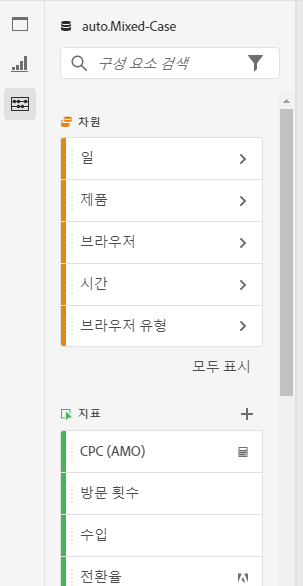
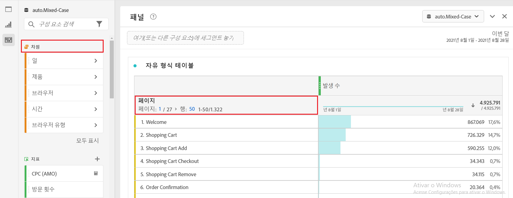
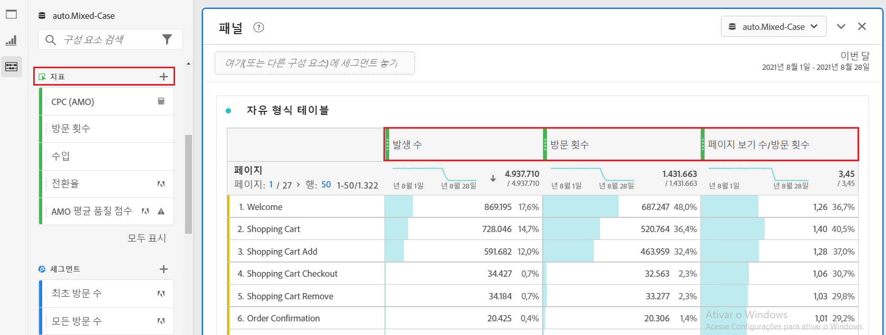
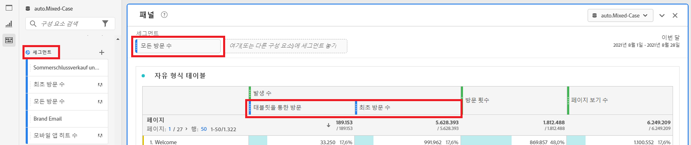
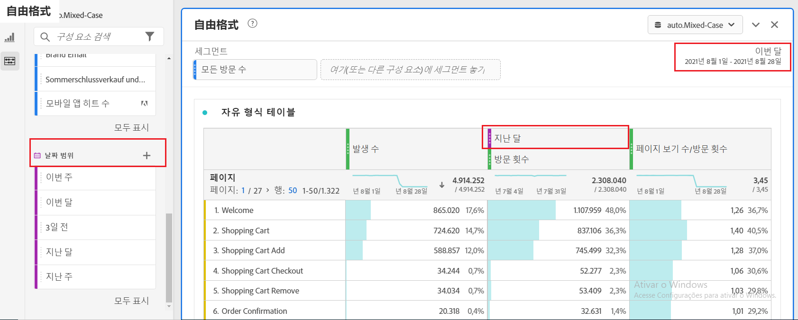
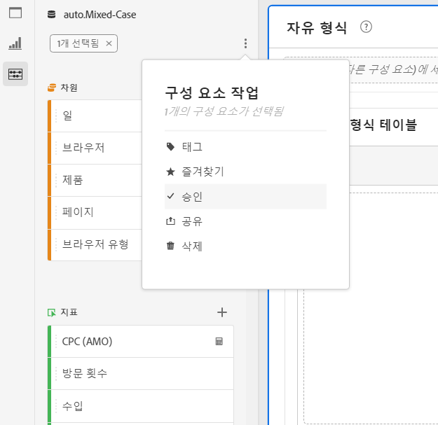

# 구성 요소 개요

Analysis Workspace의 구성 요소는 프로젝트로 드래그하여 놓을 수 있는 차원, 지표, 세그먼트 및 날짜 범위로 구성됩니다.

구성 요소 메뉴에 액세스하려면 왼쪽 레일에서 **[!UICONTROL 구성 요소]** 아이콘을 클릭합니다. 왼쪽 레일 아이콘의 [패널](https://docs.adobe.com/content/help/ko-KR/analytics/analyze/analysis-workspace/panels/panels.html), [시각화](https://docs.adobe.com/content/help/ko-KR/analytics/analyze/analysis-workspace/visualizations/freeform-analysis-visualizations.html) 및 구성 요소 간을 전환하거나 [핫키](/help/analyze/analysis-workspace/build-workspace-project/fa-shortcut-keys.md)를 사용하여 전환할 수 있습니다.

**[!UICONTROL 프로젝트 > 프로젝트 정보 및 설정 > 밀도 보기]**&#x200B;로 이동하여 프로젝트의 [밀도 설정 보기](https://docs.adobe.com/content/help/ko-KR/analytics/analyze/analysis-workspace/build-workspace-project/view-density.html) 밀도 설정을 조정하여 왼쪽 레일에 더 많은 값을 한 번에 볼 수도 있습니다.

## 치수 {#dimensions}

[**차원**](https://docs.adobe.com/content/help/en/analytics/components/dimensions/overview.html) 은 방문자의 행동을 설명하고 분석에서 보고, 분류하고 비교할 수 있는 텍스트 특성입니다. 왼쪽 구성 요소 레일(주황색 섹션)에서 찾을 수 있으며 일반적으로 표의 행으로 적용됩니다.

차원의 예로는 [!UICONTROL 페이지 이름], [!UICONTROL 마케팅 채널], [!UICONTROL 장치 유형] 및 [!UICONTROL 제품]이 있습니다. Dimension은 Adobe에서 제공되며 사용자 지정 구현(eVar, Prop, 분류 등)을 통해 캡처됩니다.

각 차원에는 **차원 항목**&#x200B;도 포함되어 있습니다. Dimension 항목은 차원 이름 옆에 있는 오른쪽 화살표를 클릭하여 왼쪽 구성 요소 레일에서 찾을 수 있습니다(항목은 노란색).

차원 항목의 예로는 [!UICONTROL 홈 페이지]([!UICONTROL 페이지] 차원 내), [!UICONTROL 유료 검색]( [!UICONTROL 마케팅 채널] 차원 내), [!UICONTROL 태블릿]([!UICONTROL 모바일 장치 유형 내) 등이 있습니다. a11/> 차원) 등과 같은 세그먼트를 만듭니다.]

## 메트릭 {#metrics}

[**지표**](https://docs.adobe.com/content/help/en/analytics/components/metrics/overview.html) 는 방문자 행동에 대한 수량 측정값입니다. 왼쪽 구성 요소 레일(녹색 섹션)에서 찾을 수 있으며 일반적으로 표의 열로 적용됩니다.

지표의 예로는 [!UICONTROL 페이지 보기 횟수], [!UICONTROL 방문 횟수], [!UICONTROL 주문 수], [!UICONTROL 평균 체류 시간] 및 [!UICONTROL 매출액/주문]이 있습니다. 지표는 Adobe에서 제공하거나 사용자 지정 구현([!UICONTROL 성공 이벤트])을 통해 캡처하거나 [계산된 지표 빌더](https://docs.adobe.com/content/help/ko-KR/analytics/components/calculated-metrics/calcmetric-workflow/cm-build-metrics.html)를 사용하여 만듭니다.

## 세그먼트 {#segments}

[**세그먼트**](https://docs.adobe.com/content/help/ko-KR/analytics/analyze/analysis-workspace/components/t-freeform-project-segment.html) 는 분석에 적용되는 대상 필터입니다. 왼쪽 구성 요소 레일(파란색 섹션)에서 찾을 수 있으며 일반적으로 표의 패널 상단 또는 위 지표 열 위에 적용됩니다.

세그먼트의 예에는 [!UICONTROL 모바일 장치 방문자], [!UICONTROL 이메일 방문] 및 [!UICONTROL 인증된 히트]가 있습니다. 세그먼트는 Adobe에서 제공하거나 [패널 드롭존](https://docs.adobe.com/content/help/en/analytics/analyze/analysis-workspace/panels/panels.html)에서 만들거나 [세그먼트 빌더](https://docs.adobe.com/content/help/ko-KR/analytics/components/segmentation/segmentation-workflow/seg-build.html)를 사용하여 만듭니다.

## 데이터 범위 {#date-ranges}

[**날짜**](https://docs.adobe.com/content/help/ko-KR/analytics/analyze/analysis-workspace/components/calendar-date-ranges/calendar.html) 범위는 분석을 수행하는 날짜 범위입니다. 왼쪽 구성 요소 레일(자주색 섹션)에서 찾을 수 있으며 일반적으로 각 패널의 달력에 적용됩니다.

날짜 범위의 예로는 2019년 7월, [!UICONTROL 지난 4주] 및 [!UICONTROL 이 달]이 있습니다. 날짜 범위는 Adobe에서 제공되거나, [패널 달력](https://docs.adobe.com/content/help/en/analytics/analyze/analysis-workspace/panels/panels.html)에 적용되거나, [날짜 범위 빌더](https://docs.adobe.com/content/help/en/analytics/analyze/analysis-workspace/components/calendar-date-ranges/custom-date-ranges.html)를 사용하여 만들어집니다.

## 구성 요소 작업 {#actions}

왼쪽 레일에서 구성 요소(개별적으로 또는 두 개 이상 선택)를 직접 관리할 수 있습니다. 구성 요소를 마우스 오른쪽 단추로 클릭하거나 구성 요소 목록 맨 위에 있는 작업 도트 아이콘을 클릭합니다.

| 구성 요소 작업 | 설명 |
|--- |--- |
| 태그 | 구성 요소에 태그를 적용하여 구성 요소를 구성하거나 관리합니다. 그런 다음 필터를 클릭하거나 #을 입력하여 왼쪽 레일에서 태그로 검색할 수 있습니다. 태그는 구성 요소 관리자도 필터 역할을 합니다. |
| 즐겨찾기 | 구성 요소를 즐겨찾기 목록에 추가합니다. 태그와 같이, 왼쪽 레일의 즐겨찾기로 검색하고 구성 요소 관리자에서 즐겨찾기로 필터링할 수 있습니다. |
| 승인 | 구성 요소가 조직 승인되었음을 사용자에게 알리기 위해 구성 요소를 승인됨으로 표시합니다. 태그와 마찬가지로 왼쪽 레일에서 승인됨으로 검색하고 구성 요소 관리자에서 기준으로 필터링할 수 있습니다. |
| 공유 | 조직의 사용자에게 구성 요소를 공유합니다. 이 옵션은 세그먼트나 계산된 지표와 같은 사용자 지정 구성 요소에만 사용할 수 있습니다. |
| 삭제 | 더 이상 필요하지 않은 구성 요소를 삭제합니다. 이 옵션은 세그먼트나 계산된 지표와 같은 사용자 지정 구성 요소에만 사용할 수 있습니다. |

사용자 지정 구성 요소는 해당 구성 요소 관리자를 통해 관리할 수도 있습니다. 예: [세그먼트 관리자](/help/components/segmentation/segmentation-workflow/seg-manage.md).
