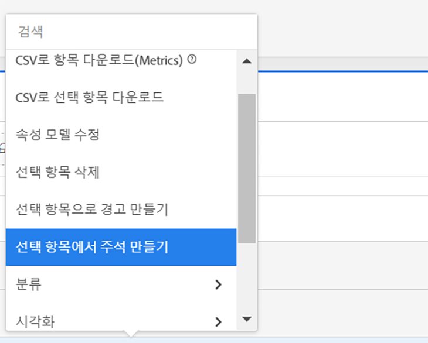
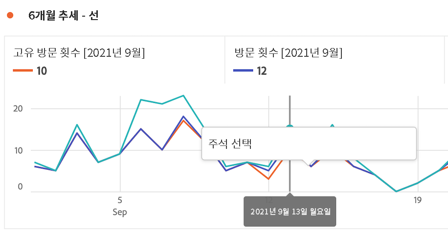
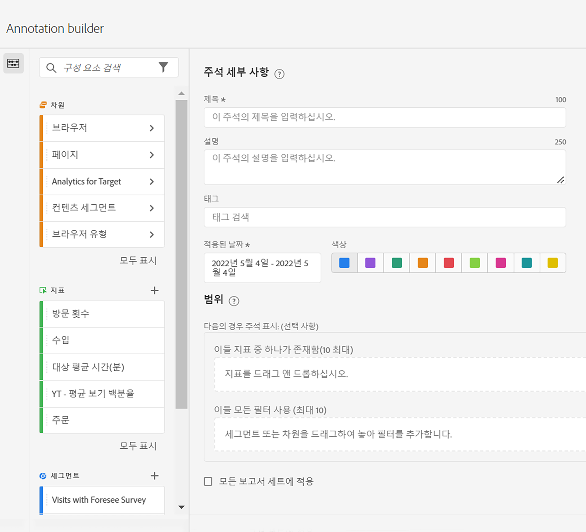

# 주석 생성

>[!NOTE]
>
>이 기능은 현재 제한적인 테스트가 실시되고 있습니다.

1. 주석을 만드는 방법은 여러 가지가 있습니다.

| 생성 방법 | 세부 사항 |
| --- | --- |
| **이동 [!UICONTROL Analytics] > [!UICONTROL 구성 요소] > [!UICONTROL 주석].** | 주석 관리자 페이지가 열립니다. [!UICONTROL 새 주석 생성]을 클릭하면 Annotation Builder가 열립니다. |
| **테이블에서 점을 마우스 오른쪽 단추로 클릭합니다.** | [!UICONTROL Annotation Builder가 열립니다. ] 기본적으로 이 방법으로 생성된 주석은 생성된 프로젝트에서만 표시됩니다. 그러나 모든 프로젝트에서 사용할 수 있도록 설정할 수 있습니다. 또한 날짜/초 및 지표 등이 이미 채워져 있음을 알 수 있습니다.
 |
| **에서 점을 마우스 오른쪽 단추로 클릭 [!UICONTROL 라인] 그래프.** | 다음 [!UICONTROL 주석 빌더] 엽니다. 기본적으로 이 방법으로 생성된 주석은 생성된 프로젝트에서만 표시됩니다. 그러나 모든 프로젝트에서 사용할 수 있도록 설정할 수 있습니다. 또한 날짜/초 및 지표 등이 이미 채워져 있음을 알 수 있습니다.
 |
| **Workspace에서 [!UICONTROL 구성 요소] > [!UICONTROL 주석 만들기].** | 다음 [!UICONTROL 주석 빌더] 엽니다. |
| **이 핫키 사용** 주석 빌더를 열려면 다음을 수행하십시오. (PC) `ctrl` `shift` + o, (Mac) `shift` + `command` + o | 핫키를 사용하여 주석을 작성하면 사전 선택된 범위(지표 또는 차원) 없이 현재 날짜에 대한 하루 주석을 생성할 수 있습니다. |

1. 을 입력합니다. [!UICONTROL 주석 빌더] 요소를 생성하지 않습니다.

   

   | 요소 | 설명 |
   | --- | --- |
   | [!UICONTROL 제목] | 주석의 이름을 지정합니다(예: “기념일”). |
   | [!UICONTROL 설명] | (선택 사항) 주석에 대한 설명을 제공합니다(예: “미국 공휴일”). |
   | [!UICONTROL 태그] | (선택 사항) 태그를 생성하거나 적용하여 주석을 구성합니다. |
   | [!UICONTROL 적용된 날짜] | 주석을 표시하기 위해 표시해야 하는 날짜 또는 날짜 범위를 선택합니다. |
   | [!UICONTROL 색상] | 주석에 색상을 적용합니다. 주석은 선택한 색상으로 프로젝트에 표시됩니다. 색상을 사용하여 공휴일, 외부 이벤트, 추적 문제 등과 같은 주석을 분류할 수 있습니다. |
   | [!UICONTROL 범위] | (선택 사항) 주석을 트리거하는 지표를 드래그 앤 드롭합니다. 그런 다음 필터 역할을 하는(즉, 주석을 볼 수 있는) 차원 또는 세그먼트를 드래그 앤 드롭합니다. 범위를 지정하지 않으면 주석이 모든 데이터에 적용됩니다.<ul><li>**[!UICONTROL 다음 지표 중 하나가 있습니다.]** 주석을 표시하도록 트리거할 지표를 최대 10개까지 드래그 앤 드롭합니다.</li><li>**[!UICONTROL 이 모든 필터 사용]**: 주석이 표시될 때 필터링할 차원 또는 세그먼트를 최대 10개까지 드래그 앤 드롭합니다.</li></ul>
사용 사례: eVar가 특정 날짜 범위에 대한 데이터 수집을 중지했습니다. eVar를 **[!UICONTROL 다음 지표 중 하나가 있습니다]** 대화 상자로 드래그합니다. 또는 [!UICONTROL 방문] 지표가 데이터를 보고하지 않는 경우 동일한 프로세스를 따르십시오.
**참고:** 계산된 지표 또는 세그먼트 정의의 일부로 사용된 구성 요소에 적용된 주석은 자동으로 주석을 상속하지 않습니다. 원하는 계산된 지표를 범위 섹션에도 추가하여 주석을 표시해야 합니다. 하지만 동일한 정보로 주석을 달 수 있는 모든 세그먼트에 대해 새 주석을 작성해야 합니다.
예: 주석을 [!UICONTROL 주문] 특정 날짜에 그런 다음 [!UICONTROL 주문] ( 동일한 날짜 범위에 대해 계산된 지표에서)를 참조하십시오. 새 계산된 지표는 주문에 대한 주석을 자동으로 표시하지 않습니다. 주석을 표시할 범위 섹션에도 계산된 지표를 추가해야 합니다. |
   | [!UICONTROL 모든 보고서 세트에 적용] | 기본적으로 주석은 기존 보고서 세트에 적용됩니다. 이 상자를 선택하면 회사의 모든 보고서 세트에 주석을 적용할 수 있습니다. |
   | [!UICONTROL 모든 프로젝트에 적용] | 기본적으로 주석은 현재 프로젝트에 적용됩니다. 이 상자를 선택하면 보유한 모든 프로젝트에 주석을 적용할 수 있습니다. 이 확인란은 Annotation Builder에서 Annotation Builder를 시작할 때만 표시됩니다. |

1. **[!UICONTROL 저장]**&#x200B;을 클릭합니다.
