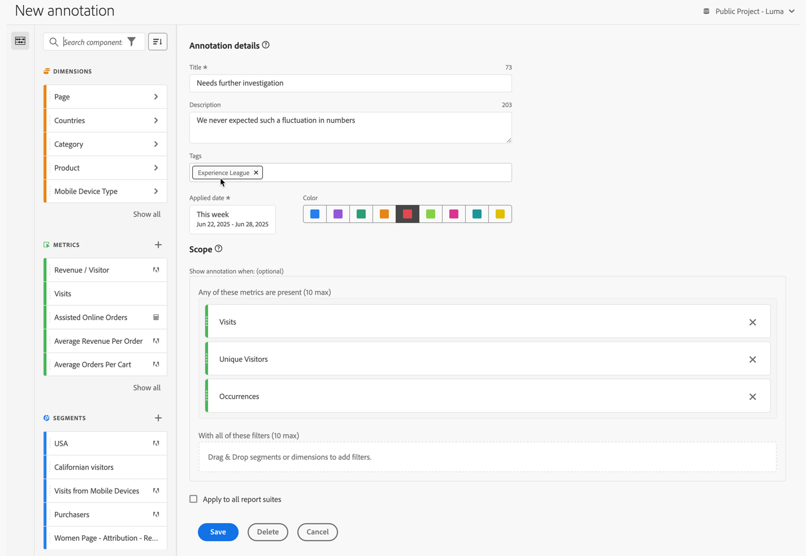

# 주석 만들기

기본적으로 관리자만 주석을 만들 수 있습니다. 사용자는 다른 구성 요소(예: 세그먼트, 계산된 지표 등) 조회 방식과 마찬가지로 주석을 볼 수 있는 권한이 있습니다.

단, 관리자는 [Adobe Admin Console](https://experienceleague.adobe.com/docs/analytics/admin/admin-console/permissions/analytics-tools.html?lang=ko)을 통해 사용자에게 [!UICONTROL 주석 만들기] 권한(Analytics 도구)을 부여할 수 있습니다.

다음과 같은 방식으로 주석을 만들 수 있습니다.

* **A**. 메인 인터페이스에서 **[!UICONTROL 구성 요소]**&#x200B;를 선택한 다음 **[!UICONTROL 주석]**&#x200B;을 선택합니다. [[!UICONTROL 주석] 관리자](/help/analyze/analysis-workspace/components/annotations/manage-annotations.md)에서  [!UICONTROL **[!UICONTROL 추가]**]를 선택합니다.
* **B**. Workspace 프로젝트 시각화의 컨텍스트 메뉴에서 **[!UICONTROL 선택 항목으로 주석 만들기]**&#x200B;를 선택합니다.
* **C**. Workspace 프로젝트 선 그래프의 컨텍스트 메뉴에서 **[!UICONTROL 선택 항목에 주석 달기]**&#x200B;를 선택합니다.
* **D**. Workspace 프로젝트의 메뉴에서 **[!UICONTROL 구성 요소]**&#x200B;를 선택한 다음 **[!UICONTROL 주석 만들기]**&#x200B;를 선택합니다.
* **E**.  Workspace 프로젝트에서 단축키 **[!UICONTROL Ctrl+Shift+o]**(Windows) 또는 **[!UICONTROL Ctrl+Shift+o]**(macOS)를 사용합니다.

주석을 정의하려면 [[!UICONTROL 주석 빌더]](#annotation-builder)를 사용합니다.

## 주석 빌더 {#annotation-builder}

>[!CONTEXTUALHELP]
>id="components_annotations_details"
>title="주석 세부 정보"
>abstract="주석을 사용하면 상황별 데이터 뉘앙스와 인사이트를 조직에 효과적으로 전달할 수 있습니다. 캘린더 이벤트를 특정 차원/지표에 연결할 수 있습니다."

>[!CONTEXTUALHELP]
>id="components_annotations_scope"
>title="범위"
>abstract="범위를 사용하면 주석을 달 데이터를 맞춤화할 수 있습니다. 계산된 지표 및 세그먼트는 정의에 사용되는 구성 요소에 적용된 주석을 자동으로 상속하지 않습니다. 기존 주석의 범위 섹션에 계산된 지표를 새로 추가할 수 있습니다. 새 세그먼트에는 새로운 주석이 필요합니다."

**[!UICONTROL 주석 빌더]** 대화 상자를 사용하여 주석을 새로 만들거나 기존 주석을 편집합니다. 대화 상자 제목은 [[!UICONTROL 주석] 관리자](/help/analyze/analysis-workspace/components/annotations/manage-annotations.md)에서 만들거나 관리하는 주석에 대한 **[!UICONTROL 새로운 주석]** 또는 **[!UICONTROL 주석 편집]**&#x200B;으로 지정됩니다.

>[!BEGINTABS]

>[!TAB 주석 빌더]

>[!TAB 주석 만들기/편집]

>[!ENDTABS]

1. 다음 세부 정보를 지정합니다(는 필수 입력 항목).

   | 요소 | 설명 |
   | --- | --- |
   | **[!UICONTROL 보고서 세트]** | 주석에 대한 보고서 세트를 선택할 수 있습니다. 정의한 주석은 선택한 보고서 세트를 기반으로 하는 Workspace 프로젝트에서 주석으로 사용할 수 있습니다. [!UICONTROL 모든 보고서 세트에 적용]을 사용하도록 설정하면 이 선택이 무효화됩니다. |
   | **[!UICONTROL 프로젝트 전용 주석]** | 작업 중인 Workspace 프로젝트에만 표시되는 주석에 대해 설명하는 정보 상자입니다. 주석을 모든 프로젝트에 표시할 수 있도록 **[!UICONTROL 이 주석을 모든 프로젝트에 사용하기]**&#x200B;를 활성화합니다. 이 정보 상자는 Workspace 프로젝트 내에서 주석을 만들 때만 표시됩니다. |
   | **[!UICONTROL 제목]**  | 주석의 이름을 지정합니다(예: `Needs further investigation`). |
   | **[!UICONTROL 설명]** | 주석에 대한 설명을 입력합니다(예: `We never expected such a fluctuation in numbers.`). |
   | **[!UICONTROL 태그]** | 하나 이상의 태그를 만들거나 적용하여 주석을 구성합니다. 이름을 입력하여 선택할 수 있는 기존 태그를 찾습니다. 또는 **[!UICONTROL Enter]** 키를 눌러 새 태그를 추가합니다. 를 선택하여 태그를 제거합니다. |
   | **[!UICONTROL 적용된 날짜]**  | 주석을 표시하기 위해 표시해야 하는 날짜 또는 날짜 범위를 선택합니다. 단축키로 주석을 만들면 주석이 기본적으로 해당 날짜에 대한 날짜 범위로 설정됩니다. 시각화의 선택 사항으로 주석을 만들면 주석이 기본적으로 시각화가 속한 패널의 날짜 범위에 따라 날짜 범위로 설정됩니다. |
   | **[!UICONTROL 색상]** | 주석에 색상을 적용합니다. 주석은 선택한 색상으로 프로젝트에 표시됩니다. 색상을 사용하여 공휴일, 외부 이벤트, 추적 문제 등과 같은 주석을 분류할 수 있습니다. |
   | **[!UICONTROL 범위]** | 주석을 트리거하는 구성 요소 패널에서 지표를 드래그 앤 드롭합니다. 예를 들어 인원, 세션, 이벤트 등입니다. 그런 다음 구성 요소 패널에서 세그먼트 역할을 하는 차원이나 세그먼트를 드래그 앤 드롭하여 주석을 표시할지 여부를 결정합니다. 범위를 지정하지 않으면 주석이 모든 데이터에 적용됩니다.  두 가지 옵션이 있습니다.<ul><li>**[!UICONTROL 다음 지표 중 하나가 있습니다.]** 주석을 표시하도록 트리거하는 지표를 최대 10개까지 드래그 앤 드롭합니다. 예를 들어 매출 지표가 특정 날짜 범위에 대한 데이터 수집을 중지했습니다. 매출 지표를 이 상자로 드래그합니다.</li><li>**[!UICONTROL 이 모든 세그먼트 사용]**: 주석 표시 여부를 세그먼트화할 차원 또는 세그먼트를 최대 10개까지 드래그 앤 드롭합니다.</li></ul>

**참고:** 이후 계산된 지표 또는 세그먼트 정의의 일부로 사용되는 구성 요소에 적용된 주석은 자동으로 주석을 상속하지 않습니다. 주석을 표시하려면 원하는 계산된 지표도 범위 섹션에 추가해야 합니다. 그러나 동일한 정보로 주석을 추가하려는 모든 세그먼트에 대해 새 주석을 만들어야 합니다. 예를 들어 특정 날짜의 [!UICONTROL 주문]에 주석을 적용합니다. 그런 다음 동일한 날짜 범위에 대해 계산된 지표에서 [!UICONTROL 주문]을 사용합니다. 새로 계산된 지표는 주문에 대한 주석을 자동으로 표시하지 않습니다. 또한 주석을 표시하려면 계산된 지표를 범위 섹션에 추가합니다. |
   | **[!UICONTROL 모든 데이터 보기에 적용]** | 기본적으로 주석은 기존 보고서 세트에 적용됩니다. 이 상자를 선택하면 회사의 모든 보고서 세트에 주석을 적용할 수 있습니다. |

   {style="table-layout:auto"}

1. 선택
   * **[!UICONTROL 저장]**&#x200B;을 클릭하여 주석을 저장합니다.
   * **[!UICONTROL 다른 이름으로 저장]**&#x200B;을 사용하여 주석 사본을 저장합니다.
   * **[!UICONTROL 삭제]**&#x200B;를 사용하여 주석을 삭제합니다.
   * **[!UICONTROL 취소]**&#x200B;를 사용하여 주석에 적용된 변경 사항을 취소하거나 새 주석 만들기를 취소합니다.
