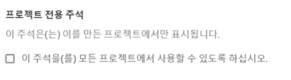

# 주석 생성

>[!NOTE]
>
>이 기능의 점진적 롤아웃은 2022년 3월 23일에 시작됩니다. 일반 공급: 2022년 4월 11일.

1. 여러 가지 방법으로 시작하여 주석을 만들 수 있습니다.

| 만들기 방법 | 세부 사항 |
| --- | --- |
| **[!UICONTROL Analytics] > [!UICONTROL 구성 요소] > [!UICONTROL 주석]으로 이동합니다.** | 주석 관리자 페이지가 열립니다. [!UICONTROL 새 주석 만들기]를 클릭하면 [!UICONTROL 주석 빌더]가 열립니다. |
| **테이블의 한 지점을 마우스 오른쪽 버튼으로 클릭합니다.** | [!UICONTROL 주석 빌더]가 열립니다. 기본적으로 이 방법으로 생성된 주석은 생성된 프로젝트에서만 표시됩니다. 그러나 모든 프로젝트에서 사용할 수 있도록 설정할 수 있습니다. 또한 날짜 및 지표 등이 이미 채워져 있습니다.
 |
| **[!UICONTROL 선] 그래프의 한 지점을 마우스 오른쪽 버튼으로 클릭합니다.** | [!UICONTROL 주석 빌더]가 열립니다. 기본적으로 이 방법으로 생성된 주석은 생성된 프로젝트에서만 표시됩니다. 그러나 모든 프로젝트에서 사용할 수 있도록 설정할 수 있습니다. 또한 날짜 및 지표 등이 이미 채워져 있습니다.
 |
| **작업 영역에서 [!UICONTROL 구성 요소] > [!UICONTROL 주석 만들기]로 이동합니다.** | [!UICONTROL 주석 빌더]가 열립니다. |
| **이 핫키를 사용하여** 주석 빌더를 엽니다. (PC) `ctrl` `shift` + o, (Mac) `shift` + `command` + o | 핫키를 사용하여 주석을 만들면 미리 선택된 범위(지표 또는 차원) 없이 현재 날짜에 대한 하루 주석을 만들 수 있습니다. |

1. [!UICONTROL 주석 빌더] 요소를 입력합니다.

   

   | 요소 | 설명 |
   | --- | --- |
   | [!UICONTROL 프로젝트 전용 주석] | 기본적으로 주석은 현재 프로젝트에 적용됩니다. 이 상자를 선택하면 보유한 모든 프로젝트에 주석을 사용할 수 있습니다.
  |
   | [!UICONTROL 제목] | 주석의 이름을 지정합니다(예: “기념일”). |
   | [!UICONTROL 설명] | (선택 사항) 주석에 대한 설명을 제공합니다(예: “미국 공휴일”). |
   | [!UICONTROL 태그] | (선택 사항) 태그를 생성하거나 적용하여 주석을 구성합니다. |
   | [!UICONTROL 적용된 날짜] | 주석을 표시하기 위해 표시해야 하는 날짜 또는 날짜 범위를 선택합니다. |
   | [!UICONTROL 색상] | 주석에 색상을 적용합니다. 주석은 선택한 색상으로 프로젝트에 표시됩니다. 색상을 사용하여 공휴일, 외부 이벤트, 추적 문제 등과 같은 주석을 분류할 수 있습니다. |
   | [!UICONTROL 범위] | (선택 사항) 주석을 트리거하는 지표를 드래그 앤 드롭합니다. 그런 다음 필터 역할을 하는(즉, 주석을 볼 수 있는) 차원 또는 세그먼트를 드래그 앤 드롭합니다. 범위를 지정하지 않으면 주석이 모든 데이터에 적용됩니다.<ul><li>**[!UICONTROL 다음 지표 중 하나가 있습니다.]** 주석을 표시하도록 트리거할 지표를 최대 10개까지 드래그 앤 드롭합니다.</li><li>**[!UICONTROL 이 모든 필터 사용]**: 주석이 표시될 때 필터링할 차원 또는 세그먼트를 최대 10개까지 드래그 앤 드롭합니다.</li></ul>
사용 사례: eVar가 특정 날짜 범위에 대한 데이터 수집을 중지했습니다. eVar를 **[!UICONTROL 다음 지표 중 하나가 있습니다]** 대화 상자로 드래그합니다. 또는 [!UICONTROL 방문] 지표가 데이터를 보고하지 않는 경우 동일한 프로세스를 따르십시오.
**참고:** 계산된 지표 또는 세그먼트 정의의 일부로 사용되는 구성 요소에 적용된 주석은 자동으로 주석을 상속하지 않습니다. 주석을 표시하려면 원하는 계산된 지표도 범위 섹션에 추가해야 합니다. 그러나 동일한 정보로 주석을 추가하려는 모든 세그먼트에 대해 새 주석을 만들어야 합니다.
예: 특정 날짜의 [!UICONTROL 주문]에 주석을 적용합니다. 그런 다음 동일한 날짜 범위에 대해 계산된 지표에서 [!UICONTROL 주문]을 사용합니다. 새로 계산된 지표는 주문에 대한 주석을 자동으로 표시하지 않습니다. 주석을 표시하려면 계산된 지표도 범위 섹션에 추가해야 합니다. |
   | [!UICONTROL 모든 보고서 세트에 적용] | 기본적으로 주석은 기존 보고서 세트에 적용됩니다. 이 상자를 선택하면 회사의 모든 보고서 세트에 주석을 적용할 수 있습니다. |

   {style=&quot;table-layout:auto&quot;}

1. **[!UICONTROL 저장]**&#x200B;을 클릭합니다.
