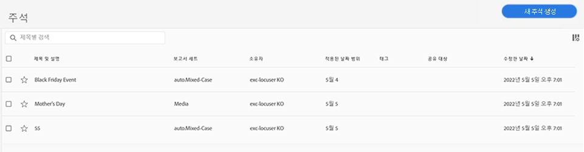

# 주석 관리

>[!NOTE]
>
>이 기능은 현재 제한적인 테스트가 실시되고 있습니다.

[!UICONTROL 구성] 요소 > [!UICONTROL 주석] 관리자는 공유, 필터링, 태그 지정, 승인, 복사, 삭제 및 즐겨찾기로 표시 등 주석을 관리하는 다양한 방법을 제공합니다.

[!UICONTROL 주석] 관리자는 모든 프로젝트에 범위가 지정되고 사용자가 보유하는 공유된 모든 주석을 표시합니다.

>[!NOTE]
>
>[!UICONTROL 주석] 특정 프로젝트에 대해서만 만든 이 정보는 관리자에 표시되지 않습니다.

## 주석 관리자 사용자 인터페이스

| UI 요소 | 설명 |
| --- | --- | 
| [!UICONTROL 제목 및 설명] | 주석 빌더에 제공됩니다. 제목 및 설명을 편집하려면 제목 링크를 클릭합니다. 이렇게 하면 주석 빌더로 돌아갑니다. |
| [!UICONTROL 보고서 세트] | 이 주석이 적용되는 보고서 세트입니다. |
| [!UICONTROL 소유자] | 주석을 소유한 사람을 나타냅니다. 관리자가 아닌 경우 사용자가 소유하거나 사용자와 공유된 주석만 표시할 수 있습니다. |
| [!UICONTROL 적용 날짜 범위] | 이 주석이 적용되는 날짜 또는 날짜 범위입니다. |
| [!UICONTROL 다음 사용자와 공유] | 주석을 공유한 개인 또는 그룹의 수를 나열합니다. 자세한 내용을 보려면 를 클릭합니다. |
| [!UICONTROL 수정한 날짜] | 주석을 마지막으로 수정한 날짜 및 시간을 표시합니다. |

## 주석 편집

주석을 편집한다는 것은 날짜 범위, 색상, 범위 또는 모든 보고서 세트 또는 프로젝트에 적용되는지 여부를 조정할 수 있음을 의미합니다. 다음과 같은 두 가지 방법으로 주석을 편집할 수 있습니다.

* 선 차트에서 주석 위로 마우스를 가져간 다음 팝업 내에서 연필 아이콘을 클릭합니다.

* 에서 [!UICONTROL 주석 관리자]를 클릭하고 주석의 제목을 클릭합니다.

이 두 옵션 모두 주석 빌더에 다시 나타납니다. 여기에서 필요한 조정을 수행하고 새 버전을 저장할 수 있습니다.

## 기타 주석 작업

주석 관리자를 사용하여 관리자는 주석을 편집, 추가, 태그, 삭제, 이름 변경, 승인, 복사, 내보내기 및 필터링할 수 있습니다. 관리자가 아닌 사용자에게는 표시되지 않습니다.

하나 이상의 주석을 선택하면 작업 표시줄이 나타납니다.

| 작업 | 설명 |
| --- | --- |
| 이벤트가 복제되지 않도록 하면서 현재 이벤트 변수에 | 새 주석을 생성할 수 있는 주석 빌더로 이동합니다. |
| 태그 | 모든 사용자는 주석에 태그를 만들어 주석에 하나 이상의 태그를 적용할 수 있습니다. 하지만 자신이 소유한 해당 세그먼트에 대한 태그만 표시됩니다. 어떤 종류의 태그를 만들어야 합니까? 다음은 제안되는 유용한 태그입니다.<ul><li>팀 이름을 기반으로 하는 태그 (예: 소셜 마케팅, 모바일 마케팅)</li><li>프로젝트 태그 (분석 태그) (예: 시작 페이지 분석)</li><li>카테고리 태그: 남성용, 지역</li><li>워크플로 태그: 조정 대상 (특정 비즈니스 단위), 승인됨</li></ul> |
| 삭제 | 주석을 삭제하면 조직의 모든 프로젝트에서 주석이 제거됩니다. |
| 이름 변경 | 주석 이름을 바꾸면 주석을 적용한 모든 프로젝트에서 주석 이름이 바뀝니다. |
| 복사 | 자체 주석 ID가 있지만 이름과 정의가 동일한 고유한 복사본을 만듭니다. |
| CSV로 내보내기 | 주석 정의를 .csv 파일로 내보냅니다. |
| 필터(왼쪽 레일) | 태그, 보고서 세트, 소유자 및 기타 필터(내 세그먼트, 승인됨, 즐겨찾기, 나와 공유, 모두 표시)로 필터링합니다. |
