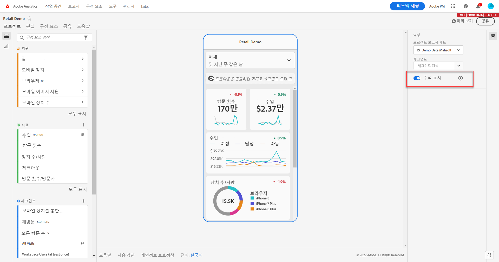
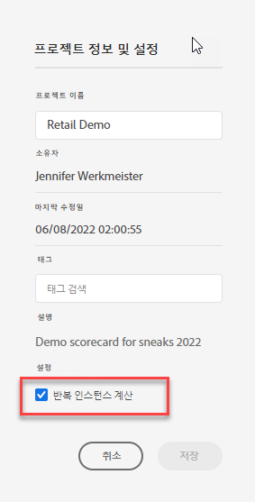

# 모바일 스코어카드에서 주석 공유

모바일 스코어카드에서 작업 영역에 생성된 주석을 표시할 수 있습니다. 이를 통해 Analytics 대시보드 모바일 앱에서 볼 수 있는 모바일 스코어카드 프로젝트 내에서 조직 및 캠페인에 대한 상황별 데이터 뉘앙스와 통찰력을 직접 공유할 수 있습니다.

## 모바일 스코어카드에서 주석 표시

모바일 스코어카드에 주석을 표시하려면 먼저 작업 영역 프로젝트 또는 구성 요소 메뉴에서 주석을 만드십시오.

주석 만들기에 대한 정보는 [주석 만들기](create-annotations.md)를 참조하십시오. 주석은 기본적으로 모바일 스코어카드에서 꺼져 있으며 모바일 스코어카드에 표시하려는 각 스코어카드에 대해 주석을 활성화해야 합니다.

1. 주석을 켜십시오. 주석을 켜려면 [주석 켜기 또는 끄기](overview.md#annotations-on-off)를 참조하십시오.

1. 주석을 만들고 모든 프로젝트에 공유되는지 확인하십시오. 작업 영역에서 주석을 만들려면 [주석 만들기](create-annotations.md)를 참조하십시오.

1. 모바일 스코어카드에 주석을 표시하려면 **주석 표시**&#x200B;를 선택하십시오.

   

1. 주석 표시가 선택되어 있는지 확인하고 **프로젝트** > **프로젝트 정보 및 설정**&#x200B;으로 이동하십시오.

   

## 모바일 스코어카드에서 주석 보기

주석이 활성화되면 스코어카드 빌더에서 주석 아이콘이 표시됩니다. 주석은 자세히 보기의 차트 및 테이블에만 나타납니다. 스코어카드의 기본 타일 보기에서는 주석을 볼 수 없습니다.

주석 아이콘이 표시되면 빌더 캔버스에서 주석을 완전히 보거나 상호 작용할 수 없습니다. 미리보기 모드를 사용하여 앱에 나타나는 주석을 보고 상호 작용할 수 있습니다. 

주석 색상은 작업 영역에서 주석이 생성될 때 선택됩니다. 회색 주석은 주석이 두 개 이상 있음을 나타냅니다.  

## 차트 주석 보기

| 날짜 | 모양 |
| --- | --- |
| **하루** |    |
| **날짜 범위** |  |
| **겹치는 주석** |   Analytics 대시보드 앱에서 주석 세부 정보를 보려면 주석 아이콘을 탭합니다.   차트에서 주석을 볼 때 왼쪽과 오른쪽으로 스와이프하여 차트에 있는 모든 주석을 탐색할 수 있습니다. 테이블에서 주석을 볼 때 왼쪽과 오른쪽으로 스와이프하여 테이블의 해당 행 항목과 연결된 모든 주석을 탐색하십시오.      도넛형 또는 가로 막대형 차트와 같이 시간 기반 *x축*&#x200B;이 없는 차트에서는 오른쪽 하단에 있는 아이콘을 탭하여 차트에 적용되는 주석을 볼 수 있습니다.    |
