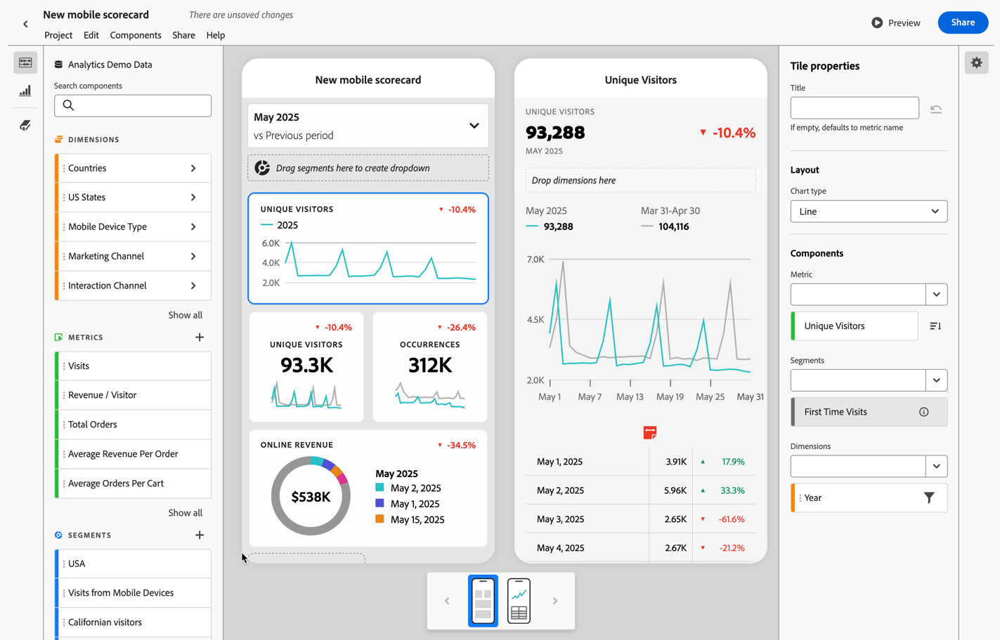
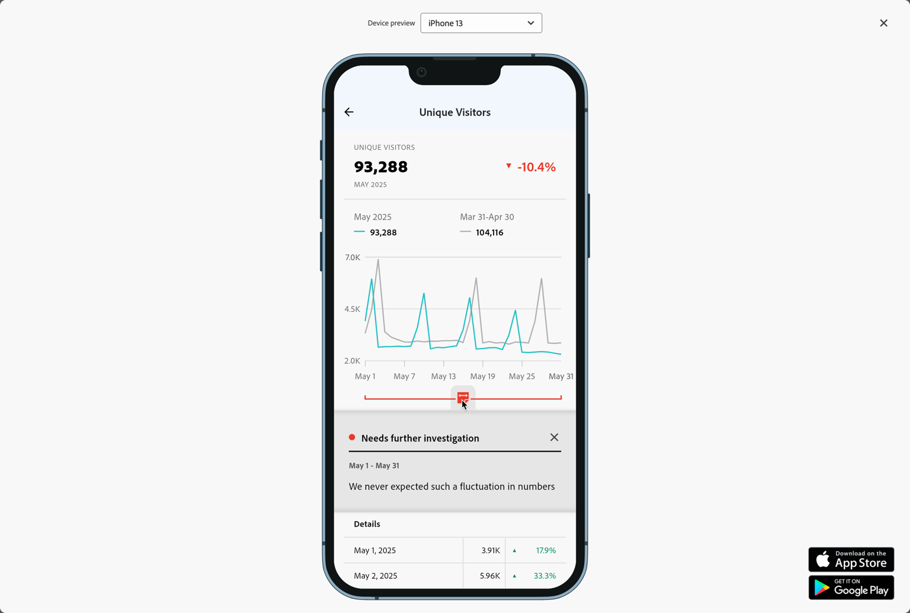
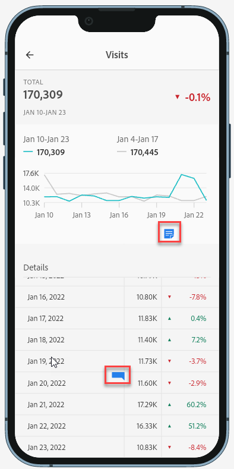

# 모바일 스코어카드 주석

모바일 스코어카드에서 Workspace에 만든 주석을 표시할 수 있습니다. 모바일 스코어카드의 주석을 사용하면 조직 및 캠페인에 대한 상황별 데이터 뉘앙스와 인사이트를 공유할 수 있습니다.

## 모바일 스코어카드에서 주석 표시

모바일 스코어카드에 주석을 표시하려면 먼저 Workspace 프로젝트 또는 구성 요소 메뉴에서 주석을 만듭니다.

주석 만들기에 대한 정보는 [주석 만들기](create-annotations.md)를 참조하십시오. 주석은 기본적으로 모바일 스코어카드에서 꺼져 있으며 모바일 스코어카드에 표시하려는 각 스코어카드에 대해 주석을 활성화해야 합니다.

1. 주석을 켜십시오. 주석을 켜려면 [주석 켜기 또는 끄기](overview.md#turn-annotations-on-or-off)를 참조하십시오.

1. 주석을 만들고 모든 프로젝트에 공유되는지 확인하십시오. 자세한 내용은 [주석 만들기](create-annotations.md)를 참조하십시오.

1. 모바일 스코어카드에 주석을 표시하려면 **[!UICONTROL 주석 표시]**&#x200B;를 선택합니다.

   

   선택적으로, **[!UICONTROL 프로젝트]** > **[!UICONTROL 프로젝트 정보 및 설정]**&#x200B;에서 **[!UICONTROL 주석 표시]**&#x200B;가 선택되어 있는지 확인합니다.

## 모바일 스코어카드에서 주석 보기

주석이 활성화되면 주석 아이콘이 스코어카드 빌더에 표시됩니다. 주석은 자세히 보기의 차트 및 테이블에만 나타납니다. 스코어카드의 기본 타일 보기에서는 주석을 볼 수 없습니다.

주석 아이콘이 표시되면 빌더 캔버스에서 주석을 완전히 보거나 상호 작용할 수 없습니다.  **[!UICONTROL 미리보기]**&#x200B;를 사용하여 앱에 나타나는 주석을 보고 상호 작용할 수 있습니다.

주석 색상은 Workspace에서 주석을 만들 때 선택됩니다. 회색 주석은 주석이 두 개 이상 있음을 나타냅니다.

## 주석 미리보기

 미리보기를 사용하여 주석을 미리 볼 수 있습니다. 주석을 선택하여 주석의 세부 정보를 엽니다.

더 많은 주석을 사용할 수 있는 경우 주석 하단에 여러 점(●)이 표시됩니다. 왼쪽 또는 오른쪽으로 스와이프하여 주석을 전환합니다.

<!--
# Share Annotations in Mobile Scorecards

You can display annotations that are created in Workspace in Mobile Scorecards. This allows you to share contextual data nuances and insights about your organization and campaigns directly within Mobile Scorecard projects, viewable in the Analytics dashboards mobile app.

## Surface Annotations in Mobile Scorecards

To surface annotations in mobile scorecards, create the annotation first from Workspace projects or from the components menu.

For information on creating annotations, see [Create Annotations](create-annotations.md). Annotations are turned off in mobile scorecards by default and must be enabled for each scorecard that you want to surface in mobile scorecards.

1. Turn on annotations. To turn annotations on, see [Turn annotations on or off](overview.md#annotations-on-off).

1. Create an annotation and make sure it is shared to all your projects. To create an annotation in Workspace,  see [Create Annotations](create-annotations.md).

1. Select **Show annotations** to display the annotation in Mobile Scorecards.

   

1. Confirm that show annotations is selected, go to **Project** > **Project info and settings**.

   

## View annotations in Mobile Scorecards

When annotations are enabled, annotation icons are visible in the Scorecard Builder. Annotations appear only on charts and tables in the detailed view. Annotations are not visible from the main tile view of the scorecard.

 

When annotation icons are visible, you can't fully view or interact with annotations in the builder canvas. Use the Preview mode to view and interact with annotations as they appear in the app  **Preview**.

Annotation colors are selected when the annotation is created in workspace. Gray annotations indicated the presence of more than one annotation.

## View chart annotations

| Date | Appearance |
| --- | --- |
| **Single day** |     |
| **Date range** |  |
| **Overlapping annotations** |   To view annotation details in the Analytics dashboards app, tap an annotation icon.   When viewing an annotation in a chart, you can swipe left and right to navigate all annotations present in the chart. When viewing an annotation in the table, swipe left and right to navigate all annotations associated with that row item in the table.      In charts that do not have a time-based *x axis*, such as the donut or horizontal bar charts, annotations that apply to the chart can be viewed by tapping the icon located in the lower right-hand corner.   |
-->