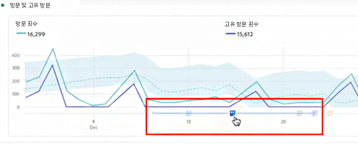
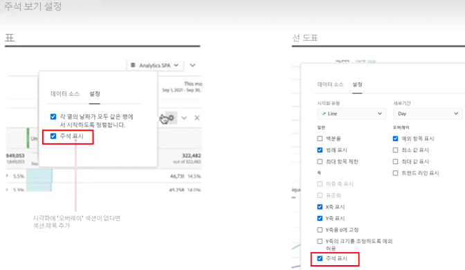
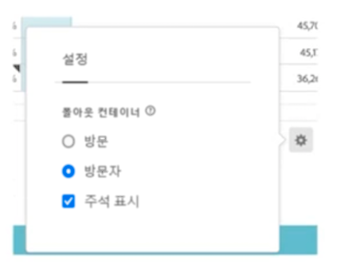

# 주석 개요

작업 영역의 주석을 사용하면 상황별 데이터 뉘앙스와 통찰력을 조직에 효과적으로 전달할 수 있습니다. 캘린더 이벤트를 특정 차원/지표에 연결할 수 있습니다. 알려진 데이터 문제, 공휴일, 캠페인 시작 등으로 날짜 또는 날짜 범위에 주석을 달 수 있습니다. 그런 다음 이벤트를 그래픽으로 표시하고 캠페인이나 다른 이벤트가 사이트 트래픽, 매출 또는 기타 지표에 영향을 미치는지 여부를 확인할 수 있습니다.

예를 들어 조직과 프로젝트를 공유한다고 가정해 보겠습니다. 마케팅 캠페인으로 인해 트래픽이 급증한 경우 “캠페인 시작일” 주석을 만들고 범위를 전체 보고서 세트로 지정할 수 있습니다. 사용자가 해당 날짜가 포함된 데이터 세트를 볼 때 데이터와 함께 프로젝트 내의 주석을 볼 수 있습니다.

다음 사항에 주의하십시오.

* 주석은 단일 날짜 또는 날짜 범위에 연결할 수 있습니다.

* 전체 데이터 세트 또는 지정된 지표, 차원 또는 세그먼트에 적용할 수 있습니다.

* 생성된 프로젝트(기본값) 또는 모든 프로젝트에 적용할 수 있습니다.

* 생성된 보고서 세트(기본값) 또는 모든 보고서 세트에 적용할 수 있습니다.

## 권한 {#permissions}

기본적으로 관리자만 주석을 생성할 수 있습니다. 사용자는 다른 Analytics 구성 요소(예: 세그먼트, 계산된 지표 등)와 마찬가지로 주석을 볼 수 있는 권한이 있습니다.

단, 관리자는 [Adobe Admin Console](https://experienceleague.adobe.com/docs/analytics/admin/admin-console/permissions/analytics-tools.html?lang=ko)을 통해 사용자에게 [!UICONTROL 주석 생성] 권한(Analytics 도구)을 부여할 수 있습니다.

## 주석 켜기 또는 끄기 {#annotations-on-off}

다음과 같은 다양한 수준에서 주석을 켜거나 끌 수 있습니다.

* 시각화 수준에서: [!UICONTROL 시각화] 설정 > [!UICONTROL 주석 표시]

* 프로젝트 수준에서: [!UICONTROL 프로젝트 정보 및 설정] > [!UICONTROL 주석 표시]

* 사용자 수준에서: [!UICONTROL 구성 요소] > [!UICONTROL 사용자 환경 설정] > [!UICONTROL 데이터] > [!UICONTROL 주석 표시]

