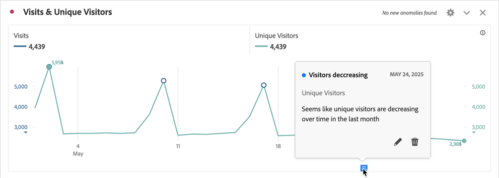
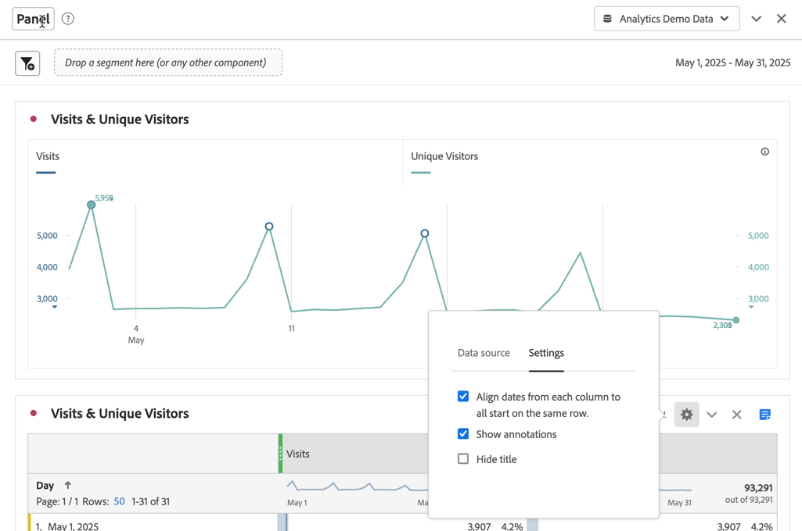

# 주석 개요

주석을 사용하면 상황별 데이터 뉘앙스와 인사이트를 효과적으로 조직의 다른 관련자에게 전달할 수 있습니다. 주석을 사용하면 캘린더 이벤트를 특정 차원 및 지표에 연결할 수 있습니다. 알려진 데이터 문제, 공휴일, 캠페인 시작 등으로 날짜 또는 날짜 범위에 주석을 달아 그런 다음 이벤트를 그래픽으로 표시하고 캠페인이나 다른 이벤트가 사이트 트래픽, 모바일 앱 사용량, 매출 또는 기타 지표에 영향을 미치는지 여부를 확인할 수 있습니다.

예를 들어 조직과 프로젝트를 공유하고 있습니다. 고유 방문자 수가 눈에 띄게 감소한 경우, **방문자 감소 중** 주석을 만들어 전체 보고서 세트에 적용할 수 있습니다. 사용자가 해당 날짜가 포함된 보고서 세트를 볼 때 데이터와 함께 프로젝트 내의 주석을 볼 수 있습니다.

주석이 다음에 적용될 수 있습니다.

* 단일 날짜 또는 날짜 범위.

* 전체 데이터 세트 또는 특정 지표, 차원 또는 세그먼트.

* 주석이 만들어지는 프로젝트(기본값) 또는 모든 프로젝트.

* 주석이 만들어지는 데이터 보기(기본값) 또는 모든 데이터 보기.

주석을 만들 수 있는 다양한 옵션은 [주석 만들기](create-annotations.md)를 참조하십시오. 그런 다음 [주석 빌더](create-annotations.md#annotation-builder)에서 주석을 빌드, 수정 및 저장합니다.

[주석 관리자](manage-annotations.md)를 사용하여 주석을 관리합니다.

## 주석 켜기 또는 끄기

다음과 같은 다양한 수준에서 주석을 켜거나 끌 수 있습니다.

| 레벨 | 방법... |
|---|---|
| **시각화** |  > **[!UICONTROL 설정]** >  **[!UICONTROL 주석 표시]**&#x200B;를 활성화 또는 비활성화합니다.  |
| **프로젝트** | Workspace 프로젝트 메뉴에서 **[!UICONTROL 프로젝트]** > **[!UICONTROL 프로젝트 정보 및 설정]**&#x200B;을 선택하고 **[!UICONTROL 주석 표시]**&#x200B;를 활성화 또는 비활성화합니다.  |
| **사용자** | **[!UICONTROL 구성 요소]** 탭에서 **[!UICONTROL 환경 설정]**&#x200B;을 선택하거나, Workspace 프로젝트 메뉴에서 **[!UICONTROL 프로젝트]** > **[!UICONTROL 사용자 환경 설정]**&#x200B;을 선택합니다.   **[!UICONTROL 환경 설정]**&#x200B;에서 **[!UICONTROL 프로젝트 및 분석]**&#x200B;을 선택합니다. 왼쪽 탭 막대에서 **[!UICONTROL 데이터]**&#x200B;를 선택합니다. 하단에서 **[!UICONTROL 자유 형식 테이블]** 제목 아래의 **[!UICONTROL 주석 표시]**&#x200B;를 활성화하거나 비활성화합니다.  |

<!--
# Annotations overview

Annotations in Workspace enable you to effectively communicate contextual data nuances and insights to your organization. They let you tie calendar events to specific dimensions/metrics. You can annotate a date or date range with known data issues, public holidays, campaign launches, etc. You can then graphically display events and see whether campaigns or other events have affected your site traffic, revenue, or any other metric.

For example, let's say you are sharing projects with your organization. If you had a major spike in traffic due to a marketing campaign, you could create a "Campaign launch date" annotation and scope it for your whole report suite. When your users view any data sets that included that date, they see the annotation within their projects, alongside their data.

Keep this in mind:

* Annotations can be tied to a single date or to a date range.

* They can apply to your entire data set or to specified metrics, dimensions, or segments.

* They can apply to the project in which they were created (default) or to all projects.

* They can apply to the report suite in which they were created (default) or to all report suites.

## Permissions {#permissions}

By default, only Admins can create annotations. Users have rights to view annotations like they do with other other Analytics components (such as segments, calculated metrics, etc.).

However, Admins can give the [!UICONTROL Annotation Creation] permission (Analytics Tools) to users via the [Adobe Admin Console](https://experienceleague.adobe.com/docs/analytics/admin/admin-console/permissions/analytics-tools.html?lang=ko).

## Turn annotations on or off {#annotations-on-off}

Annotations can be turned on or off at several levels:

* At the Visualization level: [!UICONTROL Visualization] settings > [!UICONTROL Show annotations]

* At the Project level: [!UICONTROL Project info & settings] > [!UICONTROL Show annotations]

* At the User level: [!UICONTROL Components] > [!UICONTROL User preferences] > [!UICONTROL Data] > [!UICONTROL Show annotations]

-->