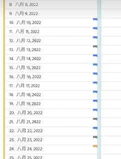

# 주석 보기

>[!NOTE]
>
>이 기능은 현재 제한적인 테스트가 실시되고 있습니다.

주석은 하루 또는 날짜 범위에 따라 다소 다르게 나타납니다.

## 라인 차트 또는 표에서 주석 보기

| 날짜 | 모양 |
| --- | --- |
| **하루** | 
주석 위로 마우스를 가져가면 주석의 세부 사항을 볼 수 있고, 펜 아이콘을 선택하여 편집할 수도 있고, 삭제할 수도 있습니다.
  |
| **날짜 범위** | 아이콘이 바뀌고 그 위로 마우스를 가져다 대면 날짜 범위가 나타납니다.

라인 차트에서 주석 메타데이터를 선택하면 주석 메타데이터가 나타나고 다음을 편집하거나 삭제할 수 있습니다.
표에서 날짜 범위의 모든 날짜에 아이콘이 나타납니다.
 |
| **주석 겹치기** | 주석에 연결된 주석이 두 개 이상 있는 날에는 아이콘이 회색 색상으로 표시됩니다.

회색 아이콘 위로 마우스를 가져가면 겹치는 모든 주석이 나타납니다.
 |

## 요약 차트에서 주석 보기

## .pdf 파일에서 주석 보기

.pdf 파일의 아이콘 위에 마우스를 놓을 수 없으므로 이 파일(내보낸 후)은 패널 하단에 설명 참고 사항을 제공합니다. 다음은 한 예입니다.

## 날짜를 기반으로 하지 않는 주석 보기

경우에 따라 주석이 날짜에 연결되지 않고 특정 차원에 연결되어 있습니다. 이 경우 오른쪽 아래 모서리에 있는 요약 주석에만 표시됩니다. 다음은 한 예입니다.

