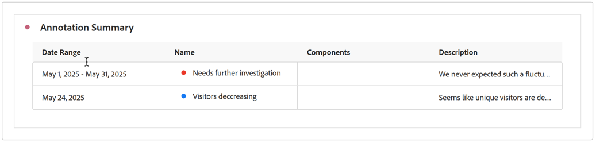

# 주석 보기

주석은 표시되는 위치와 하루 또는 날짜 범위에 따라 약간 다르게 나타납니다.

## Workspace에서 주석 보기

| 시각화 유형 | 설명 |
| --- | --- |
| **라인&#x200B;** **하루** | 라인 시각화에서 를 선택하면 주석 세부 정보가 포함된 팝업이 표시됩니다.   [주석 빌더](create-annotations.md#annotation-builder)에서 주석을 편집하려면 을 선택합니다. 주석을 삭제하려면 를 선택합니다. |
| **라인&#x200B;** **날짜 범위** | 를 선택하면 주석 세부 정보가 포함된 팝업과 날짜 범위를 나타내는 하단의 라인이 표시됩니다.  [주석 빌더](create-annotations.md#annotation-builder)에서 주석을 편집하려면 을 선택합니다. 주석을 삭제하려면 를 선택합니다. |
| **자유 형식 테이블** | 자유 형식 테이블에서 시각화 오른쪽 상단에 있는 주석 버튼의 모든 주석에 액세스할 수 있습니다. 를 선택하여 모든 주석의 (스크롤 목록)을 확인합니다.각 주석의   에서 을 선택하여 [주석 빌더](create-annotations.md#annotation-builder)에서 주석을 편집하고 를 선택하여 주석을 삭제할 수 있습니다. |

{style="table-layout:auto"}

## PDF에서 주석 보기

프로젝트를 PDF로 다운로드하거나 프로젝트를 PDF로 전송하면 주석은 주석 요약 섹션에 PDF로 요약됩니다.

<!--
# View annotations

Annotations manifest slightly differently, depending on whether they span a single day or a date range.

## View annotations in Line charts or Tables

| Date | Appearance |
| --- | --- |
| **Single day** |   
When you hover over the annotation, you can see its details, you can edit it by selecting the pen icon, or you can delete it:
  |
| **Date range** |  The icon changes and when you hover over it, the date range appears.

When you select it in the line chart, the annotation metadata appear, and you can edit or delete it:
In a table, an icon appears on every date in the date range.
|
| **Overlapping annotations** | On days that have more than one annotation tied to them, the icon appears in a grey color.

When you hover over the grey icon, all overlapping annotations appear:
 |

{style="table-layout:auto"}

## View annotations in a .pdf file

Since you cannot hover over icons in a .pdf file, this file (after export) provides notes of explanations at the bottom of a panel. Here is an example:

## View annotations with non-trended data

Sometimes annotation are shown with non-trended data, but tied to a specific dimension. In that case, they appear only in a summary annotation in the bottom right corner. Here is an example:

The summary chart appears in all visualization types in the corner, not just in non-trended freeform tables and summary numbers. It also appears in visualizations like [!UICONTROL Donut], [!UICONTROL Flow],[!UICONTROL Fallout],[!UICONTROL Cohort], and so on.

-->