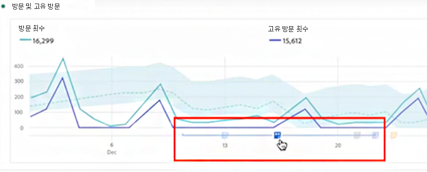

# 주석 보기

>[!NOTE]
>
>이 기능은 현재 제한적인 테스트가 실시되고 있습니다.

주석은 단일 날짜 또는 날짜 범위에 포함되는지 여부에 따라 약간 다르게 매니페스트됩니다.

## 라인 차트 또는 테이블에서 주석 보기

| 날짜 | 모양 |
| --- | --- |
| **하루** |  |
| **날짜 범위** | 아이콘이 변경되고 마우스로 가리키면 날짜 범위가 나타납니다.

테이블에서 날짜 범위의 모든 날짜에 아이콘이 표시됩니다.

다음을 참조하십시오. 주석에 연결된 주석이 두 개 이상 있는 날에는 아이콘이 회색 색상이 됩니다. |

## 요약 차트에 주석 보기

## .pdf 파일에서 주석 보기

.pdf 파일의 아이콘을 마우스로 가리키면 안 되므로 이 파일(내보내기 후)에서는 패널 하단에 설명을 제공합니다. 다음은 한 예입니다.

## 날짜를 기반으로 하지 않는 주석 보기

경우에 따라 주석이 날짜에 연결되지 않고 특정 차원에 연결되어 있습니다. 이 경우 오른쪽 아래 모서리에 있는 요약 주석에만 표시됩니다. 다음은 한 예입니다.

