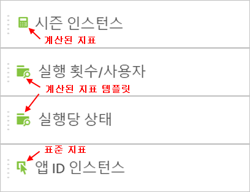
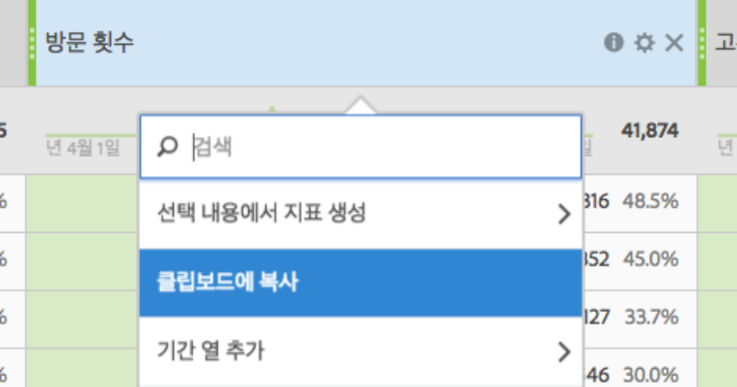

# 지표

Analysis Workspace에서 지표를 사용하는 두 가지 방법이 있습니다.

[!UICONTROL 구성 요소] 메뉴에서 다음 테이블로 표준 지표, 계산된 지표 또는 계산된 지표 템플릿을 드래그할 수 있습니다.

>[!NOTE]
>
>This is seemingly simple, the use of metrics is rather powerful. 표의 지표 섹션으로 적절한 지표를 드래그하여 보고서에 지표를 추가할 수 있습니다. 지표를 지표로 분류하여 테이블 보기를 세밀하게 제어할 수도 있습니다. 또한 지표를 차원 및 차원으로 삽입하여 초과 근무 보고서를 만들 수 있습니다. 다양한 구성 요소를 사용하여 작업을 진행해 보십시오. 가능성은 무한합니다.

**[!UICONTROL 또는 구성 요소]** &gt; **[!UICONTROL 새 지표를 클릭할]**&#x200B;수 있습니다. 이 경우 기존 지표에서 사용자 지정 지표를 작성할 수 있는 [계산된 지표 빌더](https://marketing.adobe.com/resources/help/en_US/analytics/calcmetrics/)로 이동합니다.

계산된 지표를 더 빠르고 쉽게 생성할 수 있도록 **[!UICONTROL 선택 항목으로 지표 만들기]가 자유 형식 테이블의 열 마우스 오른쪽 단추 클릭 메뉴에 추가되었습니다.** 이 옵션은 머리글 열 셀을 하나 이상 선택하면 표시됩니다.

[YouTube에서 기여도 지표 사용](https://www.youtube.com/watch?v=ngmJHcg65o8&list=PL2tCx83mn7GuNnQdYGOtlyCu0V5mEZ8sS&index=32) (4:16)
