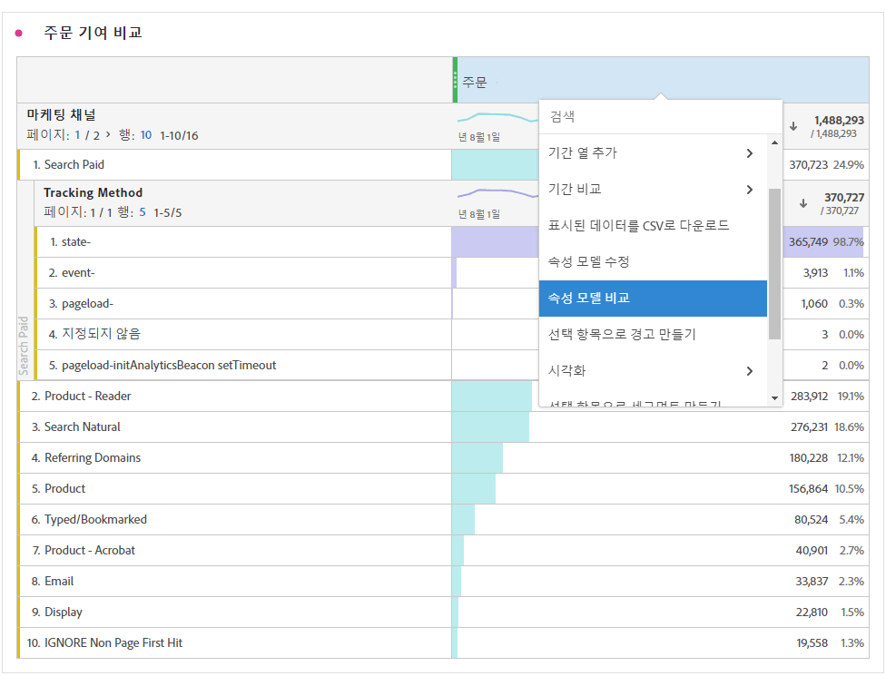

# 지표

Analysis Workspace에서 지표를 사용하는 두 가지 방법이 있습니다.

[!UICONTROL 구성 요소] 메뉴에서 다음 테이블로 표준 지표, 계산된 지표 또는 계산된 지표 템플릿을 드래그할 수 있습니다.

>[!NOTE]
>
>이 방법은 간단해 보이지만 지표 사용은 매우 강력합니다. 적절한 지표를 테이블의 지표 섹션으로 드래그하여 보고서에 지표를 추가할 수 있습니다. 지표를 기준으로 차원을 분류하여 테이블 보기를 미세하게 제어할 수도 있습니다. 또한 지표를 차원으로 삽입하고 차원을 지표로 삽입하여 기간 보고서를 만들 수도 있습니다. 다양한 구성 요소로 여러 가지 시도를 하여 가능한 작업을 확인해 보십시오. 가능성은 무한합니다.

또는 **[!UICONTROL 구성 요소]** > **[!UICONTROL 새 지표]**&#x200B;를 클릭할 수 있습니다. 이 경우 기존 지표에서 사용자 지정 지표를 작성할 수 있는 [계산된 지표 빌더](/help/components/c-calcmetrics/cm-overview.md)로 이동합니다.

계산된 지표를 더 빠르고 쉽게 생성할 수 있도록 **[!UICONTROL 선택 항목으로 지표 만들기]**&#x200B;가 자유 형식 테이블의 열 마우스 오른쪽 단추 클릭 메뉴에 추가되었습니다. 이 선택 사항은 머리글 열 셀을 하나 이상 선택하면 표시됩니다.

[계산된 지표:구현 없는 지표](https://docs.adobe.com/content/help/en/analytics-learn/tutorials/components/calculated-metrics/calculated-metrics-implementationless-metrics.html) (3:42)

## 다양한 속성 모델과 지표 비교

한 속성 모델을 빠르고 쉽게 다른 속성 모델과 비교하려면 지표를 마우스 오른쪽 단추로 클릭하고 **[!UICONTROL 속성 모델 비교]**&#x200B;를 선택합니다.

이 바로 가기를 사용하면 지표를 드래그하여 두 번 구성하지 않고 한 가지 속성 모델을 다른 모델과 신속하고 간편하게 비교할 수 있습니다.
