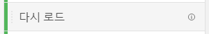
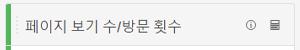
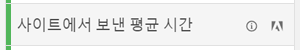

# 지표

지표를 사용하면 Analysis Workspace에서 데이터 포인트를 수량화할 수 있습니다. 이들은 일반적으로 시각화에서 열로 사용되며 차원에 연결됩니다.

## 지표 유형

Adobe는 Analysis Workspace에서 사용할 수 있는 여러 유형의 지표를 제공합니다.

* **표준 지표**: 프로젝트에서 사용하는 대부분의 지표는 표준 지표입니다. 예를 들면 [페이지 조회수](/help/components/metrics/page-views.md), [매출](/help/components/metrics/revenue.md) 또는 [사용자 정의 이벤트](/help/components/metrics/custom-events.md)가 해당됩니다. 자세한 내용은 구성 요소 사용 안내서의 [지표 개요](/help/components/metrics/overview.md)를 참조하십시오.

  

* **계산된 지표**: 표준 지표, 정적 수 또는 알고리즘 함수를 기반으로 하는 사용자 정의 지표입니다. 사용자 정의 계산된 지표는 사용 가능한 구성 요소 목록에 계산기 아이콘을 표시합니다. 자세한 내용은 구성 요소 사용 안내서의 [계산된 지표 개요](/help/components/c-calcmetrics/cm-overview.md)를 참조하십시오.

  

* **계산된 지표 템플릿**: 계산된 지표와 유사하게 동작하는 Adobe에서 정의한 지표입니다. Workspace 프로젝트에서 그대로 사용하거나 복사본을 저장하여 논리를 사용자 정의할 수 있습니다. 계산된 지표 템플릿은 사용 가능한 구성 요소 목록에 Adobe 아이콘을 표시합니다.

  

## Analysis Workspace에서 지표 사용

지표는 Analysis Workspace 내에서 다양한 방식으로 사용될 수 있습니다. Analysis Workspace에 지표 및 기타 유형의 구성 요소를 추가하는 방법에 대한 자세한 내용은 [Analysis Workspace에서 구성 요소 사용](/help/analyze/analysis-workspace/components/use-components-in-workspace.md)을 참조하십시오.

>[!BEGINSHADEBOX]

데모 비디오를 보려면  [지표 사용](https://video.tv.adobe.com/v/40817?quality=12&learn=on){target="_blank"}을 참조하십시오.

>[!ENDSHADEBOX]

## 계산된 지표 만들기

계산된 지표를 사용하면 간단한 연산자나 통계 함수를 사용하여 지표가 서로 관련되는 방식을 쉽게 확인할 수 있습니다.

계산된 지표를 만드는 방법에는 몇 가지가 있습니다. 선택하는 방법은 계산된 지표를 모든 프로젝트의 구성 요소 목록에서 사용할 수 있는지 또는 지표를 만든 프로젝트에서만 사용할 수 있는지 여부를 결정합니다.

### 모든 프로젝트에 대해 계산된 지표 만들기

계산된 지표 빌더를 사용하여 계산된 지표를 만들 수 있습니다. 이러한 방식으로 생성되면 계산된 지표를 구성 요소 목록에서 사용할 수 있으며, 그런 다음 조직 전체의 프로젝트에서 사용할 수 있습니다.

계산된 지표 빌더에 액세스하는 방법에 대한 자세한 내용은 [지표 빌드](/help/components/c-calcmetrics/c-workflow/cm-workflow/c-build-metrics/cm-build-metrics.md)를 참조하십시오.

### 단일 프로젝트에 대해 계산된 지표 만들기

지표를 만든 프로젝트에서만 사용할 수 있는 계산된 지표를 빠르게 만들 수 있습니다.

단일 프로젝트에 대해 계산된 지표를 만들려면 다음 작업을 수행하십시오.

1. Analysis Workspace에서 계산된 지표를 만들 프로젝트를 엽니다.

1. 자유 형식 테이블에서 단일 열의 열 헤더를 마우스 오른쪽 단추로 클릭합니다.

   또는

   Shift 키를 누른 상태에서 두 열을 선택한 다음 선택한 열 중 하나를 마우스 오른쪽 버튼으로 클릭합니다.

1. **[!UICONTROL 선택 항목에서 지표 만들기]** 선택

   

1. 이 프로젝트에 대해서만 계산된 지표를 만들려면 사용 가능한 옵션 중에서 선택하십시오.

   단일 열을 선택하면 다음 옵션을 사용할 수 있습니다.

   * [!UICONTROL **평균**]: 열에 대한 차원 요소 집합에서 평균 값을 표시하는 새 열을 만듭니다. [평균](/help/components/c-calcmetrics/cm-reference/cm-functions.md#mean) 함수를 사용합니다.

   * [!UICONTROL **중간값**]: 열에 대한 차원 요소 집합의 중간값을 표시하는 새 열을 만듭니다. [Median](/help/components/c-calcmetrics/cm-reference/cm-functions.md#median) 함수를 사용합니다.

   * [!UICONTROL **열 최대값**]: 열의 차원 요소 집합에서 가장 큰 값을 표시하는 새 열을 만듭니다. [열 최대값](/help/components/c-calcmetrics/cm-reference/cm-functions.md#column-maximum) 함수를 사용합니다.

   * [!UICONTROL **열 최소값**]: 열에 대한 차원 요소 집합에서 가장 작은 값을 표시하는 새 열을 만듭니다. [열 최소값](/help/components/c-calcmetrics/cm-reference/cm-functions.md#column-minimum) 함수를 사용합니다.

   * [!UICONTROL **열 합계**]: 열 내의 한 지표에 대한 모든 숫자 값을 추가하는 새 열을 만듭니다(차원의 요소에 대해). [열 합계](/help/components/c-calcmetrics/cm-reference/cm-functions.md#column-sum) 함수를 사용합니다.

   두 개의 열을 선택하면 다음 옵션을 사용할 수 있습니다.

   * [!UICONTROL **나누기**]: 선택한 두 열의 값을 나누는 새 열을 만듭니다.

   * [!UICONTROL **빼기**]: 선택한 두 열의 값을 빼는 새 열을 만듭니다.

   * [!UICONTROL **추가**]: 선택한 두 열의 값을 추가하는 새 열을 만듭니다.

   * [!UICONTROL **곱하기**]: 선택한 두 열의 값을 곱하는 새 열을 만듭니다.

   * [!UICONTROL **백분율 변경**]: 선택한 두 열 사이의 백분율 변경을 표시하는 새 열을 만듭니다.

[계산된 지표: 구현 불가 지표](https://experienceleague.adobe.com/docs/analytics-learn/tutorials/components/calculated-metrics/calculated-metrics-implementationless-metrics.html?lang=ko-KR) (3:42)

## 다양한 속성 모델과 지표 비교

한 속성 모델을 다른 속성 모델과 빠르게 비교하려면 지표를 마우스 오른쪽 단추로 클릭하고 **[!UICONTROL 속성 모델 비교]**&#x200B;를 선택하십시오.

이 바로 가기를 사용하면 지표를 드래그하여 두 번 구성하지 않고 한 가지 속성 모델을 다른 모델과 비교할 수 있습니다.

## [!UICONTROL 누적 평균] 함수를 사용하여 지표 스무딩 적용

다음은 해당 주제에 대한 비디오입니다.

>[!BEGINSHADEBOX]

데모 비디오는  [누적 평균](https://video.tv.adobe.com/v/27068?quality=12&learn=on){target="_blank"}을 참조하세요.

>[!ENDSHADEBOX]

