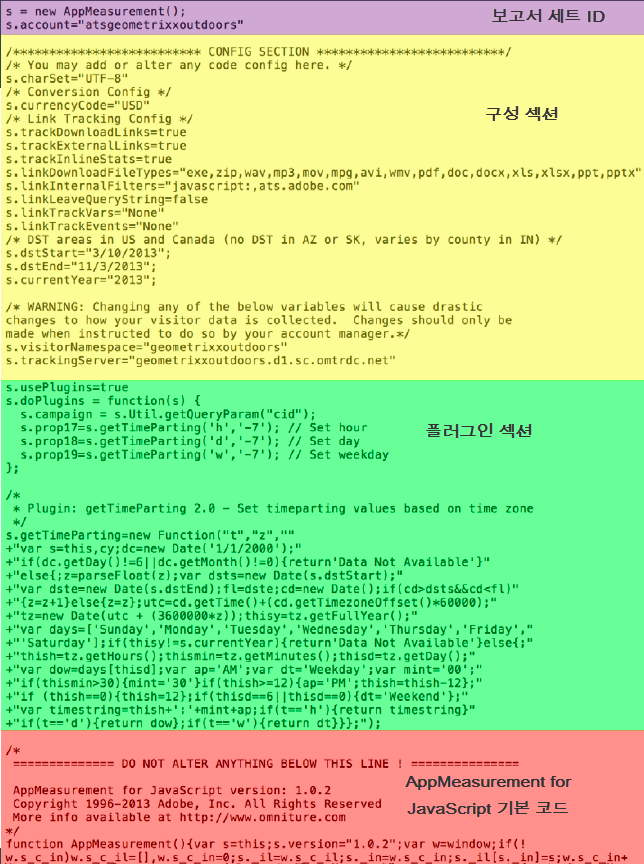

# 달력 및 날짜 범위 개요

달력에서 날짜와 날짜 범위를 지정하거나 사전 설정을 선택할 수 있습니다.

달력 선택 사항은 패널 수준에서 적용되지만, 모든 패널에 적용되는 옵션이 있습니다. 기본적으로 Workspace 달력에는 현재 달과 마지막 달이 표시됩니다.

처음 클릭하면 날짜 범위 선택이 시작됩니다. 그런 다음 날짜 범위의 끝을 선택하는 두 번째 클릭까지 범위를 양쪽 방향으로 강조 표시합니다. 첫 번째 날짜를 클릭한 채로 `Shift` 키를 누르고 있으면(또는 마우스 오른쪽 단추를 클릭하면) 이 날짜가 범위에 추가됩니다.

사용자는 날짜(및 시간 차원)를 Workspace 프로젝트에 드래그하여 놓을 수도 있습니다. 특정, 날, 주, 달, 연도 또는 연속 날짜를 지정할 수 있습니다.

[YouTube의 분석 작업 공간에서 날짜 범위 및 달력 사용](https://www.youtube.com/watch?v=L4FSrxr3SDA&list=PL2tCx83mn7GuNnQdYGOtlyCu0V5mEZ8sS&index=28) (4:07)

| 설정 | 설명 |
|--- |--- |
| 선택한 기간(일) | 선택한 일/주/월/년. |
| 롤링 날짜 사용 | 롤링 날짜를 사용하면 보고서를 실행한 때를 기반으로 설정된 기간에 대해 앞 또는 뒤는 보는 동적 보고서를 생성할 수 있습니다. 예를 들어, "지난 달"에 수행한 모든 주문에 대해 보고하려 하고(생성일 필드를 기반으로 한), 12월에 해당 보고서를 실행한 경우, 11월에 수행한 주문이 표시됩니다. 동일한 보고서를 1월에 실행한 경우에는 12월에 수행한 주문이 표시됩니다. 날짜 미리 보기: 롤링 달력이 포함하는 기간을 가리킵니다.  시작: 오늘, 이번 주, 이번 달, 이번 분기, 올해 중에서 선택할 수 있습니다.  끝: 오늘, 이번 주, 이번 달, 이번 분기, 올해 중에서 선택할 수 있습니다.  예를 들어, 여기로 이동합니다. |
| 날짜 범위 | 사전 설정 날짜 범위를 선택할 수 있습니다. 최근 30일이 기본값입니다.  |
| 모든 패널에 적용 | 현재 패널에 대한 선택된 날짜 범위를 변경할 뿐만 아니라 프로젝트 내의 모든 다른 패널에 대한 선택된 날짜 범위도 변경할 수 있습니다. |
| 적용 | 날짜 범위를 이 패널에만 적용합니다. |
