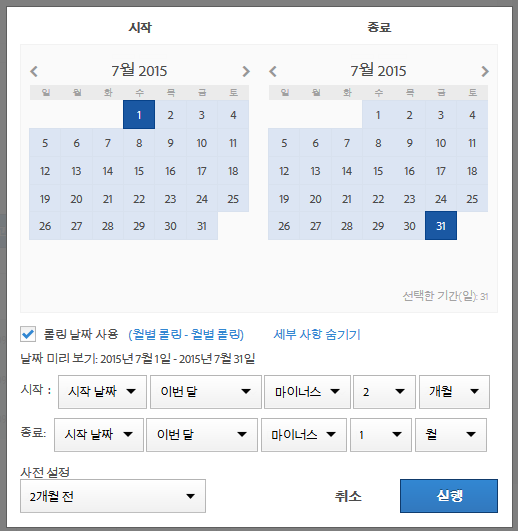
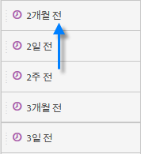
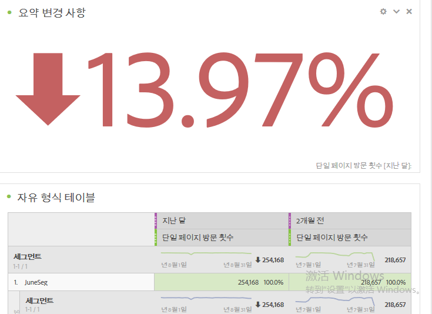
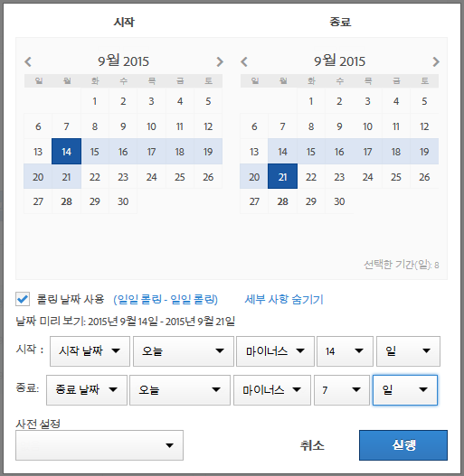

# 사용자 지정 날짜 범위 만들기

Analysis Workspace에서 사용자 지정 날짜 범위를 만든 후 시간 구성 요소로 저장합니다.

**[!UICONTROL Components]** > **[!UICONTROL New Date Range]**

날짜 범위는 패널 수준에서 적용됩니다. 날짜 범위를 프로젝트에 추가하려면 **패널** > *`<select panel>`*&#x200B;을 클릭하고 새 날짜 범위를 지정하십시오.

## &quot;2개월 전&quot;에 대한 날짜 범위 {#section_C4109C57CB444BB2A79CC8082BD67294}

다음 사용자 지정 날짜 범위는 방향 변경을 보여주는 요약 변경 사항 시각화가 있는, &quot;2개월 전&quot;에 대한 날짜 범위를 보여줍니다.

The custom date range is displayed at the top of the [!UICONTROL Date Range] component panel in your project:

비교를 위해 [지난 달] 사전 설정을 사용하는 사용자 지정 월별 롤링 날짜 범위와 함께 이 사용자 지정 날짜 범위를 열로 드래그할 수 있습니다. 요약 변경 사항 시각화를 추가하고, 각 열에서 합계를 선택하여 방향 변경 사항을 표시합니다.

## 7일 순환 날짜 범위 사용 {#section_7EF63B2E9FF54D2E9144C4F76956A8DD}

날짜 범위는 패널 수준에 적용됩니다. 날짜 범위를 프로젝트에 추가하려면 **작업** > **패널 추가**&#x200B;를 클릭하고, 새 날짜 범위를 지정하십시오.

날짜 범위 빌더에서는 다른 날짜 범위와 함께 [구성 요소] 패널에 표시되는 사용자 지정 날짜 범위를 만들 수 있습니다.

예를 들어, 1주일 전에 끝나는 7일 순환 기간을 지정하는 날짜 범위를 만들 수 있습니다.

사용 *`rolling daily`*.

* 시작 설정은 *`current day minus 14 days`*.

* 끝 설정은 *`current day minus 7 days`*.

이 날짜 범위는 임의의 자유 형식 테이블로 드래그하는 구성 요소일 수 있습니다.
