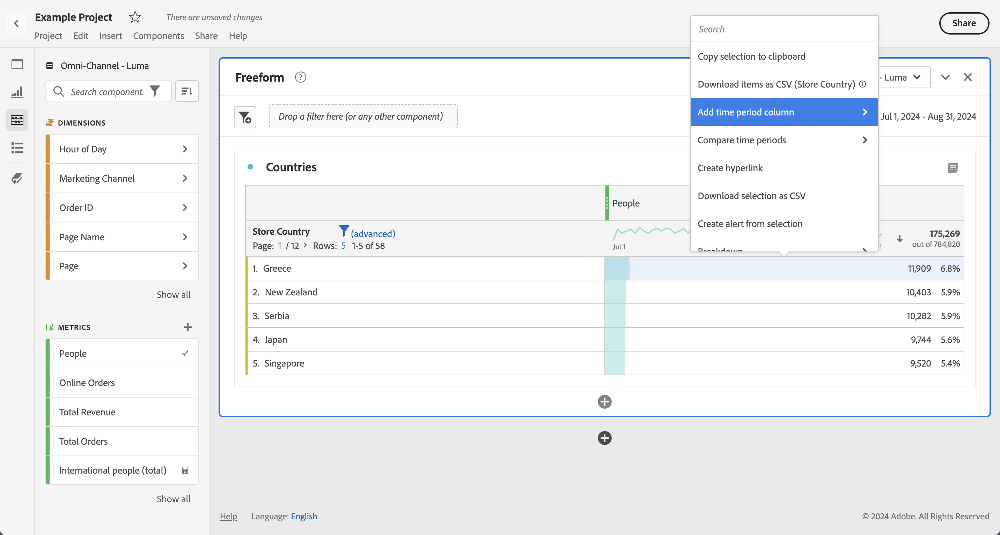

# 날짜 비교

Analysis Workspace의 날짜 비교를 사용하여 날짜 범위가 포함된 열을 가져오고 전년 대비, 사분기 대비, 전월 대비 등과 같은 일반 날짜 비교를 만들 수 있습니다.

## 기간 비교 {#section_C4E36BFE0F5C4378A74E705747C9DEE4}

분석하려면 컨텍스트가 필요하며, 해당 컨텍스트를 이전 기간에서 제공하는 경우가 종종 있습니다. 예를 들어, "작년 이맘때보다 얼마나 좋아질까요/나빠질까요?"라는 질문은 비즈니스를 이해하는 데 기본적인 질문입니다. 날짜 비교에 “차이점” 열이 자동으로 포함되는데, 이 열은 지정된 기간과 비교한 백분율 변경을 표시합니다.

1. 기간을 비교할 차원 및 지표를 사용하여 자유 형식 테이블을 만듭니다.
1. 테이블 행을 마우스 오른쪽 단추로 클릭하고 **[!UICONTROL 기간 비교를 선택합니다]**.

   

   >[!IMPORTANT]
   >
   >이 마우스 오른쪽 단추 클릭 옵션은 지표 행, 날짜 범위 행 및 시간 차원 행에 대해 비활성화됩니다.

1. 테이블의 날짜 범위를 설정한 방법에 따라 비교에 대한 다음 옵션이 제공됩니다.

   | 옵션 | 설명 |
   |---|---|
   | **[!UICONTROL 이 날짜 범위에 대한 이전 주/달/분기/년]** | 이 날짜 범위로부터 주/달 전 등을 비교합니다. |
   | **[!UICONTROL 이번 주/달/분기/년과 작년]** | 1년 전의 같은 날짜 범위와 비교합니다. |
   | **[!UICONTROL 범위 선택]** | 사용자 지정 날짜 범위를 선택할 수 있습니다. |

   >[!NOTE]
   >
   >When you select a custom number of days, for example October 7 - October 20 (a 14-day range), you will get only 2 options: **[!UICONTROL Prior 14 days before this date range]**, and **[!UICONTROL Select range]**.

1. 결과 비교 모양은 다음과 같습니다.

   

   [퍼센트 변경] 열의 행은 음수 값인 경우 빨간색으로 표시되고 양수 값인 경우 녹색으로 표시됩니다.

1. (선택 사항) 다른 Workspace 프로젝트에서와 마찬가지로 이러한 시간 비교에 기반을 두고 시각화를 만들 수 있습니다. 예를 들어, 다음은 막대 그래프입니다.

   

   막대 차트에 백분율 변경을 표시하려면 [!UICONTROL 시각화 설정]에서 [!UICONTROL 백분율] 설정을 선택해야 합니다.

## Add a time period column for comparison {#section_93CC2B4F48504125BEC104046A32EB93}

이제 테이블의 각 열에 기간을 추가하여 달력에 설정된 기간과 다른 기간을 추가할 수 있습니다. 날짜를 비교할 수 있는 다른 방법입니다.

1. 테이블에서 열을 마우스 오른쪽 단추로 클릭하고 **[!UICONTROL 기간 열 추가를 선택합니다.]**

1. 테이블의 날짜 범위를 설정한 방법에 따라 비교에 대한 다음 옵션이 제공됩니다.

   | 옵션 | 설명 |
   |---|---|
   | **[!UICONTROL 이 날짜 범위에 대한 이전 주/달/분기/년]** | 이 날짜 범위로부터 주/달 전 등의 열을 추가합니다. |
   | **[!UICONTROL 이번 주/달/분기/년과 작년]** | 1년 전의 같은 날짜 범위를 추가합니다. |
   | **[!UICONTROL 범위 선택]** | 사용자 지정 날짜 범위를 선택할 수 있습니다. |

   >[!NOTE]
   >
   >When you select a custom number of days, for example October 7 - October 20 (a 14-day range), you will get only 2 options: **[!UICONTROL Prior 14 days before this date range]**, and **[!UICONTROL Select range]**.

1. 선택한 열 맨 위에 기간이 삽입됩니다.

   

1. 원하는 만큼 여러 번 열을 추가하고 다른 날짜 범위를 조합할 수 있습니다.

   

1. 또한 각 열을 정렬하여 정렬하는 열에 따라 일 순서를 변경할 수 있습니다.

## Align column dates to start on same row {#section_5085E200082048CB899C3F355062A733}

모든 테이블에 새 설정을 사용하여 **[!UICONTROL 날짜를 각 열에서 동일한 행의 시작으로 정렬합니다(전체 테이블에 적용)]**. "전체 테이블에 적용"이란 예를 들어, 테이블에서 분류를 수행하는 경우 및 분류에 대한 이 설정을 변경하는 경우 전체 테이블에 대한 설정이 변경됨을 의미합니다.

>[!IMPORTANT]
>
>This setting is **disabled** (unchecked) for all existing projects and **enabled** (checked) for all new projects.

예: 날짜를 맞추도록 선택한 경우 예를 들어, 2016년 10월과 9월 간에 월별 비교를 수행하는 경우 왼쪽 열이 10월 1일로 시작되고 오른쪽 열이 9월 1일로 시작됩니다.

<!-- 

See Jonny Moon's email from November 3. 

 -->

