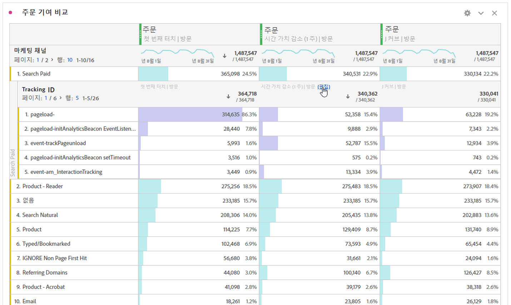

# 차원 분류

Analysis Workspace에서 차원 및 차원 항목을 분류합니다.

구체적인 필요 사항들을 위해 원하는 방법으로 데이터를 분류할 수 있습니다. 적절한 지표, 차원, 세그먼트, 타임라인 및 기타 분석 분류 값을 사용하여 쿼리를 작성해 보십시오.

1. 데이터 테이블로 [프로젝트를 만듭니다](/help/analyze/analysis-workspace/build-workspace-project/t-freeform-project.md).
1. 데이터 테이블에서 라인 항목을 마우스 오른쪽 단추로 클릭하고 **[!UICONTROL 분류]** > *`<item>`*.

   

   선택한 기간에 대해 차원 항목이나 대상 세그먼트별로 지표를 분류할 수 있습니다. 더 세부적인 수준으로 드릴다운할 수도 있습니다.

   >[!NOTE]
   >
   >테이블에 표시되는 분류의 수는 200개로 제한됩니다. 이 제한은 분류 내보내기에 대해서는 증가합니다.

[Analysis Workspace에서 프로젝트에 Dimension 및 지표 추가](https://docs.adobe.com/content/help/en/analytics-learn/tutorials/analysis-workspace/metrics/adding-dimensions-and-metrics-to-your-project-in-analysis-workspace.html) (11:39)

[자유 형식 테이블에서 Dimension 작업](https://docs.adobe.com/content/help/en/analytics-learn/tutorials/analysis-workspace/building-freeform-tables/working-with-dimensions-in-a-freeform-table.html) (15:35)

## 분류에 속성 모델 적용

테이블 내의 모든 분류에는 모든 속성 모델이 적용될 수 있습니다. 이 속성 모델은 상위 열과 동일하거나 다를 수 있습니다. 예를 들어, 마케팅 채널 차원에서 선형 주문을 분석하고 채널 내 특정 추적 코드에 U자형 주문을 적용할 수 있습니다. 분류에 적용되는 속성 모델을 편집하려면 다음과 같이 분류 모델 위로 마우스를 이동하고&#x200B;**[!UICONTROL 편집]**&#x200B;을 클릭합니다.

