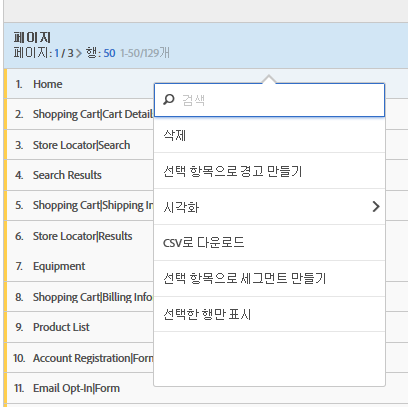

# 차원 분류

Analysis Workspace에서 차원 및 차원 항목을 분류합니다.

구체적인 필요 사항들을 위해 원하는 방법으로 데이터를 분류할 수 있습니다. 적절한 지표, 차원, 세그먼트, 타임라인 및 기타 분석 분류 값을 사용하여 쿼리를 작성해 보십시오.

1. [데이터 테이블로 프로젝트를 만듭니다.](../../../../analyze/analysis-workspace/build-workspace-project/t-freeform-project.md#task_C2C698ACC7954062A28E4784911E6CF2)
1. In the data table, right-click a line item and select **[!UICONTROL Breakdown]** &gt; *`<item>`*.

   

   선택한 기간에 대해 차원 값이나 대상 세그먼트를 분류할 수 있습니다. 더 세부적인 수준으로 드릴다운할 수도 있습니다.

   >[!NOTE]
   >
   >테이블에 표시할 분류의 수는 200 개로 제한됩니다. 이 제한은 분류 내보내기에 대해서는 증가합니다.

[YouTube의 분석 작업 공간에서 차원](https://www.youtube.com/watch?v=P9W0hhIHhCs&index=12&list=PL2tCx83mn7GuNnQdYGOtlyCu0V5mEZ8sS) (4:54)

[YouTube의 차원 분류](https://www.youtube.com/watch?v=3mQ2HN7-lIc&list=PL2tCx83mn7GuNnQdYGOtlyCu0V5mEZ8sS&index=13) (2:02)