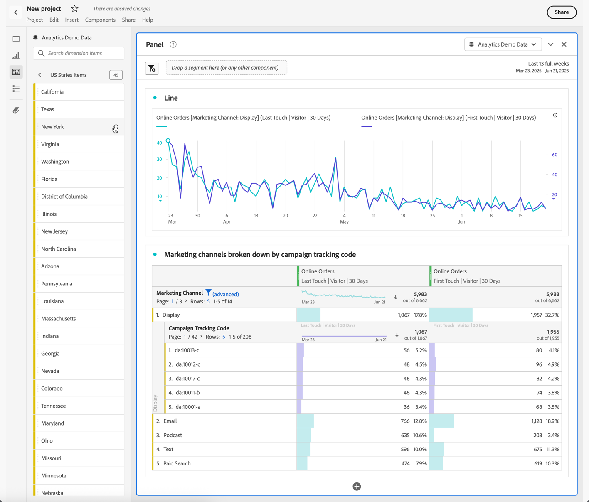

# 차원 미리보기

구성 요소에 대한 [구성 요소 정보](/help/analyze/analysis-workspace/components/use-components-in-workspace.md#component-info)를 사용하여 차원의 상위 항목을 표시할 수 있습니다.

<!--
Now, by default, we show dynamic values instead of static ones, with the option to turn them into static values. Other things to note:

* As your data updates, the dynamic dimension columns will update to show the current 5/15 dimension items.
* A dynamic dimension column that is copied or moved will become static.
* When hovering a static dimension column you will see a lock icon, indicating that the dimension is static.

-->

## 차원 항목 표시

구성 요소 패널에서 차원에 대해 를 선택하면 해당 차원 항목 목록이 나타납니다. 차원 항목 목록에는 일반적으로 지난 30일 동안의 상위 항목이 표시됩니다. 더 많은 항목을 사용할 수 있는 경우 패널에 대해 선택한 날짜 범위를 벗어나면 링크를 선택하여 더 많은 항목을 표시합니다. 예를들어 **[!UICONTROL 지난 달의 항목을 표시]**&#x200B;합니다.

<!--
# Preview dimensions

Hover over the information (i) icon next to a dimension. This shows the top 5 values for non-time dimensions (and 15 for time dimensions). We used to keep those values static (i.e., the 5 values picked never changed).

Now, by default, we show dynamic values instead of static ones, with the option to turn them into static values. Other things to note:

* As your data updates, the dynamic dimension columns will update to show the current 5/15 dimension items.
* A dynamic dimension column that is copied or moved will become static.
* When hovering a static dimension column you will see a lock icon, indicating that the dimension is static.

## Show dimension items

When you hover over a dimension and click the grey right-arrow next to it, a list of its dimension items appears. Any list of dimension items usually shows the top items for the last 30 days.

If you scroll down to the bottom of the list, you see **[!UICONTROL Show Top Items From Last 18 Months]**. Click this option to see top dimension items from the last 547 days.

-->
