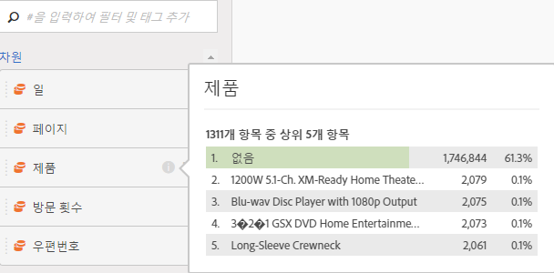
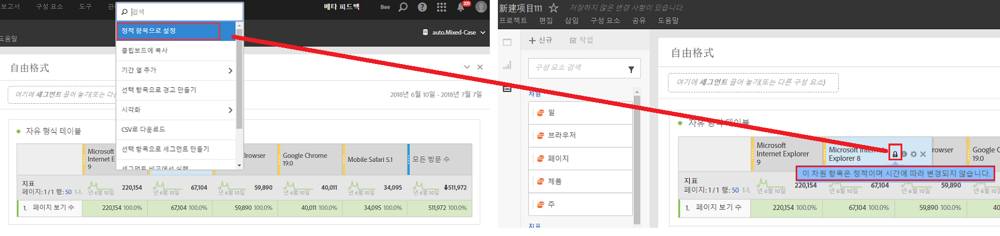

# 차원 미리 보기

차원 옆에 있는 정보(i) 아이콘을 마우스로 가리킵니다. 비시간 차원에 대한 상위 5개 값(시간 차원에 대해 15개)이 표시됩니다. 이러한 값을 정적으로 유지할 수 있었습니다(즉, 선택한 5개의 값은 변경되지 않음).

이제 기본적으로 정적 값 대신 동적 값을 표시하는데 이 값을 정적 값으로 변환하는 옵션이 있습니다. 기타 참고 사항:

* 데이터가 업데이트되면 동적 차원 열이 업데이트되어 현재 5/15개 차원 항목이 표시됩니다.
* 복사되거나 이동되는 동적 차원 열은 정적이 됩니다.
* 정적 차원 열을 마우스로 가리키면 잠금 아이콘이 표시되어 차원이 정적이라는 것을 나타냅니다.

## 차원 항목 표시

차원 위로 마우스를 가져간 후 그 옆에 있는 회색 오른쪽 화살표를 클릭하면 차원 항목 목록이 나타납니다. 일반적으로 모든 차원 항목 목록은 지난 30일 동안의 상위 항목을 보여줍니다.

목록의 아래쪽으로 스크롤하면 **[!UICONTROL Show Top Items From Last 6 Months]**&#x200B;표시됩니다. 최근 180일의 상위 차원 항목을 보려면 이 선택 사항을 클릭하십시오.
