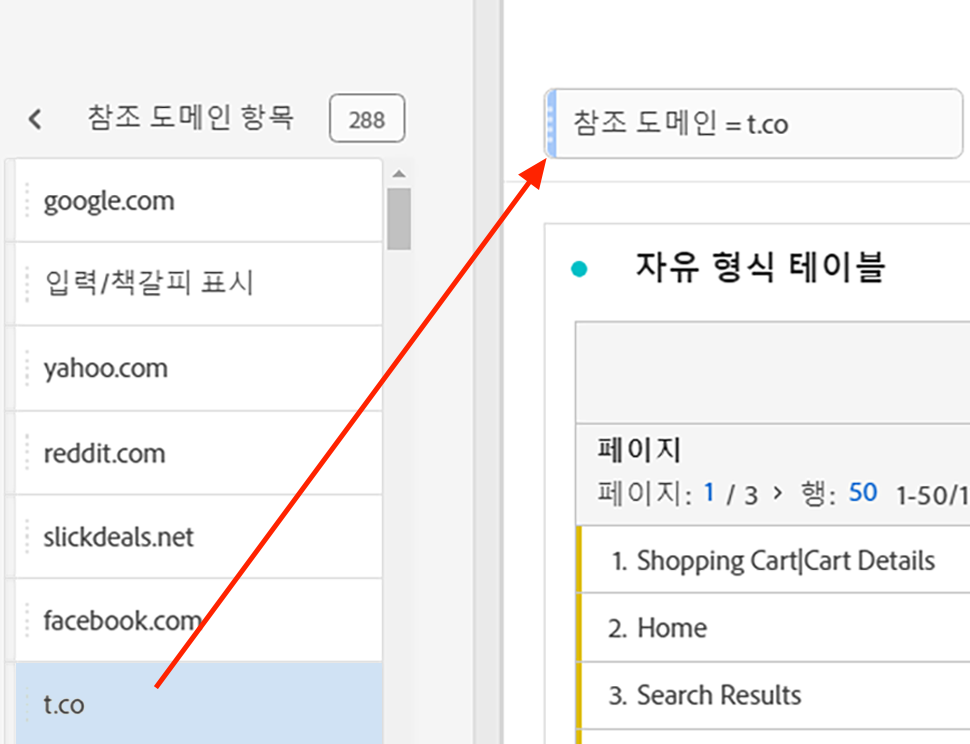

# 임시 프로젝트 세그먼트

임시 프로젝트 세그먼트를 사용하면 구성 요소를 패널 드롭 영역으로 바로 드래그하여 놓아 세그먼트를 만들 수 있습니다. 세그먼트가 [프로젝트 수준 세그먼트](https://experienceleague.adobe.com/docs/analytics/analyze/analysis-workspace/components/segments/quick-segments.html?#what-are-project-only-segments%3F) 로컬에서 현재 프로젝트에 액세스할 수 있습니다.

다음은 임시 프로젝트 세그먼트 만들기에 대한 비디오입니다.

>[!VIDEO](https://video.tv.adobe.com/v/23978/?quality=12)

1. 구성 요소 유형(차원, 차원 항목, 이벤트, 지표, 세그먼트, 세그먼트 템플릿, 날짜 범위)을 패널 위쪽에 세그먼트 드롭 영역으로 드래그합니다. 구성 요소 유형은 자동으로 임시 세그먼트로 변환되거나, [빠른 세그먼트](https://experienceleague.adobe.com/docs/analytics/analyze/analysis-workspace/components/segments/quick-segments.html?lang=ko-KR) 호환되는 경우
다음은 Twitter 참조 도메인을 위한 세그먼트를 만드는 방법의 예입니다.

   

   패널에 이 세그먼트를 자동으로 적용하여 결과를 즉시 조회할 수 있습니다.

1. 패널에 세그먼트를 무제한으로 추가할 수 있습니다.
1. 이 세그먼트를 저장하기로 결정되면 아래의 다음 섹션을 참조하십시오.

다음 사항에 주의하십시오.

* 다음 구성 요소 유형을 세그먼트 영역으로 끌어 놓을 수 **없음**: 세그먼트를 빌드할 수 없는 계산된 지표 및 차원/지표.
* 전체 차원 및 이벤트에 대해 Analysis Workspace는 &quot;존재함&quot; 히트 세그먼트를 만듭니다. 예: `Hit where eVar1 exists` 또는 `Hit where event1 exists`.
* 세그먼트를 놓는 영역에 &quot;지정되지 않음&quot; 또는 &quot;없음&quot;을 놓으면 세그먼테이션에서 올바로 처리되도록 자동으로 &quot;존재하지 않음&quot; 세그먼트로 변환됩니다.

프로젝트 내에서 만들고 적용할 수 있는 서로 다른 세그먼트를 비교하려면 [여기](/help/analyze/analysis-workspace/components/segments/t-freeform-project-segment.md).

## 임시 세그먼트 저장 {#ad-hoc-save}

임시 세그먼트는 저장하여 다른 프로젝트에서 사용할 수 있도록 만들 수 있습니다.

1. 드롭 영역의 세그먼트 위에 커서를 놓고 &quot;i&quot; 아이콘을 클릭합니다.
1. 연필 편집을 클릭하여 세그먼트 빌더로 이동합니다.
1. 확인 **[!UICONTROL 모든 프로젝트를 사용할 수 있도록 설정하고 구성 요소 목록에 추가합니다]**.
1. 클릭 **[!UICONTROL 저장]**.

저장되면 왼쪽 레일 구성 요소 목록에서 세그먼트를 사용할 수 있으며 세그먼트 관리자의 다른 사용자와 공유할 수 있습니다.
