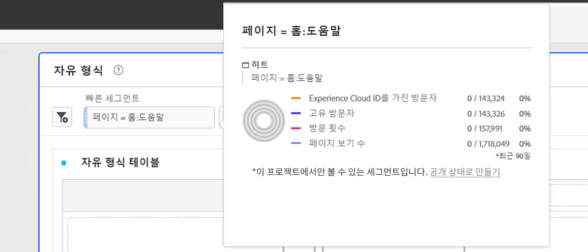

# 임시 프로젝트 세그먼트

다음은 임시 프로젝트 세그먼트 만들기에 대한 비디오입니다.

>[!VIDEO](https://video.tv.adobe.com/v/23978/?quality=12)

세그먼트 빌더로 이동하지 않고 세그먼트가 프로젝트에 어떻게 영향을 주는지를 신속하게 탐색하려는 경우 임시 프로젝트 세그먼트를 만들 수 있습니다. 이러한 세그먼트를 임시 프로젝트 수준 세그먼트로 간주합니다. 일반적으로 왼쪽 레일의 구성 요소 세그먼트와 같이 세그먼트 &quot;라이브러리&quot;에 포함되지 않습니다. 그러나 아래와 같이 저장할 수 있습니다.

임시 프로젝트 세그먼트가 수행할 수 있는 작업과 완전한 구성 요소 수준 세그먼트를 비교하려면 [여기](/help/analyze/analysis-workspace/components/segments/t-freeform-project-segment.md)로 이동하십시오.

1. 구성 요소 유형(차원, 차원 항목, 이벤트, 지표, 세그먼트, 세그먼트 템플릿, 날짜 범위)을 패널 위쪽에 세그먼트 드롭 영역으로 놓습니다. 구성 요소 유형은 자동으로 세그먼트로 변환됩니다.
다음은 Twitter 참조 도메인의 세그먼트를 만드는 방법의 예입니다.

   

   패널에서는 이 세그먼트가 자동으로 적용되며 결과를 즉시 볼 수 있습니다.

1. 패널에 구성 요소를 무제한으로 추가할 수 있습니다.
1. 이 세그먼트를 저장하기로 결정한 경우 아래 섹션을 참조하십시오.

다음 사항에 주의하십시오.

* 다음 구성 요소 유형을 세그먼트 영역으로 끌어 놓을 수 **없음**: 세그먼트를 빌드할 수 없는 계산된 지표 및 차원/지표.
* 전체 차원 및 이벤트에 대해 Analysis Workspace는 &quot;존재함&quot; 히트 세그먼트를 만듭니다. 예: `Hit where eVar1 exists` 또는 `Hit where event1 exists`
* 세그먼트를 놓는 영역에 &quot;지정되지 않음&quot; 또는 &quot;없음&quot;을 놓으면 세그먼테이션에서 올바로 처리되도록 자동으로 &quot;존재하지 않음&quot; 세그먼트로 변환됩니다.

>[!NOTE]
>
>이러한 방식으로 생성된 세그먼트는 프로젝트 내부에서 사용됩니다.

## 임시 프로젝트 세그먼트 저장 {#ad-hoc-save}

다음 절차에 따라 이러한 세그먼트를 저장하도록 선택할 수 있습니다.

1. 드롭 영역의 세그먼트 위에 커서를 놓고 &quot;i&quot; 아이콘을 클릭합니다.
1. 표시되는 정보 패널에서 **[!UICONTROL 저장]**&#x200B;을 클릭합니다.

   

## 프로젝트 전용 세그먼트란?

프로젝트 전용 세그먼트는 빠른 세그먼트나 임시 Workspace 프로젝트 세그먼트입니다. 세그먼트 빌더에서 이러한 필드를 편집/열면 프로젝트 전용 상자가 표시됩니다. 이들이 빌더에서 빠른 세그먼트를 적용하지만 사용 가능한 만들기 상자를 선택하지 않으면 여전히 프로젝트 전용 세그먼트이지만 더 이상 QS 빌더에서 열 수 없습니다. 확인란을 선택하고 저장을 선택하면 이제 구성 요소 목록 세그먼트가 됩니다.