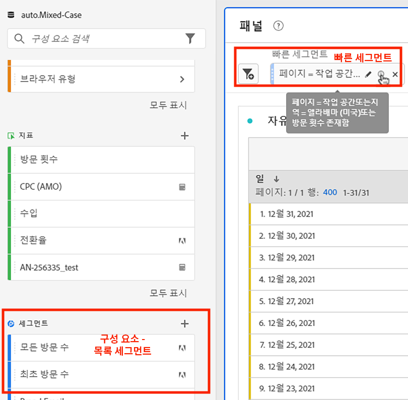
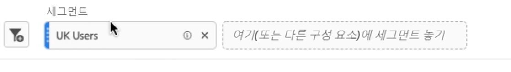

# 빠른 세그먼트

프로젝트 내에서 빠른 세그먼트를 만들어 전체 [세그먼트 빌더](/help/components/segmentation/segmentation-workflow/seg-build.md)의 복잡성을 방지할 수 있습니다. 빠른 세그먼트가 수행할 수 있는 작업과 완전한 구성 요소 수준 세그먼트를 비교하려면 [여기](/help/analyze/analysis-workspace/components/segments/t-freeform-project-segment.md)로 이동하십시오.

>[!IMPORTANT]
> 빠른 세그먼트는 현재 제한된 테스트 중이며 아직 일반적으로 사용할 수 없습니다.

## 빠른 세그먼트 만들기

1. 자유 형식 테이블의 패널 헤더에서 필터+ 아이콘을 클릭합니다.

   

   참고:

   - 세그먼트에서 차원/지표/날짜 범위를 포함(또는 세그먼트에서 제외)할 수 있는 한 개의 세그먼트 컨테이너만 있습니다.
   - 컨테이너를 히트, 방문 또는 방문자 수준으로 설정할 수 있습니다. 기본값은 히트입니다.

1. 다음 세 가지 방법 중 하나로 차원/지표/날짜 범위를 추가합니다.

   - 입력을 시작하면 빠른 세그먼트 빌더가 적절한 구성 요소를 자동으로 찾습니다.
   - 드롭다운 목록을 사용하여 구성 요소를 찾습니다.
   - 왼쪽 레일에서 구성 요소를 드래그하여 놓습니다.

1. `Page equals workspace` 등의 첫 번째 규칙을 지정합니다. 세그먼트 정의에 최대 3개의 규칙을 사용할 수 있습니다. 다른 규칙을 추가하려면 &quot;+&quot; 기호를 클릭하십시오. 규칙에 &quot;AND&quot; 또는 &quot;OR&quot; 한정자를 추가할 수 있지만, 단일 세그먼트 정의에 &quot;AND&quot;와 &quot;OR&quot;를 혼합할 수 없습니다.

   다음은 차원과 지표를 결합하는 세그먼트의 예입니다.

   

1. **[!UICONTROL 적용]** 을 클릭하여 이 세그먼트를 패널에 적용합니다.
세그먼트가 맨 위에 나타납니다. 왼쪽의 구성 요소 수준 세그먼트에 대한 파란색 막대와 대조적으로 회색 사이드바를 확인합니다.

   

## 빠른 세그먼트 공개하기

다음 단계를 수행하여 이러한 세그먼트를 공개(전역)로 지정하도록 선택할 수 있습니다.

1. 빠른 세그먼트 위로 마우스를 가져간 후 &quot;i&quot; 아이콘을 클릭합니다.
1. **[!UICONTROL 빌더 열기]**를 클릭합니다.
이렇게 하면 세그먼트 빌더에서 세그먼트가 열립니다.
   >[!NOTE]
   >세그먼트 빌더에서 세그먼트를 적용하거나 저장하면 빠른 세그먼트 빌더에서 더 이상 편집할 수 없습니다.
1. **[!UICONTROL 확인]**&#x200B;을 클릭합니다.
1. 세그먼트 빌더에서 **[!UICONTROL 적용]**&#x200B;을 클릭합니다.
1. Workspace로 돌아가서 세그먼트가 구성 요소 라이브러리의 일부임을 알리는 파란색 사이드바를 이제 가지고 있는 방식을 확인합니다.

   

