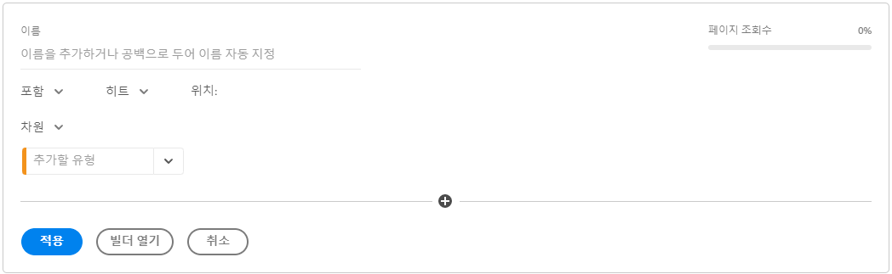
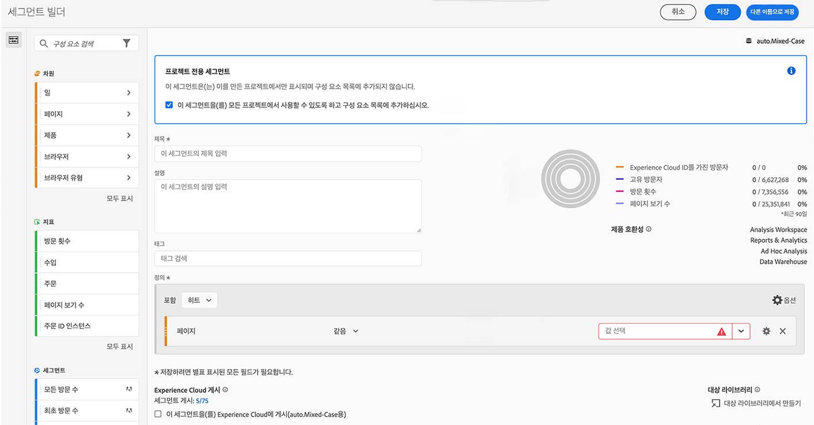

# 빠른 세그먼트

프로젝트에서 빠른 세그먼트를 만들어 복잡한 전체 [세그먼트 빌더](/help/components/segmentation/segmentation-workflow/seg-build.md)를 우회할 수 있습니다. 빠른 세그먼트

* 적용 대상 [프로젝트 전용 세그먼트](https://experienceleague.adobe.com/docs/analytics/analyze/analysis-workspace/components/segments/quick-segments.html?lang=en#what-are-project-only-segments%3F).
* 최대 3개의 규칙 허용.
* 중첩 컨테이너이나 순차적 규칙을 수용하지 않습니다.

빠른 세그먼트로 수행할 수 있는 작업과 완전한 구성 요소 목록 세그먼트로 수행할 수 있는 작업을 비교하려면 [여기](/help/analyze/analysis-workspace/components/segments/t-freeform-project-segment.md)를 참조하십시오.

## 사전 요구 사항

누구나 [!UICONTROL 빠른 세그먼트]를 만들 수 있습니다. 단, 빠른 세그먼트를 저장하거나 [!UICONTROL 세그먼트 빌더]에서 열려면 [Adobe Admin Console](https://experienceleague.adobe.com/docs/analytics/admin/admin-console/permissions/summary-tables.html?lang=ko-KR#analytics-tools)에서의 [!UICONTROL 세그먼트 생성] 권한이 필요합니다.

## 빠른 세그먼트 만들기

자유 형식 테이블에서 패널 헤드의 필터 + 아이콘을 클릭합니다.

이 빈 슬레이트에서 빠른 세그먼트를 구성합니다.

| 설정 | 설명 |
| --- | --- |
| 이름 | 세그먼트의 기본 이름은 세그먼트에 있는 규칙 이름의 조합입니다. 세그먼트 이름을 바꿀 수 있습니다. |
| 포함/제외 | 세그먼트 정의에 구성 요소를 포함 또는 제외할 수 있지만 둘 다 할 수는 없습니다. |
| 히트/방문/방문자 컨테이너 | 빠른 세그먼트에는 하나의 [세그먼트 컨테이너](https://experienceleague.adobe.com/docs/analytics/components/segmentation/seg-overview.html?lang=ko-KR#section_AF2A28BE92474DB386AE85743C71B2D6)만이 포함되어 세그먼트에 차원/지표/날짜 범위를 포함하거나 세그먼트에서 제외할 수 있습니다. [!UICONTROL 방문자]에는 여러 방문 및 페이지 조회수에서 방문자와 관련된 데이터가 포함됩니다. [!UICONTROL 방문] 컨테이너를 사용하여 방문에 따라 방문자의 데이터를 분석하는 규칙을 설정할 수 있고, [!UICONTROL 히트] 컨테이너를 사용하여 개별 페이지 보기에 따라 방문자 정보를 분류할 수 있습니다. 기본 컨테이너는 [!UICONTROL 히트]입니다. |
| 구성 요소(차원/지표/날짜 범위) | 구성 요소 차원 및/또는 지표 및/또는 날짜 범위 및 값을 추가하여 최대 3개의 규칙을 정의합니다. 적합한 구성 요소를 검색하는 3가지 방법이 있습니다.<ul><li>입력을 시작하면 [!UICONTROL 빠른 세그먼트] 빌더가 적절한 구성 요소를 자동으로 검색합니다.</li><li>드롭다운 목록을 사용하여 구성 요소를 검색합니다.</li><li>왼쪽 레일에서 구성 요소를 드래그 앤 드롭합니다.</li></ul> |
| 연산자 | 드롭다운 메뉴를 사용하여 표준 연산자 및 [!UICONTROL 고유 개수] 연산자를 검색합니다. [자세히 알아보기](https://experienceleague.adobe.com/docs/analytics/components/segmentation/segment-reference/seg-operators.html?lang=ko-KR) |
| 더하기(+) 기호 | 다른 규칙 추가 |
| AND/OR 한정자 | 규칙에 “AND” 또는 “OR” 한정자를 추가할 수 있지만 단일 세그먼트 정의에서는 “AND”와 “OR”를 혼합할 수 없습니다. |
| 적용 | 이 세그먼트를 패널에 적용합니다. 세그먼트에 데이터가 포함되지 않은 경우 계속 진행하라는 메시지가 표시됩니다. |
| 빌더 열기 | 세그먼트 빌더를 엽니다. 세그먼트 빌더에 세그먼트를 저장하거나 적용하면 더 이상 “빠른 세그먼트”로 간주되지 않습니다. 구성 요소 목록의 세그먼트 라이브러리의 일부가 됩니다. |
| 취소 | 이 빠른 세그먼트를 취소합니다. 적용하지 않습니다. |
| 날짜 범위 | 유효성 검사기는 패널 날짜 범위를 사용하여 데이터를 조회합니다. 하지만 빠른 세그먼트에 적용되는 날짜 범위는 패널 상단의 패널 날짜 범위를 오버라이드합니다. |
| 이전(오른쪽 상단) | 유효한 세그먼트가 있는지 여부와 세그먼트의 범위가 얼마나 넓은지 확인할 수 있습니다. 이 세그먼트를 적용할 경우 표시될 것으로 예상되는 데이터 분류를 표시합니다. 이 세그먼트에 데이터가 없다는 것을 보여 주는 알림을 수신할 수 있습니다. 이 경우 세그먼트 정의를 계속 진행하거나 변경할 수 있습니다. |

다음은 차원과 지표를 결합하는 세그먼트의 예입니다.

세그먼트는 맨 위에 나타납니다. 왼쪽 세그먼트 라이브러리에 있는 구성 요소 수준의 세그먼트가 아니라 파란색 줄무늬 사이드바를 확인합니다.

## 빠른 세그먼트 편집

1. 빠른 세그먼트 위에 커서를 놓고 연필 모양의 아이콘을 선택합니다.
1. 세그먼트 정의 및/또는 세그먼트 이름을 편집합니다.
1. [!UICONTROL 적용]을 클릭합니다.

## 빠른 세그먼트 저장

>[!IMPORTANT]
>세그먼트를 저장하거나 적용하면 빠른 세그먼트 빌더에서는 더 이상 편집할 수 없고 정규 세그먼트 빌더에서만 편집할 수 있습니다.

1. 빠른 세그먼트를 적용하고 나서 커서를 올려놓은 다음 정보 아이콘(“i“)을 선택합니다.

   

1. **[!UICONTROL 모든 프로젝트에 사용할 수 있도록 설정하기 및 구성 요소 목록 추가하기]**&#x200B;를 클릭합니다.
1. (선택 사항) 세그먼트 이름을 바꿉니다.
1. **[!UICONTROL 저장]**&#x200B;을 클릭합니다.

세그먼트의 측면 막대가 스트라이핑된 파란색에서 연한 파란색으로 어떻게 변경되는지 확인합니다. 이제 왼쪽 레일 구성 요소 목록에도 표시됩니다.

## 프로젝트 전용 세그먼트는 무엇입니까?

프로젝트 전용 세그먼트는 세그먼트가 만들어진 현재 프로젝트에만 적용되는 세그먼트입니다. 다른 프로젝트에서 사용할 수 없으며 다른 사용자에게 공유할 수 없습니다. 왼쪽 레일에서 세그먼트를 만들고 저장하지 않고 데이터를 빠르게 탐색하기 위한 것입니다. 프로젝트 전용 세그먼트는 빠른 세그먼트나 [애드혹 세그먼트](https://experienceleague.adobe.com/docs/analytics/analyze/analysis-workspace/components/segments/ad-hoc-segments.html?lang=en).

프로젝트 전용 세그먼트가 [!UICONTROL 세그먼트 빌더]에 프로젝트 전용 알림이 표시됩니다. &quot;이 세그먼트를 사용할 수 있도록 설정..&quot;을 선택하지 않으면 을(를) 클릭합니다. **[!UICONTROL 적용]**&#x200B;로 지정하는 경우 세그먼트는 프로젝트 전용 세그먼트로 유지됩니다. 참고: 세그먼트 빌더에서 빠른 세그먼트를 적용하는 경우에는 더 이상 [!UICONTROL 빠른 세그먼트 빌더].

&quot;이 세그먼트를 사용할 수 있도록 설정..&quot;을 선택하는 경우 을(를) 클릭합니다. **[!UICONTROL 저장]**&#x200B;를 입력하면 왼쪽 레일 구성 요소 목록에서 세그먼트를 사용할 수 있게 되어 다른 프로젝트에서 사용할 수 있습니다. 세그먼트 관리자의 다른 사용자와 공유할 수도 있습니다.

