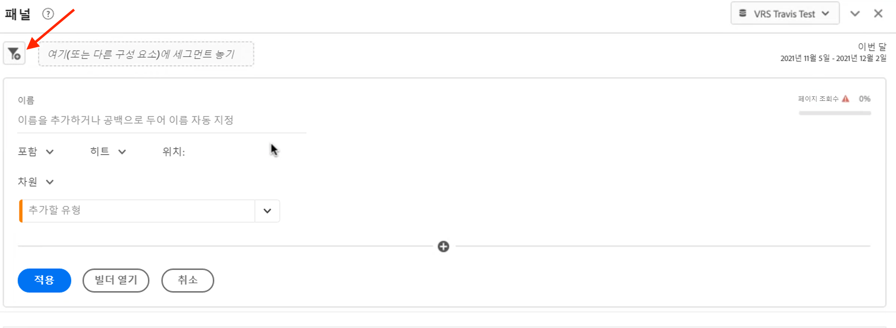
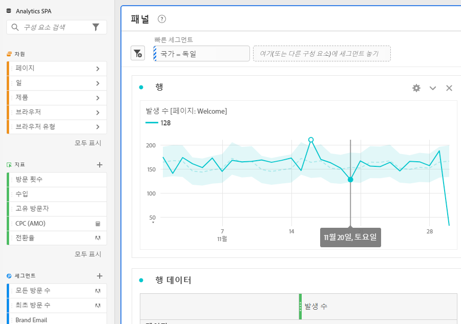
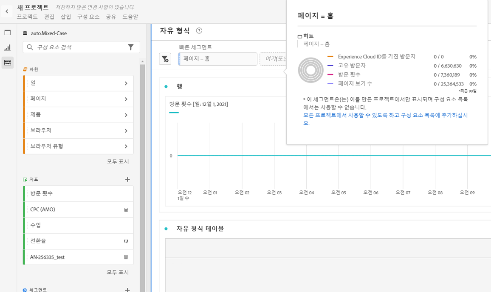
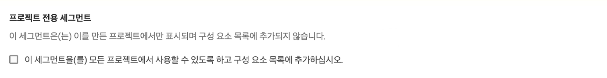

# 빠른 세그먼트

프로젝트 내에서 빠른 세그먼트를 만들어 전체 [세그먼트 빌더](/help/components/segmentation/segmentation-workflow/seg-build.md)의 복잡성을 방지할 수 있습니다. 빠른 세그먼트

* 프로젝트가 만들어진 프로젝트에만 적용합니다(이 설정을 변경할 수 있습니다.).
* 최대 3개의 규칙을 허용합니다.
* 중첩된 컨테이너 또는 순차적 규칙을 수용하지 마십시오.
* 여러 보고서 세트가 있는 프로젝트에서 작업하십시오.

빠른 세그먼트가 수행할 수 있는 작업과 완전한 구성 요소 목록 세그먼트를 비교하려면 [여기](/help/analyze/analysis-workspace/components/segments/t-freeform-project-segment.md)로 이동하십시오.

>[!IMPORTANT]
> 빠른 세그먼트는 현재 제한된 테스트 중이며 아직 일반적으로 사용할 수 없습니다.

## 전제 조건

누구나 [!UICONTROL 빠른 세그먼트]를 만들 수 있습니다. 그러나 빠른 세그먼트를 저장하거나 [!UICONTROL 세그먼트 빌더]에서 열려면 [Adobe Admin Console](https://experienceleague.adobe.com/docs/analytics/admin/admin-console/permissions/summary-tables.html?lang=en#analytics-tools)에서[!UICONTROL 세그먼트 생성] 권한이 필요합니다.

## 빠른 세그먼트 만들기

자유 형식 테이블의 패널 헤더에서 필터+ 아이콘을 클릭합니다.

| 설정 | 설명 |
| --- | --- |
| 이름 | 세그먼트의 기본 이름은 세그먼트에 있는 규칙 이름의 조합입니다. 세그먼트 이름을 변경할 수 있습니다. |
| 포함/제외 | 세그먼트 정의에 구성 요소를 포함하거나 제외할 수 있지만, 둘 다 포함할 수는 없습니다. |
| 히트/방문/방문자 컨테이너 | 빠른 세그먼트에는 세그먼트에 차원/지표/날짜 범위를 포함하거나 세그먼트에서 제외할 수 있는 하나의 [세그먼트 컨테이너](https://experienceleague.adobe.com/docs/analytics/components/segmentation/seg-overview.html?lang=en#section_AF2A28BE92474DB386AE85743C71B2D6)만 포함됩니다.  방문자에는 방문 및 페이지 보기에서 해당 방문자 고유의 중요 데이터가 포함되어 있습니다. [!UICONTROL 방문] 컨테이너를 사용하여 방문에 따라 방문자의 데이터를 분석하는 규칙을 설정할 수 있고, [!UICONTROL 히트] 컨테이너를 사용하여 개별 페이지 보기에 따라 방문자 정보를 분류할 수 있습니다. 기본 컨테이너는 [!UICONTROL 히트]입니다. |
| 구성 요소(Dimension/지표/날짜 범위) | 구성 요소 차원 및/또는 지표 및/또는 날짜 범위 및 해당 값을 추가하여 최대 3개의 규칙을 정의합니다. 올바른 구성 요소를 찾는 세 가지 방법이 있습니다.<ul><li>입력을 시작하면 [!UICONTROL 빠른 세그먼트] 빌더가 해당 구성 요소를 자동으로 찾습니다.</li><li>드롭다운 목록을 사용하여 구성 요소를 찾습니다.</li><li>왼쪽 레일에서 구성 요소를 드래그하여 놓습니다.</li></ul> |
| 연산자 | 드롭다운 메뉴를 사용하여 표준 연산자와 [!UICONTROL 고유 개수] 연산자를 찾습니다. [자세히 알아보기](https://experienceleague.adobe.com/docs/analytics/components/segmentation/segment-reference/seg-operators.html?lang=en) |
| 더하기(+) 기호 | 다른 규칙 추가 |
| 및/또는 구분자 | 규칙에 &quot;AND&quot; 또는 &quot;OR&quot; 한정자를 추가할 수 있지만, 단일 세그먼트 정의에 &quot;AND&quot;와 &quot;OR&quot;를 혼합할 수 없습니다. |
| 적용 | 이 세그먼트를 패널에 적용합니다. 세그먼트에 데이터가 없으면 계속하시겠습니까? |
| 빌더 열기 | 세그먼트 빌더를 엽니다. 세그먼트 빌더에서 세그먼트를 저장하면 더 이상 &quot;빠른 세그먼트&quot;로 간주되지 않습니다. 구성 요소 목록 세그먼트 라이브러리의 일부가 됩니다. |
| 취소 | 이 빠른 세그먼트 취소 - 적용하지 마십시오. |
| 날짜 범위 | 유효성 검사기는 데이터 조회에 패널 날짜 범위를 사용합니다. 하지만 빠른 세그먼트에 적용된 모든 날짜 범위는 패널 위쪽에 있는 패널 날짜 범위를 무시합니다. |
| 미리 보기(오른쪽 상단) | 세그먼트가 유효한지와 세그먼트가 얼마나 광범위한지 확인할 수 있습니다. 이 세그먼트를 적용할 때 표시될 것으로 예상되는 데이터 분류를 나타냅니다. 이 세그먼트에 데이터가 없음을 나타내는 알림이 표시될 수 있습니다. 세그먼트 정의를 계속 진행하거나 변경할 수 있습니다. |

다음은 차원과 지표를 결합하는 세그먼트의 예입니다.

세그먼트가 맨 위에 나타납니다. 왼쪽의 세그먼트 라이브러리에 있는 구성 요소 수준 세그먼트에 대한 파란색 사이드바와 대조적으로 파란색 사이드바를 확인합니다.

## 빠른 세그먼트 편집

1. 빠른 세그먼트 위로 마우스를 가져간 다음 연필 아이콘을 선택합니다.
1. 세그먼트 정의 또는 세그먼트 이름을 편집합니다.

## 빠른 세그먼트 저장

빠른 세그먼트를 [!UICONTROL 빠른 세그먼트 빌더] 또는 [!UICONTROL 세그먼트 빌더]에서 저장하도록 선택할 수 있습니다.

>[!IMPORTANT]
>세그먼트를 저장하거나 적용하면 일반 세그먼트 빌더에서만 빠른 세그먼트 빌더에서 더 이상 편집할 수 없습니다.

### 빠른 세그먼트 빌더에 저장

1. 빠른 세그먼트를 적용했으면 빠른 세그먼트를 마우스로 가리킨 다음 정보(&quot;i&quot;) 아이콘을 선택합니다.

   

1. **[!UICONTROL 모든 프로젝트에서 사용할 수 있도록 설정 을 클릭하고 구성 요소 목록에 추가합니다]**.
1. (선택 사항) 세그먼트 이름을 변경합니다.
1. **[!UICONTROL 저장]**&#x200B;을 클릭합니다.

세그먼트의 측면 막대가 스트라이핑된 파란색에서 파란색으로 어떻게 변경되는지 확인합니다. 이제 왼쪽 레일의 구성 요소 목록에 표시됩니다.

세그먼트를 적용한 후 세그먼트 구성 요소 목록에 추가하고 모든 프로젝트에서 사용할 수 있도록 선택할 수 있습니다.

1. 저장된 세그먼트 위로 마우스를 가져간 다음 연필 아이콘을 선택합니다.

1. 세그먼트 빌더 상단에서 이 대화 상자를 확인합니다.

   

1. **[!UICONTROL 이 세그먼트를 모든 프로젝트에서 사용할 수 있도록 설정 옆의 확인란을 선택하고 구성 요소 목록에 추가합니다.]**
1. **[!UICONTROL 저장]**&#x200B;을 클릭합니다.
1. 이제 세그먼트가 모든 프로젝트의 세그먼트 구성 요소 목록에 표시됩니다.
1. 또한 [세그먼트를](/help/components/segmentation/segmentation-workflow/t-seg-share.md)조직의 다른 사람과 공유할 수도 있습니다.

## 프로젝트 전용 세그먼트란?

프로젝트 전용 세그먼트는 빠른 세그먼트나 임시 Workspace 프로젝트 세그먼트입니다. [!UICONTROL 세그먼트 빌더]에서 이러한 필드를 편집/열면 프로젝트 전용 상자가 표시됩니다. 빌더에서 빠른 세그먼트를 적용하지만 사용 가능한 만들기 상자를 선택하지 않으면 여전히 프로젝트 전용 세그먼트이지만 더 이상 [!UICONTROL 빠른 세그먼트 빌더]에서 열 수 없습니다. 확인란을 선택하고 **[!UICONTROL 저장]**&#x200B;을 클릭하면 이제 구성 요소 목록 세그먼트가 됩니다.