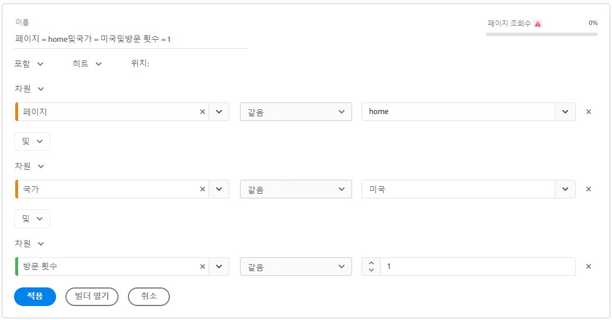

# 빠른 세그먼트

빠른 세그먼트를 사용하면 [세그먼트 빌더](/help/components/segmentation/segmentation-workflow/seg-build.md).

빠른 세그먼트를 만들 때 다음 사항을 고려하십시오.

* 빠른 세그먼트는 생성된 프로젝트에만 적용됩니다. 다른 프로젝트에서 사용할 수 없으며, 다른 사용자와 공유할 수 없습니다.
* 최대 3개의 규칙이 허용됩니다.
* 중첩된 컨테이너 또는 순차적 규칙은 지원되지 않습니다.

다음 비디오에서는 빠른 세그먼트를 사용하는 방법을 보여 줍니다.

>[!VIDEO](https://video.tv.adobe.com/v/341466/?quality=12&learn=on)

## 빠른 세그먼트 만들기

Analysis Workspace의 모든 사용자는 빠른 세그먼트를 만들 수 있습니다.

빠른 세그먼트를 만들려면:

1. 빠른 세그먼트 만들기를 시작하려면 다음 방법 중 하나를 선택합니다.

   * **Ad hoc(드래그 앤 드롭):** 왼쪽 레일에서 구성 요소를 **세그먼트** 패널 헤더에서 아이콘을 선택한 다음 **편집** 아이콘을 클릭하여 세그먼트를 조정합니다.

      

      >[!NOTE]
      >
      > 빠른 세그먼트 Ad Hoc(드래그 앤 드롭) 을 만들 때 다음 사항을 고려하십시오.
      > * 다음 구성 요소 유형은 지원되지 않습니다. 계산된 지표 및 차원과 세그먼트를 작성할 수 없는 지표입니다.
      > * 전체 차원 및 이벤트에 대해 Analysis Workspace는 &quot;존재함&quot; 히트 세그먼트를 만듭니다. 예: `Hit where eVar1 exists` 또는 `Hit where event1 exists`.
      > * 세그먼트 드롭 영역에 &quot;지정되지 않음&quot; 또는 &quot;없음&quot;을 놓으면 세그먼트에서 올바로 처리되도록 자동으로 &quot;존재하지 않음&quot; 세그먼트로 변환됩니다.

   * **세그먼트 아이콘 사용:** 자유 형식 테이블에서 **세그먼트** 아이콘 을 클릭하여 제품에서 사용할 수 있습니다.

      

1. 다음 설정을 조정합니다.

   | 설정 | 설명 |
   | --- | --- |
   | [!UICONTROL 이름] | 세그먼트의 기본 이름은 세그먼트에 있는 규칙 이름의 조합입니다. 세그먼트의 이름을 더 친숙한 이름으로 변경할 수 있습니다. |
   | [!UICONTROL 포함/제외] | 세그먼트 정의에 구성 요소를 포함 또는 제외할 수 있지만 둘 다 할 수는 없습니다. |
   | [!UICONTROL 히트/방문/방문자] 컨테이너 | 빠른 세그먼트에는 하나의 [세그먼트 컨테이너](https://experienceleague.adobe.com/docs/analytics/components/segmentation/seg-overview.html#section_AF2A28BE92474DB386AE85743C71B2D6)만이 포함되어 세그먼트에 차원/지표/날짜 범위를 포함하거나 세그먼트에서 제외할 수 있습니다. [!UICONTROL 방문자]에는 여러 방문 및 페이지 조회수에서 방문자와 관련된 데이터가 포함됩니다. [!UICONTROL 방문] 컨테이너를 사용하여 방문에 따라 방문자의 데이터를 분석하는 규칙을 설정할 수 있고, [!UICONTROL 히트] 컨테이너를 사용하여 개별 페이지 조회수에 따라 방문자 정보를 분류할 수 있습니다. 기본 컨테이너는 [!UICONTROL 히트]입니다. |
   | [!UICONTROL 구성 요소] (차원/지표/날짜 범위) | 구성 요소(차원, 지표, 날짜 범위 또는 차원 값)를 추가하여 최대 3개의 규칙을 정의합니다. 적합한 구성 요소를 검색하는 3가지 방법이 있습니다.<ul><li>입력을 시작하면 빠른 세그먼트 빌더가 해당 구성 요소를 자동으로 찾습니다.</li><li>드롭다운 목록을 사용하여 구성 요소를 검색합니다.</li><li>왼쪽 레일에서 구성 요소를 드래그 앤 드롭합니다.</li></ul> |
   | [!UICONTROL 연산자] | 드롭다운 메뉴를 사용하여 표준 연산자 및 [!UICONTROL 고유 개수] 연산자를 검색합니다. 자세한 내용은 [세그먼트 연산자](/help/components/segmentation/seg-reference/seg-operators.md). |
   | 플러스(+) 기호 | 다른 규칙 추가 |
   | AND/OR 한정자 | 규칙에 “AND” 또는 “OR” 한정자를 추가할 수 있지만 단일 세그먼트 정의에서는 “AND”와 “OR”를 혼합할 수 없습니다. |
   | [!UICONTROL 적용] | 이 세그먼트를 패널에 적용합니다. 세그먼트에 데이터가 없는 경우 계속하시겠습니까? |
   | [!UICONTROL 빌더 열기] | 세그먼트 빌더를 엽니다. 세그먼트 빌더에서 세그먼트를 저장하거나 적용하면 더 이상 &quot;빠른 세그먼트&quot;로 간주되지 않습니다. 구성 요소 목록의 세그먼트 라이브러리의 일부가 됩니다. 
모든 프로젝트에서 구성 요소를 사용할 수 있도록 하고 왼쪽 레일에서 옵션을 선택합니다 [!UICONTROL **이 세그먼트를 모든 프로젝트에서 사용할 수 있도록 하고 구성 요소 목록에 추가합니다**].

자세한 내용은 섹션을 참조하십시오 [빠른 세그먼트를 구성 요소 목록 세그먼트로 저장](#save-a-quick-segment-as-a-component-list-segment) 참조하십시오.

**참고:** 에서 세그먼트 생성 권한이 있는 사용자만 [Adobe Admin Console](https://experienceleague.adobe.com/docs/analytics/admin/admin-console/permissions/summary-tables.html#analytics-tools) 세그먼트 빌더를 열 수 있습니다.
 |
   | [!UICONTROL 취소] | 이 빠른 세그먼트를 취소합니다(적용되지 않음). |
   | [!UICONTROL 날짜 범위] | 유효성 검사기는 패널 날짜 범위를 사용하여 데이터를 조회합니다. 하지만 빠른 세그먼트에 적용되는 날짜 범위는 패널 상단의 패널 날짜 범위를 오버라이드합니다. |
   | 이전(오른쪽 상단) | 유효한 세그먼트가 있는지 여부와 세그먼트의 범위가 얼마나 넓은지 확인할 수 있습니다. 이 세그먼트를 적용할 경우 표시될 것으로 예상되는 데이터 분류를 표시합니다. 이 세그먼트에 데이터가 없다는 것을 보여 주는 알림을 수신할 수 있습니다. 이 경우 세그먼트 정의를 진행하거나 변경할 수 있습니다. |

1. 선택 [!UICONTROL **적용**] 변경 사항을 저장하려면 을 클릭합니다.

## 빠른 세그먼트 편집

1. 빠른 세그먼트 위로 마우스를 가져간 후 **편집** 아이콘.

   

1. 세그먼트 정의 및/또는 세그먼트 이름을 편집합니다.

1. [!UICONTROL **적용**]&#x200B;을 선택합니다.

## 빠른 세그먼트를 구성 요소 목록 세그먼트로 저장

>[!IMPORTANT]
>
> 빠른 세그먼트를 저장할 때 다음 사항을 고려하십시오.
> 
> * 빠른 세그먼트를 저장하려면 [Adobe Admin Console](https://experienceleague.adobe.com/docs/analytics/admin/admin-console/permissions/summary-tables.html#analytics-tools).
> 
> * 세그먼트를 저장하거나 적용한 후에는 빠른 세그먼트 빌더에서 더 이상 편집할 수 없습니다. 대신 일반 세그먼트 빌더를 사용해야 합니다.

빠른 세그먼트를 구성 요소 목록 세그먼트로 저장하도록 선택할 수 있습니다. 구성 요소 목록 세그먼트의 장점은 다음과 같습니다.

* 모든 작업 공간 프로젝트에서 사용 가능
* 순차적 세그먼트와 더 복잡한 세그먼트 지원

빠른 세그먼트 빌더 또는 [!UICONTROL 필터 빌더].

### 빠른 세그먼트 빌더에 저장 {#save2}

1. 빠른 세그먼트를 적용한 후 해당 세그먼트를 마우스로 가리킨 다음 정보(&quot;i&quot;) 아이콘을 선택합니다.
1. 선택 **[!UICONTROL 모든 프로젝트를 사용할 수 있도록 설정하고 구성 요소 목록에 추가합니다]**.
1. (선택 사항) 세그먼트 이름을 바꿉니다.
1. **[!UICONTROL 저장]**&#x200B;을 선택합니다.

   이제 세그먼트가 왼쪽 레일의 구성 요소 목록에 나타납니다. 또한 세그먼트의 측면 막대는 연한 파란색에서 어두운 파란색으로 변경되며, 더 이상 빠른 세그먼트 빌더에서 편집하거나 열 수 없음을 나타냅니다.

### 세그먼트 빌더에 저장 {#save3}

1. 빠른 세그먼트를 적용한 후 해당 세그먼트를 마우스로 가리킨 다음 정보(&quot;i&quot;) 아이콘을 선택합니다.
1. **[!UICONTROL 세그먼트 저장]**&#x200B;을 선택합니다.
1. (선택 사항) 세그먼트 이름을 바꾼 다음 선택합니다 [!UICONTROL **적용**].

   Workspace로 돌아가서 빠른 세그먼트 빌더에서 더 이상 편집하거나 열 수 없음을 나타내는 세그먼트의 측면 막대가 연한 파란색에서 어두운 파란색으로 바뀝니다. 저장하면 구성 요소 목록의 일부가 됩니다.

세그먼트를 적용한 후 세그먼트 구성 요소 목록에 추가하고 모든 프로젝트에서 사용할 수 있도록 선택할 수 있습니다.

1. 저장된 세그먼트 위에 커서를 놓고 연필 모양의 아이콘을 선택합니다.

1. 선택 [!UICONTROL **빌더 열기**].

1. 세그먼트 빌더 상단에서 [!UICONTROL **프로젝트 전용 세그먼트**] 대화 상자:

   

1. **[!UICONTROL 모든 프로젝트에 사용할 수 있도록 설정하고 구성 요소 목록 추가하기]** 옆의 확인란을 선택합니다.

1. **[!UICONTROL 저장]**&#x200B;을 선택합니다.

   이제 세그먼트가 모든 프로젝트의 세그먼트 구성 요소에 표시됩니다.
조직의 다른 사용자와 [세그먼트를 공유](https://experienceleague.adobe.com/docs/analytics/analyze/analysis-workspace/curate-share/curate.html?lang=ko-KR#concept_4A9726927E7C44AFA260E2BB2721AFC6)할 수도 있습니다 .

## 빠른 세그먼트 예

다음 세그먼트 예에서는 차원과 지표를 결합합니다.

## 알려진 문제

1. 항목이 2개인 빠른 세그먼트를 만들고 Test1로 **[!UICONTROL 저장]**&#x200B;합니다.
1. **[!UICONTROL 다른 이름으로 저장]**&#x200B;을 클릭하고 이 빠른 세그먼트를 Test2로 저장합니다.
1. Test2 빠른 세그먼트를 편집하고 다시 Test2로 저장합니다.
Test1 빠른 세그먼트는 Test2에 의해 수정됩니다.
