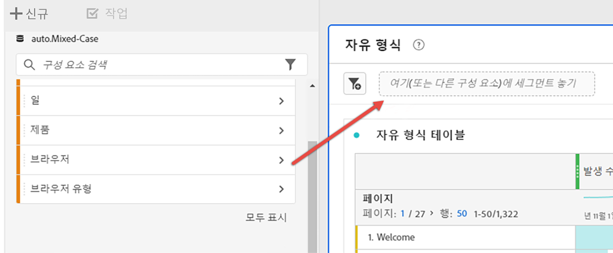

# 세그먼트 {#topic_DC2917A2E8FD4B62816572F3F6EDA58A}

세그먼트가 얼마나 복잡해야 하는지, 이 프로젝트에만 적용되어야 하는지에 따라 다른 유형의 세그먼트를 만들 수 있습니다. 다음은 세그먼트 유형의 요약입니다.

| 세그먼트 유형 | 어디에서 만들었습니까? | 적용 가능한 위치? | 여러 컨테이너? |
| --- | --- | --- | 
| 구성 요소 목록 세그먼트 | [세그먼트 빌더](/help/components/segmentation/segmentation-workflow/seg-build.md) | 모든 프로젝트(왼쪽 레일) | 예 | 파란색 |
| 빠른 세그먼트 | [빠른 세그먼트 빌더](/help/analyze/analysis-workspace/components/segments/quick-segments.md) | 프로젝트 수준만 | 아니요 |
| 애드혹 세그먼트: | 아래를 참조하십시오 | 프로젝트 수준만 | 아니요 |
| - Ad hoc Workspace 프로젝트 세그먼트 | 세그먼트로 끌어다 놓기 ? 새 프로젝트에서 |  |  |
| - 계산된 지표 기반 세그먼트 | 계산된 지표 빌더 |  |  |
| - VRS 기반 세그먼트 | 가상 보고서 세트 빌더 |  |  |
| - 세그먼트 빌더 &quot;적용&quot; &quot; | 세그먼트 빌더 |  |  |

Adobe Analytics의 세그멘테이션에 대해 자세히 알아보려면 [여기](/help/components/segmentation/seg-overview.md)로 이동하십시오.

## 왼쪽 레일의 구성 요소 목록 세그먼트 {#section_3B07D458C43E42FDAF242BB3ACAF3E90}

구성 요소 메뉴 아래의 세그먼트 레일은 다음 아이콘으로 세그먼트 템플릿과 세그먼트를 표시합니다.

[Analysis Workspace에서 세그먼트 사용](https://experienceleague.adobe.com/docs/analytics-learn/tutorials/analysis-workspace/applying-segments/using-segments-in-analysis-workspace.html?lang=ko-KR) (6:46)

## Analysis Workspace의 임시 세그먼트

다음은 Ad Hoc 세그먼트에 대한 비디오입니다.

>[!VIDEO](https://video.tv.adobe.com/v/23978/?quality=12)

## 세그먼트 만들기 {#section_693CFADA668B4542B982446C2B4CF0F5}

구성 요소 유형 (차원, 차원 항목, 이벤트, 지표, 세그먼트, 세그먼트 템플릿, 날짜 범위)을 패널 위쪽에 세그먼트 드롭 영역으로 드래그하여 인스턴스 세그먼트를 생성할 수 있습니다.

구성 요소 유형은 자동으로 세그먼트로 변환됩니다. 또는 세그먼트 추가 드롭박스에서 &quot;+&quot; 기호를 클릭할 수도 있습니다.

주의 사항:

* 다음 구성 요소 유형을 세그먼트 영역으로 끌어 놓을 수 **없음**: 세그먼트를 빌드할 수 없는 계산된 지표 및 차원/지표.
* 전체 차원 및 이벤트에 대해 Analysis Workspace는 &quot;존재함&quot; 히트 세그먼트를 만듭니다. 예: &quot;eVar1이 있는 위치 히트&quot; 또는 &quot;event1이 있는 위치 히트&quot;.
* 세그먼트를 놓는 영역에 &quot;지정되지 않음&quot; 또는 &quot;없음&quot;을 놓으면 세그먼테이션에서 올바로 처리되도록 자동으로 &quot;존재하지 않음&quot; 세그먼트로 변환됩니다.

>[!NOTE]
>
>이러한 방식으로 생성된 세그먼트는 프로젝트 내부에서 사용됩니다.

다음 단계를 수행하여 이러한 세그먼트를 공개(전역)로 지정하도록 선택할 수 있습니다.

1. 드롭 영역의 세그먼트 위에 커서를 놓고 &quot;i&quot; 아이콘을 클릭합니다.
1. 표시되는 정보 패널에서 **[!UICONTROL 공개하기를 클릭합니다]**.

   

## 세그먼트를 적용하는 다른 방법 {#section_10FF2E309BA84618990EA5B473015894}

>[!VIDEO](https://video.tv.adobe.com/v/30994/?quality=12)

자유 형식 프로젝트에 세그먼트를 적용하는 몇 가지 다른 방법이 있습니다.

| 작업 | 설명 |
|--- |--- |
| 선택 항목에서 세그먼트 만들기 | 인라인 세그먼트를 만듭니다. 행을 선택하고, 선택 항목을 마우스 오른쪽 버튼으로 클릭한 다음 인라인 세그먼트를 만듭니다. 이 세그먼트는 열려 있는 프로젝트에만 적용되며, Analytics 세그먼트로 저장되지는 않습니다. 1. 행을 선택합니다.  2. 선택 항목을 마우스 오른쪽 버튼으로 클릭합니다.  3. *선택 항목으로 세그먼트 만들기*&#x200B;를 클릭합니다. |
| 구성 요소 > 새 세그먼트 | 세그먼트 빌더를 표시합니다. 세그먼테이션에 대한 자세한 내용은 [세그먼트 빌더](https://experienceleague.adobe.com/docs/analytics/components/segmentation/segmentation-workflow/seg-build.html?lang=ko-KR)를 참조하십시오. |
| 공유 > 프로젝트 공유 또는 공유 > 프로젝트 데이터 조정 | [조정 및 공유](https://experienceleague.adobe.com/docs/analytics/analyze/analysis-workspace/curate-share/curate.html?lang=ko-KR#concept_4A9726927E7C44AFA260E2BB2721AFC6)에서, 수신자를 위한 공유 분석에서 프로젝트에 적용하는 세그먼트를 어떻게 사용할 수 있는지 알아봅니다. |
| 세그먼트를 차원으로 사용 | 비디오: [Analysis Workspace에서 세그먼트를 차원으로 사용](https://experienceleague.adobe.com/docs/analytics-learn/tutorials/analysis-workspace/applying-segments/using-segments-as-dimensions-in-analysis-workspace.html?lang=en) |

