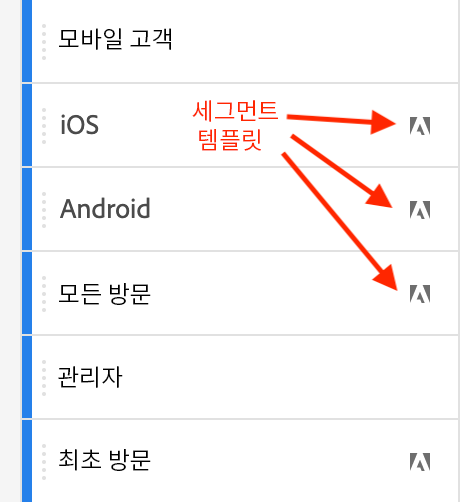

# 세그먼트 {#topic_DC2917A2E8FD4B62816572F3F6EDA58A}

세그먼트의 복잡성과 해당 프로젝트의 적용 여부에 따라 작업 영역에서 서로 다른 유형의 세그먼트를 만들 수 있습니다. 세그먼트 유형에 대한 요약은 다음과 같습니다.

| 세그먼트 유형 | 생성되는 영역은? | 적용 가능한 영역은? | 사용 시기 |
| --- | --- | --- | --- |
| 구성 요소 목록 세그먼트 | +를 클릭하면 [세그먼트 빌더](/help/components/segmentation/segmentation-workflow/seg-build.md)로 이동합니다. | 모든 작업 영역 프로젝트 | 복잡한 세그먼트의 경우는 순차적 세그먼트 |
| 빠른 세그먼트 | [빠른 세그먼트 빌더](/help/analyze/analysis-workspace/components/segments/quick-segments.md) | 프로젝트만 저장하고 세그먼트 목록에 추가할 수 있습니다. | 자유롭게 하나 이상의 규칙을 추가 또는 편집 |
| 임시 세그먼트: |  |  |  |
| - 임시 작업 영역 프로젝트 세그먼트 | [프로젝트의 세그먼트 드롭 영역으로 드래그 앤 드롭](/help/analyze/analysis-workspace/components/segments/ad-hoc-segments.md) | 프로젝트만 저장하고 세그먼트 목록에 추가할 수 있습니다. | 단일 규칙 세그먼트의 경우 |
| - 계산된 지표 기반 세그먼트 | [계산된 지표 빌더](https://experienceleague.adobe.com/docs/analytics/components/calculated-metrics/calcmetric-workflow/metrics-with-segments.html?lang=ko-KR) | 계산된 개별 지표에 | 지표 정의 내 세그먼트 적용 |
| - VRS 기반 세그먼트 | [가상 보고서 세트 빌더](https://experienceleague.adobe.com/docs/analytics/components/virtual-report-suites/vrs-workflow/vrs-create.html?lang=ko-KR) | 개별 가상 보고서 세트에 | VRS 정의 내 세그먼트 적용 |

다음은 Analysis Workspace에서의 세그먼트 사용에 대한 비디오입니다.

>[!VIDEO](https://video.tv.adobe.com/v/23977/?quality=12)

## 세그먼트 만들기 {#section_693CFADA668B4542B982446C2B4CF0F5}

Analysis Workspace에서 다음과 같이 서로 다른 유형의 세그먼트를 만들 수 있습니다.

* [빠른 세그먼트](/help/analyze/analysis-workspace/components/segments/quick-segments.md)
* [임시 세그먼트](/help/analyze/analysis-workspace/components/segments/ad-hoc-segments.md)
* 세그먼트 빌더에서 만들고 세그먼트 라이브러리에 끝나는 일반 구성 요소 목록 세그먼트(아래 참조)

### 구성 요소 목록 세그먼트 만들기 {#section_3B07D458C43E42FDAF242BB3ACAF3E90}

구성 요소 메뉴 아래의 세그먼트 레일은 다음을 표시합니다.
* 귀하 또는 귀사가 만든 세그먼트
* Adobe 아이콘으로 표시되는 세그먼트 템플릿:

이러한 유형의 세그먼트를 만들려면 2개의 옵션이 필요합니다. 둘 다 당신을 [세그먼트 빌더](/help/components/segmentation/segmentation-workflow/seg-build.md) Adobe Analytics에서 추가 지침을 찾을 수 있습니다.

* 왼쪽 레일에서 [!UICONTROL 세그먼트] 옆의 더하기(+) 기호를 클릭합니다.

또는

* [!UICONTROL 구성 요소] > [!UICONTROL 세그먼트]로 이동한 다음 [!UICONTROL + 추가]를 클릭합니다.

### 세그먼트를 적용하는 다른 방법 {#section_10FF2E309BA84618990EA5B473015894}

>[!VIDEO](https://video.tv.adobe.com/v/30994/?quality=12)

자유 형식 프로젝트에 세그먼트를 적용하는 몇 가지 다른 방법이 있습니다.

| 작업 | 설명 |
|--- |--- |
| 선택 항목에서 세그먼트 만들기 | 인라인 세그먼트를 만듭니다. 이 세그먼트는 열려 있는 프로젝트에만 적용되며, Analytics 세그먼트로 저장되지는 않습니다. 1. 행을 선택합니다.  2. 선택 항목을 마우스 오른쪽 버튼으로 클릭합니다.  3. *선택 항목으로 세그먼트 만들기*&#x200B;를 클릭합니다. |
| 구성 요소 > 새 세그먼트 | 세그먼트 빌더를 표시합니다. 세그먼테이션에 대한 자세한 내용은 [세그먼트 빌더](https://experienceleague.adobe.com/docs/analytics/components/segmentation/segmentation-workflow/seg-build.html?lang=ko-KR)를 참조하십시오. |
| 공유 > 프로젝트 공유 또는 공유 > 프로젝트 데이터 조정 | [조정 및 공유](https://experienceleague.adobe.com/docs/analytics/analyze/analysis-workspace/curate-share/curate.html?lang=ko-KR#concept_4A9726927E7C44AFA260E2BB2721AFC6)에서, 수신자를 위한 공유 분석에서 프로젝트에 적용하는 세그먼트를 어떻게 사용할 수 있는지 알아봅니다. |
| 세그먼트를 차원으로 사용 | 비디오: [Analysis Workspace에서 세그먼트를 차원으로 사용](https://experienceleague.adobe.com/docs/analytics-learn/tutorials/analysis-workspace/applying-segments/using-segments-as-dimensions-in-analysis-workspace.html?lang=ko-KR) |

## 세그먼트 IQ

세그먼트 IQ(세그먼트 비교이라고도 함)는 다음 기능으로 구성됩니다.

* [세그먼트 비교 패널:](/help/analyze/analysis-workspace/c-panels/c-segment-comparison/segment-comparison.md) 세그먼트 IQ의 핵심 기능. 두 세그먼트를 패널에 드래그하고 통계적으로 중요한 차이점과 두 대상 간의 겹침을 보여 주는 포괄적인 보고서를 살펴보십시오.
* [폴아웃의 세그먼트 비교:](/help/analyze/analysis-workspace/visualizations/fallout/compare-segments-fallout.md) 폴아웃 시각화의 컨텍스트에서 서로 다른 대상이 어떻게 서로 비교되는지 확인하십시오.

## 추가 정보

Adobe Analytics의 세그먼테이션에 대한 자세한 내용은 [여기](/help/components/segmentation/seg-overview.md)를 참조하십시오.