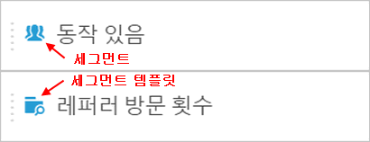
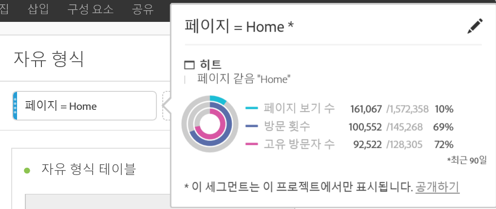

# 세그먼트 {#topic_DC2917A2E8FD4B62816572F3F6EDA58A}

## Segment rail {#section_3B07D458C43E42FDAF242BB3ACAF3E90}

구성 요소 메뉴 아래의 세그먼트 레일은 다음 아이콘으로 세그먼트 템플릿과 세그먼트를 표시합니다.

[YouTube의 분석 작업 공간에서 세그먼트 사용](https://www.youtube.com/watch?v=QlUCdQDnni4)(6:46)

## 세그먼트 만들기 {#section_693CFADA668B4542B982446C2B4CF0F5}

구성 요소 유형(차원, 차원 항목, 이벤트, 지표, 세그먼트, 세그먼트 템플릿, 날짜 범위)을 패널 위쪽에 세그먼트 드롭 영역으로 드래그하여 인스턴스 세그먼트를 생성할 수 있습니다.

구성 요소 유형은 자동으로 세그먼트로 변환됩니다. 또는 [세그먼트 추가] 드롭박스에서 "+" 기호를 클릭할 수도 있습니다.

주의 사항:

* 다음 구성 요소 유형을 세그먼트 영역으로 끌어 놓을 수 **없음**: 세그먼트를 빌드할 수 없는 계산된 지표 및 차원/지표.
* 전체 차원 및 이벤트에 대해 Analysis Workspace는 "존재함" 히트 세그먼트를 만듭니다. 예: "eVar1이 있는 위치 히트" 또는 "event1이 있는 위치 히트".
* " 지정되지 않음 "또는" 없음 "이 세그먼트 드롭 영역에 드롭되면 세그먼테이션에서 올바로 처리되도록 자동으로" 존재하지 않음 "세그먼트로 변환됩니다.

>[!NOTE]
>
>이렇게 만들어진 세그먼트는 프로젝트의 내부입니다.

다음 단계를 수행하여 이러한 세그먼트를 공개(전역)로 지정하도록 선택할 수 있습니다.

1. 드롭 영역의 세그먼트 위에 커서를 놓고 "i" 아이콘을 클릭합니다.
1. 표시되는 정보 패널에서 **[!UICONTROL 공개하기를 클릭합니다]**.

   

## Other methods for applying segments {#section_10FF2E309BA84618990EA5B473015894}

자유 형식 프로젝트에 세그먼트를 적용하는 몇 가지 다른 방법이 있습니다.

| 작업 | 설명 |
|--- |--- |
| 선택 항목에서 세그먼트 만들기 | 인라인 세그먼트를 만듭니다. 행을 선택하고, 선택 항목을 마우스 오른쪽 단추로 클릭한 다음 인라인 세그먼트를 만듭니다. 이 세그먼트는 열려 있는 프로젝트에만 적용되며, Analytics 세그먼트로 저장되지는 않습니다. 1. 행을 선택합니다. 2. 선택 항목을 마우스 오른쪽 단추로 클릭합니다. 3. Click *Create segment from selection*. |
| 구성 요소 &gt; 새 세그먼트 | 세그먼트 빌더를 표시합니다. See [Segment Builder](https://docs.adobe.com/content/help/en/analytics/components/segmentation/segmentation-workflow/seg-build.html) for more information about segmentation. |
| 공유 &gt; 프로젝트 공유 또는 공유 &gt; 프로젝트 데이터 조정 | In [Curate and Share](https://docs.adobe.com/content/help/en/analytics/analyze/analysis-workspace/curate-share/curate.html#concept_4A9726927E7C44AFA260E2BB2721AFC6), learn how segments that you apply to the project are available in shared analysis for the recipient. |
| 세그먼트를 차원으로 사용 | 비디오: [Analysis Workspace에서 세그먼트를 차원으로 사용](https://www.youtube.com/watch?v=WmSdReKTWto&list=PL2tCx83mn7GuNnQdYGOtlyCu0V5mEZ8sS&index=39) |
