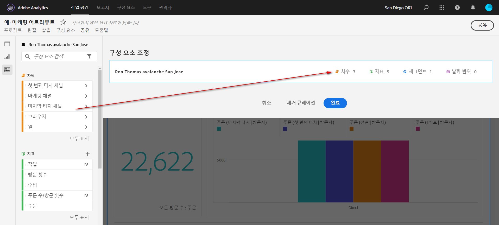
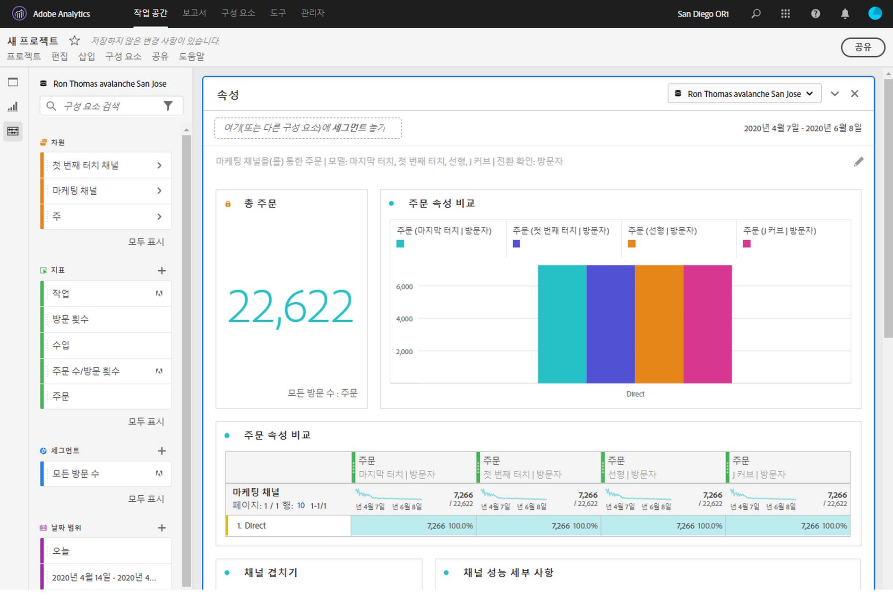

# 작업 공간 프로젝트 조정

조정 기능을 사용하면 프로젝트를 공유하기 전에 구성 요소(차원, 지표, 세그먼트, 날짜 범위)를 제한할 수 있습니다. 수신자가 프로젝트를 열면 해당 프로젝트를 위해 선별한 제한된 구성 요소 세트가 표시됩니다. 조정 작업은 선택 사항이지만 프로젝트를 공유하기 전에 권장되는 단계입니다.

>[!NOTE]
> 제품 프로필은 사용자가 볼 수 있는 구성 요소를 관리하는 기본 메커니즘으로, Adobe Experience Cloud 관리 콘솔을 통해 관리합니다. 큐레이션은 보조 필터입니다.

## 프로젝트 조정 적용

1. Click **[!UICONTROL Share]** > **[!UICONTROL Curate Project Data]**.
프로젝트에 사용되는 구성 요소가 자동으로 추가됩니다.
   **참고**: 프로젝트에 여러 보고서 세트가 있는 경우 프로젝트의 각 보고서 세트에 대한 조정 필드가 표시됩니다.
1. (선택 사항) 구성 요소를 더 추가하려면 왼쪽 레일에서 공유할 구성 요소를 구성 요소 조정 [!UICONTROL 필드로] 드래그합니다.
1. **[!UICONTROL 완료를 클릭합니다]**.

조정 및 공유를 클릭하여 [!UICONTROL 공유] 메뉴에서 조정 **[!UICONTROL 을 적용할 수도 있습니다]**. 이 옵션은 프로젝트에서 사용 중인 구성 요소에 프로젝트를 자동으로 조정해줍니다. 위의 단계에 따라 추가 구성 요소를 추가할 수 있습니다.

## 선별된 프로젝트 보기

받는 사람이 선별된 프로젝트를 열면 사용자가 정의한 선별된 구성 요소 집합만 표시됩니다.

## 프로젝트 조정 제거

프로젝트 큐레이션을 제거하고 왼쪽 레일에 있는 전체 구성 요소 세트를 복원하려면 다음을 수행하십시오.
1. Click **[!UICONTROL Share]** > **[!UICONTROL Curate Project Data]**.
1. 조정 **[!UICONTROL 제거를 클릭합니다]**.
1. **[!UICONTROL 완료를 클릭합니다]**.

## VRS(가상 보고서 세트) 조정

한 번에 많은 프로젝트에 적용되도록 보고서 세트 수준에서 조정을 적용하려면 VRS(가상 보고서 세트)에서 구성 [요소를 조정할 수 있습니다](https://docs.adobe.com/content/help/ko-KR/analytics/components/virtual-report-suites/vrs-components.html).

>[!NOTE]
> VRS 조정은 항상 프로젝트 조정 전에 적용됩니다. 즉, 조정된 프로젝트에 특정 구성 요소가 포함되어 있더라도 조정된 VRS에 해당 구성 요소가 포함되어 있지 않으면 필터링됩니다.

## 모든 구성 요소 표시 옵션

선별된 프로젝트 또는 VRS에서 수신자에게 왼쪽 레일에 **[!UICONTROL 모든]** 구성 요소 표시 옵션이 표시됩니다. [!UICONTROL 모두] 표시를 선택하면 다음 항목에 따라 다른 구성 요소 세트가 표시됩니다.

* 사용자의 권한 수준(관리자 또는 비관리자)
* 프로젝트 역할(소유자/편집기 아님)
* 적용된 조정 유형(VRS 또는 프로젝트)

| 큐레이션 유형 | 관리자 | 관리자가 아닌 프로젝트 소유자 또는 역할 편집 | 관리자가 아닌 복제 또는 역할 보기 |
|---|---|---|---|
| 조정된 VRS | 조정되지 않은 모든 VRS 구성 요소 | 이 역할이 소유하거나 함께 공유한 조정되지 않은 VRS 구성 요소 | 이 역할이 소유하거나 함께 공유한 조정되지 않은 VRS 구성 요소 |
| 조정된 프로젝트 | 조정되지 않은 모든 프로젝트 구성 요소 | 조정되지 않은 모든 프로젝트 구성 요소 | 이 역할이 소유하거나 함께 공유한 조정되지 않은 프로젝트 구성 요소 |
| 조정된 VRS에서 조정된 프로젝트 | All non-corporated components, shown under **[!UICONTROL 조정되지 않은 프로젝트 구성 요소]** 및 **[!UICONTROL 조정되지 않은 VRS 구성 요소]** 아래에 표시된 모든 조정되지 않은 모든 구성 요소 | 이 역할이 소유하거나 이 역할과 공유된 모든 조정되지 않은 모든 구성 요소와 조정되지 않은 프로젝트 구성 요소 | 이 역할이 소유하거나 함께 공유한 조정되지 않은 VRS 및 프로젝트 구성 요소 |
