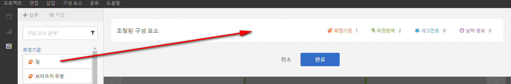
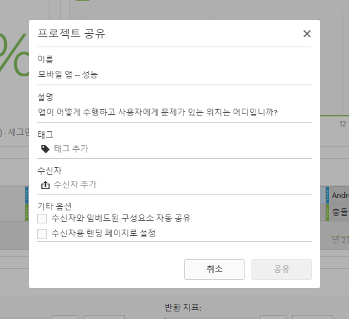

# 조정/공유 개요

조정 기능을 사용하여 프로젝트를 공유하기 전에 구성 요소를 제한할 수 있습니다. 프로젝트 및 그 구성 요소들을 비즈니스에 있는 마케터 및 다른 비분석가와 공유할 수 있습니다. 프로젝트에 주석을 달고 태그를 적용합니다.

**비디오 개요**

>[!VIDEO](https://www.youtube.com/watch?v=LJJRskdmlOg&amp;index=79&amp;t=0s&amp;list=PL2tCx83mn7GuNnQdYGOtlyCu0V5mEZ8sS)

**[!UICONTROL Workspace]** > **[!UICONTROL Share]**> **[!UICONTROL Curate Project Data]**

## 프로젝트 데이터 조정

1. 프로젝트를 생성하고 조정하는 권한을 지정하십시오.

   Before creating or curating an Analysis Workspace project, administrators must add you to a [group](https://docs.adobe.com/content/help/ko-KR/analytics/admin/user-product-management/user-groups/groups.html) with the **[!UICONTROL Analysis Workspace Access]** permission enabled, or to the **[!UICONTROL All Report Access]** user group. ( **[!UICONTROL Admin]** > **[!UICONTROL User Management]** > **[!UICONTROL Groups]**).

1. [프로젝트를 만들어 저장한](/help/analyze/analysis-workspace/build-workspace-project/t-freeform-project.md) 다음 **[!UICONTROL Share]** >를 **[!UICONTROL Curate Project Data]**&#x200B;클릭합니다.
1. Drag components you want to share from the draggable component stack on the left to the **[!UICONTROL Curated Components]** field.

   

   >[!IMPORTANT]
   >
   >구성 요소 조정은 프로젝트 공유에 필수가 아닙니다. 모든 사용 가능한 기본 구성 요소나 선택한 구성 요소와 프로젝트를 공유할 수 있습니다. To preserve all of the default components in a project, a best practice is to create a copy of a project for yourself (using **[!UICONTROL Save As]**) prior to curating components. 일단 프로젝트에서 구성 요소를 조정하면, 해당 프로젝트에 기타 구성 요소를 더 이상 사용할 수 없습니다.

1. 클릭 **[!UICONTROL Done]**.

결과 프로젝트는 Analysis Workspace에서 전형적인 프로젝트처럼 동작하지만, 선택하도록 지정된 구성 요소들만 사용합니다.

## 조정된 프로젝트 공유

공유를 하면 이 프로젝트를 조직의 다른 Analysis Workspace 사용자가 사용할 수 있습니다. 수행한 조정 결과는 다른 사용자가 프로젝트를 사용할 때 반영됩니다.

1. 보고서의 구성 요소를 조정한 후 **[!UICONTROL Share]** > **[!UICONTROL Share Project]**&#x200B;을 클릭합니다.

   

1. 수신자를 추가합니다.
1. (옵션) 모든 수신자와 포함된 구성 요소(세그먼트, 계산된 지표 및 날짜 범위)를 공유할 수 있습니다. 이러한 구성 요소가 공유되면 수신자 Workspace의 구성 요소 드롭다운에 표시됩니다.

   >[!IMPORTANT]
   >
   >이 설정은 유지되지 않습니다. 공유 시의 단일 작업입니다.

1. 선택적으로 이 페이지를 수신자의 랜딩 페이지로 설정할 수 있습니다.

   >[!IMPORTANT]
   >
   >이 설정은 유지되지 않습니다. 공유 시의 단일 작업입니다.

1. 클릭 **[!UICONTROL Share]**.

<!-- 

 <b>Annotate and tag a project</b> 
 

An alternative way to collaborate on a project is to use the Information panel. This panel will be re-introduced in an upcoming release. 
 

 
 
<ul id="ul_EFD045FD9F3B4BF8A70637B00EE0BC9C"> 
 <li id="li_EC6C5EAF9C234E76BDA7FF0226B82083">Tag reports for sharing. </li> 
 <li id="li_CF6A438C55F847F8890F8CB674CAA4F7">Specify the recipient (filter by permission group or user name), the storage folder. In-product notifications let users know that they have a shared report waiting. </li> 
 <li id="li_C8E088DA43024277908705CB0F3A142A">Write messages or report descriptions for recipients. </li> 
 <li id="li_342EB4758C344B859757E23691068FA3"> Select the dimensions, metrics, and segments to recommend to a non-analyst colleague, who can view the report you are curating and sharing. Curating the component gives the recipient access to those components, based on their permission settings. </li> 
 <li id="li_6487500F9315481599B7F3897998879F"> Add suggested items to a previously configured report. These new items exist as recommended selectable options. </li> 
</ul>

 -->

